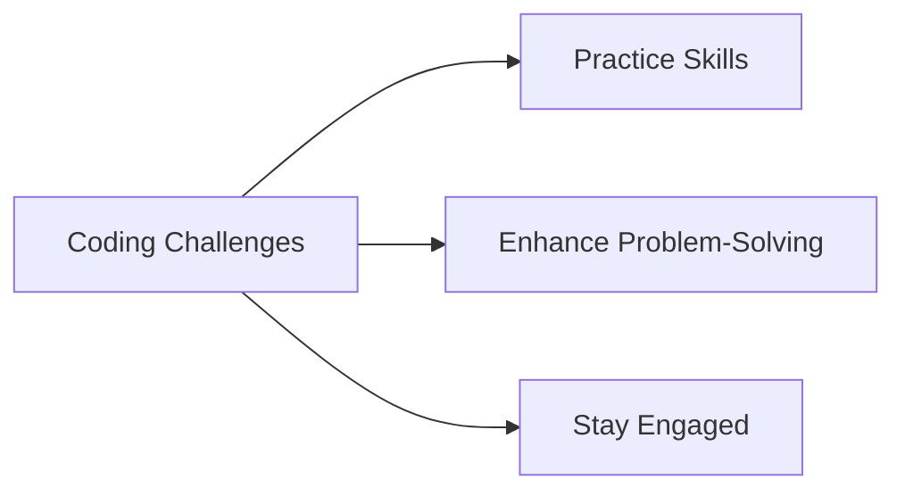
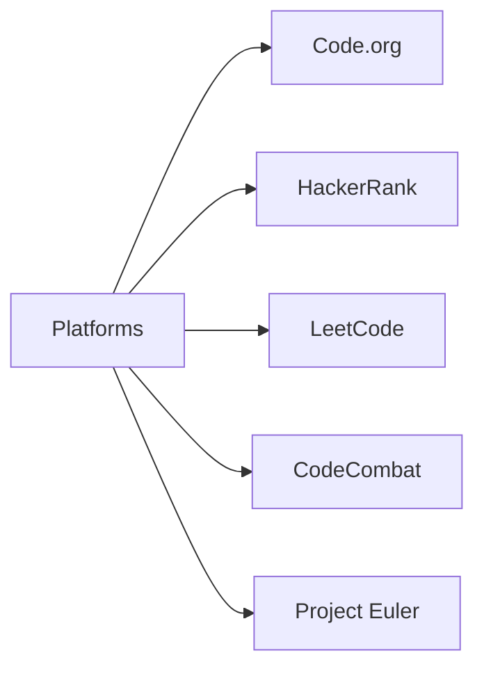

## 12.3.3 Coding Challenges

As you continue your journey in the world of coding, one of the most exciting and effective ways to enhance your skills is through coding challenges. These challenges are not just about writing code; they are about solving puzzles, thinking creatively, and applying what you've learned in new and interesting ways. Let's dive into the world of coding challenges and discover how they can help you become a better coder.

### What are Coding Challenges?

Coding challenges are problems or puzzles that require you to write code to solve them. They are designed to test and improve your coding skills, logical thinking, and problem-solving abilities. Whether you're a beginner or an experienced coder, there's always something new to learn from these challenges.

### Benefits of Coding Challenges

Coding challenges offer a multitude of benefits that can significantly enhance your programming journey:

#### Practice Coding Skills

By tackling coding challenges, you reinforce what you've learned by applying it to new problems. This hands-on practice is crucial for solidifying your understanding and improving your coding proficiency.

#### Boost Problem-Solving Abilities

Coding challenges require you to think logically and creatively. They push you to find efficient solutions and develop a deeper understanding of algorithms and data structures.

#### Stay Engaged and Motivated

Coding challenges make learning fun through gamified experiences and competitions. They keep you engaged and motivated to continue improving your skills.

#### Visualizing the Benefits

Here's a flowchart that illustrates how coding challenges can benefit you:

### Popular Platforms for Kids

There are several platforms that offer coding challenges specifically designed for young learners. Here are some popular ones:

#### Code.org Challenges

Code.org provides age-appropriate coding puzzles and projects that are perfect for beginners. It's a great place to start your coding challenge journey.

#### HackerRank

HackerRank offers challenges across various programming languages, including sections that are beginner-friendly. It's a platform where you can gradually increase the difficulty level as you improve.

#### LeetCode

LeetCode is known for its wide range of coding problems suitable for different skill levels. It's an excellent resource for practicing algorithms and data structures.

#### CodeCombat

CodeCombat teaches coding through interactive, game-based challenges. It's a fun way to learn programming concepts while playing a game.

#### Project Euler

For those who enjoy numbers and logic, Project Euler offers mathematical coding challenges that can be both challenging and rewarding.

#### Visualizing the Platforms

Here's a diagram showing the different platforms where you can find coding challenges:

### Interactive Exercise

To get started, choose one of the platforms mentioned above and complete a coding challenge. Once you've solved it, share your solution with the community or your peers. This not only helps you learn but also encourages collaboration and feedback.

### Visual Aids

Below are some screenshots of coding challenge platforms and examples of challenges to give you a glimpse of what to expect:

- **Code.org:** Features colorful, interactive puzzles that guide you through coding concepts.
- **HackerRank:** Offers a clean interface with a variety of challenges across different domains.
- **LeetCode:** Provides detailed problem descriptions and a robust testing environment.
- **CodeCombat:** Engages you with a game-like experience where you write code to control characters.
- **Project Euler:** Presents mathematical problems that require coding solutions.

### Conclusion

Coding challenges are a fantastic way to continue learning and growing as a programmer. They provide an opportunity to apply your knowledge, enhance your problem-solving skills, and stay motivated through fun and engaging activities. So, dive into the world of coding challenges and see how far you can go!

## Quiz Time!



### What are coding challenges?

- [x] Problems or puzzles that require writing code to solve
- [ ] A type of video game
- [ ] A way to learn drawing
- [ ] A cooking competition

> **Explanation:** Coding challenges are problems or puzzles that require you to write code to solve them, helping to improve your coding skills and problem-solving abilities.

### Which of the following is a benefit of coding challenges?

- [x] Practice coding skills
- [x] Boost problem-solving abilities
- [x] Stay engaged and motivated
- [ ] Learn to cook

> **Explanation:** Coding challenges help practice coding skills, boost problem-solving abilities, and keep learners engaged and motivated.

### Which platform offers age-appropriate coding puzzles for beginners?

- [x] Code.org
- [ ] HackerRank
- [ ] LeetCode
- [ ] Project Euler

> **Explanation:** Code.org provides age-appropriate coding puzzles and projects, making it a great starting point for beginners.

### What type of challenges does Project Euler focus on?

- [x] Mathematical coding challenges
- [ ] Game-based challenges
- [ ] Drawing challenges
- [ ] Cooking challenges

> **Explanation:** Project Euler offers mathematical coding challenges that are ideal for those who enjoy numbers and logic.

### Which platform teaches coding through interactive, game-based challenges?

- [x] CodeCombat
- [ ] HackerRank
- [ ] LeetCode
- [ ] Project Euler

> **Explanation:** CodeCombat teaches coding through interactive, game-based challenges, making learning fun and engaging.

### What is a key benefit of sharing your coding challenge solutions with others?

- [x] Encourages collaboration and feedback
- [ ] Makes you famous
- [ ] Guarantees a job
- [ ] Teaches you to cook

> **Explanation:** Sharing your coding challenge solutions with others encourages collaboration and feedback, which can enhance your learning experience.

### Which platform is known for its wide range of coding problems suitable for different skill levels?

- [x] LeetCode
- [ ] Code.org
- [ ] CodeCombat
- [ ] Project Euler

> **Explanation:** LeetCode is known for offering a wide range of coding problems suitable for different skill levels, making it a valuable resource for practicing algorithms and data structures.

### What is the main focus of HackerRank challenges?

- [x] Coding challenges across various programming languages
- [ ] Drawing challenges
- [ ] Cooking challenges
- [ ] Music challenges

> **Explanation:** HackerRank focuses on coding challenges across various programming languages, providing a platform for learners to practice and improve their skills.

### Which of the following is NOT a benefit of coding challenges?

- [ ] Practice coding skills
- [ ] Boost problem-solving abilities
- [ ] Stay engaged and motivated
- [x] Learn to cook

> **Explanation:** Coding challenges are designed to practice coding skills, boost problem-solving abilities, and keep learners engaged and motivated, but they do not teach cooking.

### Coding challenges can help you stay engaged and motivated in your learning journey.

- [x] True
- [ ] False

> **Explanation:** True. Coding challenges make learning fun and engaging through gamified experiences, helping learners stay motivated.


