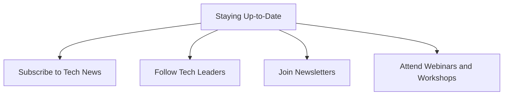

---

linkTitle: "12.3.4 Staying Up-to-Date"
title: "Staying Up-to-Date: Keeping Your Coding Skills Current"
description: "Learn the importance of staying updated with the latest in technology and coding, and discover practical ways to keep your skills sharp."
categories:
- Technology
- Education
- Coding
tags:
- Tech News
- Flutter
- Learning
- Coding Skills
- Continuous Improvement
date: 2024-10-25
type: docs
nav_weight: 1234000
---

## 12.3.4 Staying Up-to-Date

In the fast-paced world of technology, staying up-to-date is crucial for anyone who wants to keep their coding skills sharp and relevant. As young coders, understanding the importance of continuous learning and being aware of the latest trends can open up new opportunities and inspire innovation. Let's explore why staying current matters and how you can make it a fun and rewarding part of your coding journey.

### Why Staying Current Matters

Technology is constantly evolving, with new tools, languages, and frameworks emerging all the time. By staying informed about these changes, you can:

- **Enhance Your Skills:** Learning about new technologies can improve your coding abilities and make you a more versatile programmer.
- **Stay Relevant:** As technology changes, so do the skills that are in demand. Keeping up-to-date ensures that your skills remain relevant in the ever-changing tech landscape.
- **Discover New Opportunities:** Being aware of the latest trends can help you identify new projects, tools, or areas of interest that you might want to explore.
- **Inspire Innovation:** Exposure to new ideas and technologies can spark creativity and lead to innovative solutions in your projects.

### Ways to Stay Up-to-Date

Here are some practical ways to keep your knowledge current and stay engaged with the tech community:

#### Subscribe to Tech News

Following tech news websites is a great way to learn about the latest developments in technology. Websites like **TechCrunch**, **Wired**, and **Ars Technica** offer articles, reviews, and insights into the tech world. By reading these regularly, you can stay informed about new gadgets, software updates, and industry trends.

#### Follow Influential Tech Leaders

Social media platforms like **Twitter** and **LinkedIn** are excellent places to follow influential tech leaders, developers, and educators. These individuals often share valuable insights, tips, and updates about the tech industry. By following them, you can gain inspiration and learn from their experiences.

#### Join Newsletters

Subscribing to newsletters focused on programming languages like **Flutter** and **Dart** can provide you with regular updates, tutorials, and resources. These newsletters often include expert advice and highlight new tools or libraries that you can incorporate into your projects.

#### Attend Webinars and Workshops

Participating in online webinars and workshops is a fantastic way to learn from experts and engage with the tech community. These events often cover a wide range of topics, from new programming techniques to discussions about the future of technology. They also provide opportunities to ask questions and interact with other learners.

### Real-World Example

Consider the story of a young developer named Alex. By following a prominent tech leader on Twitter, Alex learned about a new tool that simplified app development. This discovery not only helped Alex improve their current project but also inspired them to explore other innovative tools, ultimately enhancing their coding skills and expanding their knowledge.

### Interactive Exercise

Let's put this into practice! Choose one source to follow, such as a tech news website or a social media expert. Spend some time exploring their content and note down a few interesting things you learn. Share your findings with a friend or family member and discuss how this new knowledge could be applied to your coding projects.

### Visual Aids

To help you get started, here are some logos and screenshots of recommended news sites, social media profiles, and webinar platforms:

- **TechCrunch**: 
- **Wired**: 
- **Twitter**: 
- **LinkedIn**: 

By staying up-to-date, you can ensure that your coding skills remain sharp and relevant, opening up a world of possibilities for your future projects and career. Remember, the tech world is always changing, and being a part of that change is both exciting and rewarding!

## Quiz Time!



### Why is it important to stay up-to-date with technology?

- [x] To enhance skills and stay relevant
- [ ] To avoid learning new things
- [ ] To only focus on old technologies
- [ ] To ignore industry trends

> **Explanation:** Staying up-to-date helps enhance skills, stay relevant, and discover new opportunities.

### Which of the following is a tech news website you can follow?

- [x] TechCrunch
- [ ] Facebook
- [ ] Instagram
- [ ] Snapchat

> **Explanation:** TechCrunch is a well-known tech news website that provides updates on the latest in technology.

### What can you gain by following influential tech leaders on social media?

- [x] Insights and inspiration
- [ ] Free gadgets
- [ ] Guaranteed job offers
- [ ] Unlimited internet access

> **Explanation:** Following tech leaders can provide valuable insights and inspiration for your projects.

### What is a benefit of joining newsletters related to Flutter and Dart?

- [x] Receiving regular updates and tutorials
- [ ] Getting free coding books
- [ ] Access to exclusive coding clubs
- [ ] Unlimited access to all programming languages

> **Explanation:** Newsletters provide regular updates, tutorials, and resources related to specific programming languages.

### How can attending webinars and workshops help you?

- [x] By learning from experts and engaging with the community
- [ ] By avoiding new technologies
- [ ] By only focusing on theory
- [ ] By ignoring practical applications

> **Explanation:** Webinars and workshops offer opportunities to learn from experts and engage with the tech community.

### What is a real-world benefit of staying up-to-date with tech trends?

- [x] Discovering new tools and improving projects
- [ ] Avoiding new technologies
- [ ] Only focusing on outdated methods
- [ ] Ignoring industry changes

> **Explanation:** Staying informed about tech trends can help you discover new tools and improve your projects.

### Which platform is recommended for following tech leaders?

- [x] Twitter
- [ ] TikTok
- [ ] Pinterest
- [ ] Snapchat

> **Explanation:** Twitter is a popular platform for following tech leaders and staying informed about industry updates.

### What should you do after selecting a source to follow for tech updates?

- [x] Explore their content and share your findings
- [ ] Ignore their updates
- [ ] Only read headlines
- [ ] Avoid discussing with others

> **Explanation:** Exploring content and sharing findings helps reinforce learning and encourages discussion.

### Which of the following is NOT a way to stay up-to-date with technology?

- [ ] Subscribe to tech news
- [ ] Follow tech leaders
- [ ] Join newsletters
- [x] Avoid learning new things

> **Explanation:** Avoiding learning new things is not a way to stay up-to-date; continuous learning is essential.

### Staying up-to-date with technology is important for discovering new opportunities.

- [x] True
- [ ] False

> **Explanation:** Staying informed about the latest trends can help identify new projects, tools, or areas of interest.


