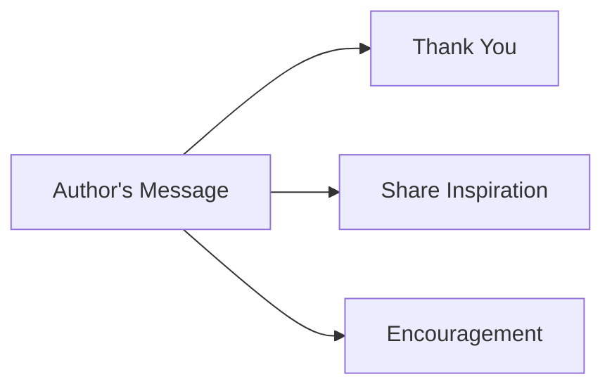

## 12.4.1 A Message from the Author

Dear Young Coders,

As we reach the end of our journey together in "Kids Can Code: Introducing Flutter to Young Minds," I want to take a moment to express my heartfelt gratitude and share some final thoughts with you.

### Expressing Gratitude

First and foremost, thank you for choosing this book and dedicating your time to learning about Flutter and coding. Your curiosity and enthusiasm are truly inspiring. It's been a joy to guide you through the exciting world of coding, and I hope you've found the experience as rewarding as I have.

### Sharing Inspiration

The inspiration to write this book came from my own journey with coding. I remember the first time I wrote a line of code and saw it come to life on the screen. It was like magic! That sense of wonder and possibility is something I wanted to share with you. Coding is not just about writing instructions for computers; it's about creating, solving problems, and bringing ideas to life. My passion for teaching young minds stems from the belief that you are the future innovators, and I am excited to see what you will create.

### Encouragement for the Future

As you continue your coding journey, remember that learning is a lifelong adventure. There will be challenges along the way, but each one is an opportunity to grow and learn. You have the potential to achieve great things, and I encourage you to keep exploring, experimenting, and expanding your skills. Whether you dream of building apps, designing games, or solving real-world problems, know that you have the tools and the talent to make it happen.

### Farewell Flowchart

To visualize this message, here's a simple flowchart that captures the essence of my farewell message:

### Interactive Element: A Thank-You Note to Yourself

Before we part ways, I invite you to write a thank-you note to yourself. Reflect on your progress, the challenges you've overcome, and the new skills you've acquired. Acknowledge your commitment and celebrate your achievements. This note will serve as a reminder of how far you've come and motivate you to keep moving forward.

### Visual Aid: A Personalized Illustration

Imagine me, your guide, interacting with a group of young coders just like you. Together, we're exploring the endless possibilities of coding, with smiles on our faces and excitement in our hearts. This illustration is a reminder that you're never alone on this journey—there's a whole community of coders cheering you on.

### Final Thoughts

As we say goodbye, remember that this is not the end but the beginning of your coding adventure. Keep your curiosity alive, stay passionate, and never stop learning. The world of technology is vast and full of opportunities, and I can't wait to see the amazing things you will accomplish.

Thank you once again for being part of this journey. I wish you all the best in your future endeavors, and I hope our paths cross again in the world of coding.

Happy coding!

Warm regards,

[Author's Name]

---

## Quiz Time!



### What is the main purpose of the author's message?

- [x] To express gratitude and encourage readers
- [ ] To introduce a new coding concept
- [ ] To provide a coding challenge
- [ ] To summarize the book's content

> **Explanation:** The author's message is intended to express gratitude to the readers and encourage them to continue their coding journey.

### What inspired the author to write this book?

- [x] Their own journey with coding
- [ ] A request from a publisher
- [ ] A popular coding trend
- [ ] A school project

> **Explanation:** The author was inspired by their own journey with coding and wanted to share the sense of wonder and possibility with young readers.

### What does the author encourage readers to do?

- [x] Continue exploring and expanding their skills
- [ ] Stop coding after finishing the book
- [ ] Only focus on Flutter development
- [ ] Avoid challenges in coding

> **Explanation:** The author encourages readers to continue exploring, experimenting, and expanding their skills, emphasizing that learning is a lifelong adventure.

### What is the purpose of the farewell flowchart?

- [x] To visualize the author's message
- [ ] To introduce a new coding concept
- [ ] To provide a step-by-step guide
- [ ] To summarize the book's chapters

> **Explanation:** The farewell flowchart is used to visually represent the key elements of the author's message: gratitude, inspiration, and encouragement.

### What interactive element does the author suggest?

- [x] Writing a thank-you note to themselves
- [ ] Creating a new Flutter app
- [ ] Solving a coding puzzle
- [ ] Designing a game

> **Explanation:** The author suggests that readers write a thank-you note to themselves, acknowledging their progress and commitment.

### What does the personalized illustration depict?

- [x] The author interacting with young coders
- [ ] A complex coding diagram
- [ ] A new app design
- [ ] A famous coder

> **Explanation:** The personalized illustration depicts the author interacting with young coders, symbolizing the shared journey and community support.

### What is the author's final wish for the readers?

- [x] To continue their coding adventure
- [ ] To stop coding and try something new
- [ ] To focus only on Flutter
- [ ] To read more books

> **Explanation:** The author's final wish is for readers to continue their coding adventure, keeping their curiosity alive and staying passionate.

### How does the author describe the world of technology?

- [x] Vast and full of opportunities
- [ ] Limited and challenging
- [ ] Only for experts
- [ ] Uninteresting

> **Explanation:** The author describes the world of technology as vast and full of opportunities, encouraging readers to explore and innovate.

### What does the author hope for the readers' future?

- [x] That they achieve great things
- [ ] That they face many challenges
- [ ] That they stop coding
- [ ] That they only use Flutter

> **Explanation:** The author hopes that readers achieve great things, using their skills and potential to make a positive impact.

### True or False: The author's message is the end of the readers' coding journey.

- [ ] True
- [x] False

> **Explanation:** False. The author's message is not the end but the beginning of the readers' coding adventure, encouraging them to continue learning and exploring.


