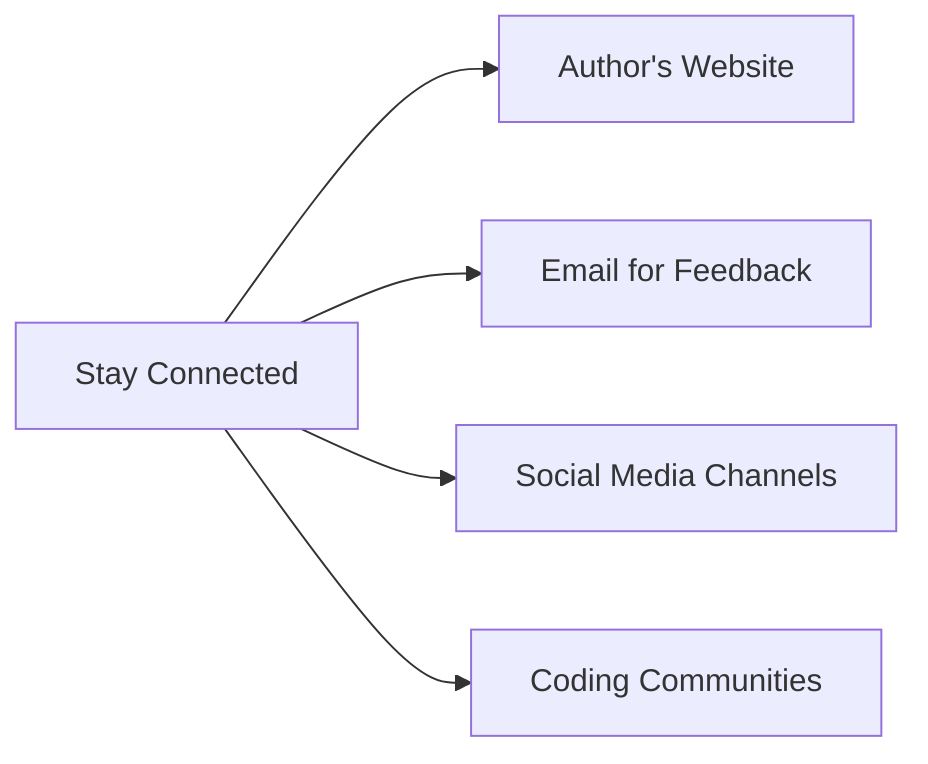

---

linkTitle: "12.4.2 Staying Connected"
title: "Staying Connected: Keep Learning and Growing in the Coding Community"
description: "Discover ways to stay connected with the author and the coding community, fostering ongoing support and learning opportunities for young coders."
categories:
- Coding
- Community
- Learning
tags:
- Flutter
- Kids Coding
- Community Engagement
- Online Learning
- Programming
date: 2024-10-25
type: docs
nav_weight: 12420

canonical: "https://fluttermasterylibrary.com/5/12/4/2"
license: "© 2023 Tokenizer Inc. CC BY-NC-SA 4.0"
---

## 12.4.2 Staying Connected: Keep Learning and Growing in the Coding Community

As you reach the end of this book, it's important to remember that your coding journey is just beginning. Staying connected with the author, fellow coders, and the broader programming community can provide you with invaluable support, inspiration, and learning opportunities. Let's explore some ways you can keep in touch and continue to grow as a coder.

### Provide Contact Information

One of the best ways to stay connected is by reaching out directly. Here are some safe and age-appropriate ways to get in touch:

- **Author's Website:** Visit [www.kidscancode.com](http://www.kidscancode.com) for additional resources, updates, and a blog filled with coding tips and projects. The website is a hub for young coders to explore new ideas and find inspiration.
  
- **Email for Feedback:** You can send your thoughts, questions, or feedback to the dedicated email address: feedback@kidscancode.com. This is a great way to share your experiences or seek advice on your coding projects.

### Encourage Joining Communities

Being part of a coding community can greatly enhance your learning experience. Here are some benefits and suggestions for joining these communities:

- **Online Coding Forums:** Platforms like [Scratch Community](https://scratch.mit.edu/discuss/) and [Code.org's Community](https://support.code.org/hc/en-us/community/topics) offer spaces where you can ask questions, share projects, and learn from others.

- **Local Coding Clubs:** Check if there are any coding clubs or workshops in your area. These can provide hands-on experience and the chance to meet other young coders.

- **Open Source Projects:** Contributing to open source projects on platforms like GitHub can be a rewarding way to apply your skills and collaborate with others.

### Social Media and Online Presence

Stay updated with the latest content and connect with the author through various online platforms:

- **YouTube Channel:** Subscribe to the "Kids Can Code" YouTube channel for video tutorials, project walkthroughs, and coding challenges. Visual learning can be a powerful tool in understanding complex concepts.

- **Social Media Accounts:** Follow on Instagram and Twitter (@KidsCanCode) for daily coding tips, motivational quotes, and updates on new projects and resources.

### Mermaid.js Connection Diagram

To visualize how you can stay connected, here's a simple diagram:

### Interactive Exercise

Here's a fun exercise to help you stay connected:

1. **Visit the Author's Website:** Explore the resources available and bookmark the site for future reference.

2. **Send an Email:** Write a short email to feedback@kidscancode.com sharing your favorite part of the book or a project you're working on.

3. **Follow on Social Media:** Choose one social media platform and follow the "Kids Can Code" account to receive regular updates.

4. **Join a Coding Community:** Sign up for an online forum or local club and introduce yourself. Share a project or ask a question to start engaging with the community.

### Visual Aids

Below are some icons representing the various ways to stay connected:

-  **Author's Website**
-  **Email for Feedback**
-  **Social Media Channels**
-  **Coding Communities**

These icons can serve as reminders of the different avenues available to you for staying connected and continuing your coding journey.

By staying connected, you not only enhance your own learning but also contribute to a vibrant community of young coders. Remember, coding is not just about writing code; it's about collaboration, creativity, and continuous learning. Keep exploring, keep coding, and most importantly, keep having fun!

## Quiz Time!



### What is one way to stay connected with the author?

- [x] Visit the author's website
- [ ] Call the author directly
- [ ] Send a letter by mail
- [ ] Visit the author's home

> **Explanation:** Visiting the author's website is a safe and effective way to stay updated with new resources and information.

### Which platform is suggested for contributing to open source projects?

- [x] GitHub
- [ ] Facebook
- [ ] Instagram
- [ ] LinkedIn

> **Explanation:** GitHub is a popular platform for hosting and contributing to open source projects.

### What is the email address provided for feedback?

- [x] feedback@kidscancode.com
- [ ] support@kidscancode.com
- [ ] info@kidscancode.com
- [ ] contact@kidscancode.com

> **Explanation:** The email address feedback@kidscancode.com is specifically provided for readers to send their feedback.

### Which social media platform is NOT mentioned for staying connected?

- [x] LinkedIn
- [ ] Instagram
- [ ] Twitter
- [ ] YouTube

> **Explanation:** LinkedIn is not mentioned as a platform for staying connected in this context.

### What is a benefit of joining a coding community?

- [x] Learning from others
- [x] Sharing your projects
- [ ] Getting free gadgets
- [ ] Avoiding all challenges

> **Explanation:** Joining a coding community allows you to learn from others and share your projects, enhancing your coding skills.

### What type of content can you find on the "Kids Can Code" YouTube channel?

- [x] Video tutorials
- [ ] Movie trailers
- [ ] Music videos
- [ ] Cooking shows

> **Explanation:** The "Kids Can Code" YouTube channel offers video tutorials, project walkthroughs, and coding challenges.

### What should you do after visiting the author's website?

- [x] Bookmark the site for future reference
- [ ] Forget about it
- [ ] Delete your browsing history
- [ ] Share your password

> **Explanation:** Bookmarking the site ensures you can easily return to it for future resources and updates.

### Which of the following is NOT a suggested way to stay connected?

- [x] Visiting the author's home
- [ ] Sending an email
- [ ] Following on social media
- [ ] Joining a coding community

> **Explanation:** Visiting the author's home is not a suggested or appropriate way to stay connected.

### What is the purpose of the Mermaid.js diagram in this section?

- [x] To visualize ways to stay connected
- [ ] To show a coding project
- [ ] To display a game design
- [ ] To illustrate a math problem

> **Explanation:** The Mermaid.js diagram is used to visualize the different ways readers can stay connected with the author and the community.

### True or False: Staying connected with the coding community can help you learn and grow as a coder.

- [x] True
- [ ] False

> **Explanation:** Staying connected with the coding community provides support, inspiration, and learning opportunities, helping you grow as a coder.


