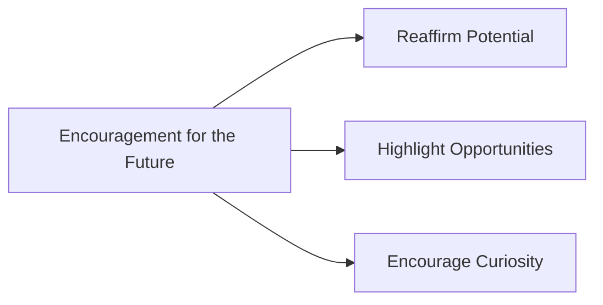

## 12.4.3 Encouragement for the Future

As we reach the end of our coding journey together, it's time to look forward to the exciting adventures that await you in the world of technology. You've come a long way, and your potential is limitless. Let's explore how you can continue to grow, learn, and innovate.

### Reaffirm Your Potential

Remember, every great coder started just like you—curious, eager to learn, and ready to explore. You have the power to create amazing things, whether it's a fun game, a helpful app, or something the world has never seen before. Your journey in coding is just beginning, and the skills you've learned will serve as a strong foundation for whatever you choose to build next.

### Highlight Future Opportunities

The world of technology is vast and full of opportunities. From developing apps that make life easier to creating games that entertain millions, your coding skills can lead to exciting careers and personal projects. Imagine working on cutting-edge technologies like virtual reality, artificial intelligence, or even space exploration. The possibilities are endless, and your journey can take you anywhere you dream.

### Encourage Curiosity

Curiosity is your greatest tool as a coder. Never stop asking questions, experimenting, and trying new things. Mistakes are simply stepping stones to success, and each one brings you closer to mastering your craft. Embrace challenges as opportunities to learn and grow, and don't be afraid to venture into new areas of technology.

### Interactive Exercise: Set a New Goal

Let's put your enthusiasm into action! Take a moment to set a new goal for yourself in coding. It could be learning a new programming language, building another app, or participating in a coding event. Write down your goal and the steps you'll take to achieve it. Remember, every small step brings you closer to your dreams.

### Visual Inspiration

Imagine the future of technology—robots assisting in daily tasks, apps that connect people across the globe, and innovations that make the world a better place. Picture yourself as a part of this future, contributing your unique ideas and creations. Here are some motivational quotes to inspire you:

- "The best way to predict the future is to invent it." – Alan Kay
- "Success is not the key to happiness. Happiness is the key to success. If you love what you are doing, you will be successful." – Albert Schweitzer
- "The only way to do great work is to love what you do." – Steve Jobs

### Safety Considerations

As you continue your coding journey, remember to involve your parents or guardians when engaging in online communities, sharing your projects, or setting up personal websites. It's important to stay safe and responsible while exploring the digital world.

### Progressive Learning

Your journey doesn't end here. Build upon what you've learned, explore new concepts, and keep pushing the boundaries of your knowledge. Each chapter of this book has equipped you with the tools to tackle new challenges and create impactful projects.

### Real-World Relevance

The skills you've gained can be applied to solve real-world problems and create projects that make a difference. Whether it's developing an app to help your community or designing a game that brings joy to others, your coding abilities have the power to change the world.

### Inclusion of Best Practices

As you continue to code, remember the importance of ethical coding, continuous learning, and community engagement. These practices will support your ongoing development and help you become a responsible and innovative coder.

## Quiz Time!



### What is one of the greatest tools you have as a coder?

- [x] Curiosity
- [ ] Perfection
- [ ] Speed
- [ ] Competition

> **Explanation:** Curiosity drives you to explore, learn, and grow as a coder, leading to innovation and creativity.

### What should you do when you make a mistake in coding?

- [x] Learn from it
- [ ] Ignore it
- [ ] Quit coding
- [ ] Blame others

> **Explanation:** Mistakes are learning opportunities that help you improve and become a better coder.

### What can your coding skills lead to in the future?

- [x] Exciting careers and personal projects
- [ ] Only simple tasks
- [ ] Limited opportunities
- [ ] No real-world application

> **Explanation:** Coding skills open doors to a wide range of exciting careers and personal projects in technology.

### How can you contribute to the future of technology?

- [x] By creating and innovating
- [ ] By following others
- [ ] By avoiding challenges
- [ ] By staying in your comfort zone

> **Explanation:** Creating and innovating allows you to contribute to the future of technology and make a difference.

### What is an important aspect of being a responsible coder?

- [x] Ethical coding
- [ ] Ignoring feedback
- [ ] Working alone
- [ ] Avoiding new technologies

> **Explanation:** Ethical coding ensures that your work is responsible and beneficial to society.

### What should you do to stay safe while exploring the digital world?

- [x] Involve parents or guardians
- [ ] Share personal information freely
- [ ] Ignore online safety
- [ ] Trust all online sources

> **Explanation:** Involving parents or guardians helps ensure safe and responsible exploration of the digital world.

### What is a good way to continue learning after finishing this book?

- [x] Set new coding goals
- [ ] Stop coding
- [ ] Only read about coding
- [ ] Avoid new challenges

> **Explanation:** Setting new coding goals encourages continuous learning and growth.

### What can you do with the skills you've gained from this book?

- [x] Solve real-world problems
- [ ] Only create small projects
- [ ] Avoid using them
- [ ] Keep them to yourself

> **Explanation:** The skills you've gained can be applied to solve real-world problems and create impactful projects.

### Why is community engagement important for coders?

- [x] It supports ongoing development
- [ ] It limits creativity
- [ ] It isolates you
- [ ] It discourages learning

> **Explanation:** Community engagement supports ongoing development and encourages collaboration and learning.

### True or False: Your coding journey ends with this book.

- [ ] True
- [x] False

> **Explanation:** Your coding journey continues beyond this book as you explore new opportunities and challenges.



Embrace the future with confidence and enthusiasm, knowing that you have the skills and potential to make a difference. Your coding journey is just beginning, and the world is waiting for your unique contributions. Keep learning, keep creating, and most importantly, keep having fun!
