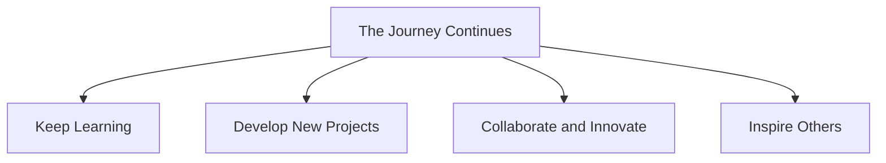

## 12.4.4 The Journey Continues

As we reach the end of this book, it's important to remember that your coding journey is far from over. In fact, it's just beginning! The world of technology is vast and ever-changing, offering endless opportunities for learning, creativity, and innovation. Let's explore how you can continue this exciting adventure and make the most of your coding skills.

### Continuous Learning: The Key to Growth

Technology evolves at a rapid pace, and there's always something new to discover. Whether it's a new programming language, a cutting-edge tool, or an innovative concept, staying curious and open to learning will keep your skills sharp and relevant.

- **Stay Updated:** Follow tech blogs, subscribe to coding newsletters, and join online forums to keep up with the latest trends and developments.
- **Take Courses:** Enroll in online courses or attend workshops to deepen your understanding of specific topics or learn new skills.
- **Read Books:** Explore books on advanced coding topics or biographies of tech innovators to gain insights and inspiration.

### Future Adventures: Where Coding Can Take You

Coding is a powerful tool that can open doors to countless possibilities. Here are a few paths you might explore:

- **Create New Apps and Games:** Use your skills to develop innovative apps or games that solve problems or entertain users.
- **Build Websites:** Design and build websites for yourself, friends, or local businesses, showcasing your creativity and technical expertise.
- **Start a Tech Project or Business:** Turn your ideas into reality by launching your own tech project or startup. With determination and hard work, you can make a real impact.

### Stay Inspired: Finding Motivation in Everyday Life

Inspiration can come from anywhere—nature, art, people, or even everyday challenges. Here are some ways to keep your coding projects meaningful and exciting:

- **Observe Your Surroundings:** Look for problems that need solving or areas where technology can make a difference.
- **Connect with Other Coders:** Join coding communities or attend meetups to share ideas, collaborate, and learn from others.
- **Tackle Real-World Problems:** Use your skills to address issues like environmental sustainability, education, or healthcare.

### Visualizing Your Journey

To help you visualize the ongoing adventure, here's a Mermaid.js flowchart illustrating the different paths your coding journey might take:

### Interactive Exercise: Draw Your Roadmap

Take a moment to reflect on your coding journey so far. Grab a piece of paper and draw a roadmap that includes:

- **Past Achievements:** Mark the milestones you've reached, such as completing this book, building your first app, or learning a new language.
- **Future Aspirations:** Outline your goals and dreams, whether it's mastering a new skill, launching a project, or collaborating with others.

### Visual Aids: The Open Road Ahead

Imagine your coding journey as an open road, full of possibilities and adventures. Picture paths leading to different tech innovations, each representing a new opportunity to learn, create, and inspire. Let this vision motivate you to keep exploring and pushing the boundaries of what's possible.

### Conclusion: Embrace the Adventure

As you continue your journey, remember that coding is not just about writing code—it's about solving problems, creating solutions, and making a positive impact. Stay curious, keep learning, and embrace the endless adventure that coding offers. Your journey is unique, and the possibilities are limitless. So go out there, explore, and make your mark on the world!

## Quiz Time!



### What is one way to stay updated with the latest trends in technology?

- [x] Follow tech blogs and subscribe to coding newsletters
- [ ] Only rely on school textbooks
- [ ] Avoid online resources
- [ ] Ignore new developments

> **Explanation:** Following tech blogs and subscribing to newsletters helps you stay informed about the latest trends and developments in technology.

### What can coding lead to in the future?

- [x] Creating new apps and games
- [ ] Only working in non-tech fields
- [ ] Avoiding innovation
- [ ] Limiting creativity

> **Explanation:** Coding can lead to creating new apps, games, and other innovative projects, opening up numerous opportunities.

### How can you find inspiration for coding projects?

- [x] Observe your surroundings and tackle real-world problems
- [ ] Only work on projects assigned by others
- [ ] Avoid looking for new ideas
- [ ] Ignore everyday challenges

> **Explanation:** Observing your surroundings and addressing real-world problems can provide meaningful inspiration for coding projects.

### What is a benefit of joining coding communities?

- [x] Sharing ideas and learning from others
- [ ] Working in isolation
- [ ] Avoiding collaboration
- [ ] Ignoring feedback

> **Explanation:** Joining coding communities allows you to share ideas, collaborate, and learn from others, enhancing your skills and knowledge.

### What should you include in your coding roadmap?

- [x] Past achievements and future aspirations
- [ ] Only past failures
- [ ] Avoid setting goals
- [ ] Ignore future plans

> **Explanation:** A coding roadmap should include both past achievements and future aspirations to help guide your journey.

### Why is continuous learning important in technology?

- [x] Technology is always evolving, and there's always something new to learn
- [ ] Technology never changes
- [ ] Learning is only for beginners
- [ ] Avoid learning new things

> **Explanation:** Continuous learning is crucial because technology is constantly evolving, and staying updated is essential for growth.

### What can coding help you address in the real world?

- [x] Environmental sustainability, education, or healthcare
- [ ] Only entertainment
- [ ] Avoid real-world problems
- [ ] Ignore societal issues

> **Explanation:** Coding can be used to address real-world issues like environmental sustainability, education, and healthcare.

### How can you make your coding projects exciting?

- [x] Find inspiration from your surroundings and other coders
- [ ] Only work on repetitive tasks
- [ ] Avoid seeking new ideas
- [ ] Ignore creativity

> **Explanation:** Finding inspiration from your surroundings and other coders can keep your projects exciting and meaningful.

### What is the purpose of a Mermaid.js flowchart in this context?

- [x] To visualize the different paths of a coding journey
- [ ] To confuse readers
- [ ] To avoid planning
- [ ] To ignore progress

> **Explanation:** A Mermaid.js flowchart helps visualize the different paths and possibilities in a coding journey, aiding in planning and understanding.

### True or False: Coding is only about writing code.

- [ ] True
- [x] False

> **Explanation:** False. Coding is not just about writing code; it's about solving problems, creating solutions, and making a positive impact.


