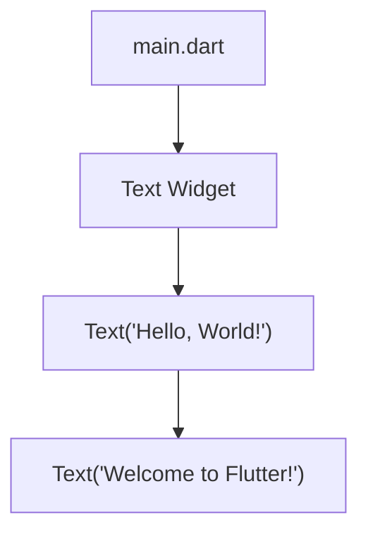

## 2.1.3 Modifying Text in Your First Flutter App

Welcome back, young coders! Now that you've created your first Flutter app, it's time to make it truly yours by modifying the text displayed on the screen. This is a fun and simple way to start customizing your app and make it say exactly what you want. Let's dive into how you can change the text in your Flutter app.

### Objective

The goal of this section is to show you how to customize the text displayed in your app. By the end of this lesson, you'll be able to change the text to say anything you like, whether it's your name, a fun message, or something else entirely!

### Explanation

In Flutter, text is displayed using a special tool called a **Text widget**. This widget is like a little box that holds the words you want to show on the screen. By changing the words inside this box, you can make your app say anything you want. Let's see how to do this step by step.

### Step-by-Step Guide

#### 1. Open `main.dart`

First, we need to open the file where our app's code lives. This file is called `main.dart`. Here's how you can find and open it:

- Open your code editor (like Visual Studio Code or Android Studio).
- In the project explorer on the left side, look for a folder named `lib`.
- Inside the `lib` folder, you'll find the `main.dart` file. Click on it to open.

#### 2. Find the Text Widget

Now that you have `main.dart` open, let's find the line of code that displays the text. Look for a line that looks like this:

```dart
Text('Hello, World!')
```

This line is telling Flutter to display the words "Hello, World!" on the screen.

#### 3. Change the Message

Here's the fun part! You can change the text inside the quotes to anything you like. Let's try changing it to "Welcome to Flutter!". Here's how:

- Click inside the quotes where it says `'Hello, World!'`.
- Delete the words "Hello, World!" and type in "Welcome to Flutter!" instead.

Your code should now look like this:

```dart
child: Text('Welcome to Flutter!'),
```

#### 4. Save and Run

After making changes to your code, it's important to save your work and run the app again to see the changes. Here's how:

- Save the file by clicking on the save icon or pressing `Ctrl + S` (Windows) or `Cmd + S` (Mac).
- Run the app by clicking the play button in your code editor or typing `flutter run` in the terminal.

Once the app is running, you should see your new message displayed on the screen!

### Code Example

Here's the complete code snippet with the modified text:

```dart
import 'package:flutter/material.dart';

void main() {
  runApp(MyApp());
}

class MyApp extends StatelessWidget {
  @override
  Widget build(BuildContext context) {
    return MaterialApp(
      home: Scaffold(
        appBar: AppBar(
          title: Text('My First Flutter App'),
        ),
        body: Center(
          child: Text('Welcome to Flutter!'), // Modified text here
        ),
      ),
    );
  }
}
```

### Visuals

Let's use a diagram to highlight the part of the code you changed. Here's a simple Mermaid.js diagram showing the modification:



### Language and Creativity

Feel free to get creative with the text you display! You can write a short message, your name, or even a fun greeting. Here are some ideas to get you started:

- "Hello, [Your Name]!"
- "Flutter is Fun!"
- "Coding Rocks!"

### Engagement Challenge

Now it's your turn! Try writing a short message or your name in the app. What will you make your app say? Share your creative messages with friends or family and see what fun ideas they come up with too!

## Quiz Time!



### What is the purpose of the Text widget in Flutter?

- [x] To display text on the screen
- [ ] To create buttons
- [ ] To store data
- [ ] To handle user input

> **Explanation:** The Text widget in Flutter is used to display text on the screen.

### Where do you find the `main.dart` file in a Flutter project?

- [ ] In the `assets` folder
- [x] In the `lib` folder
- [ ] In the `images` folder
- [ ] In the `test` folder

> **Explanation:** The `main.dart` file is located in the `lib` folder of a Flutter project.

### What should you do after modifying the text in your Flutter app?

- [ ] Close the editor
- [x] Save the file and run the app
- [ ] Delete the project
- [ ] Change the app icon

> **Explanation:** After modifying the text, you should save the file and run the app to see the changes.

### What is the default text displayed in a new Flutter app?

- [ ] "Welcome to Flutter!"
- [x] "Hello, World!"
- [ ] "Flutter is Fun!"
- [ ] "My First App"

> **Explanation:** The default text displayed in a new Flutter app is "Hello, World!".

### How can you save changes in your code editor?

- [ ] By closing the file
- [x] By clicking the save icon or pressing `Ctrl + S` (Windows) or `Cmd + S` (Mac)
- [ ] By restarting the computer
- [ ] By deleting the file

> **Explanation:** You can save changes by clicking the save icon or pressing `Ctrl + S` (Windows) or `Cmd + S` (Mac).

### What is the purpose of the `runApp` function in Flutter?

- [x] To start the Flutter application
- [ ] To stop the application
- [ ] To display images
- [ ] To handle user input

> **Explanation:** The `runApp` function is used to start the Flutter application.

### What should you modify to change the text displayed in your app?

- [ ] The app icon
- [x] The text inside the Text widget
- [ ] The app name
- [ ] The background color

> **Explanation:** To change the text displayed in your app, modify the text inside the Text widget.

### What is the role of the `MaterialApp` widget in Flutter?

- [x] To provide a basic structure for the app
- [ ] To handle user input
- [ ] To display images
- [ ] To store data

> **Explanation:** The `MaterialApp` widget provides a basic structure for the app, including themes and navigation.

### Can you display multiple lines of text using the Text widget?

- [x] True
- [ ] False

> **Explanation:** Yes, you can display multiple lines of text using the Text widget by setting the `maxLines` property.

### What is a fun way to engage with your app's text customization?

- [x] Write a short message or your name
- [ ] Delete the Text widget
- [ ] Change the app's theme
- [ ] Remove the app bar

> **Explanation:** A fun way to engage with your app's text customization is to write a short message or your name.



Great job! You've learned how to modify text in your Flutter app. Keep experimenting and have fun customizing your app!
