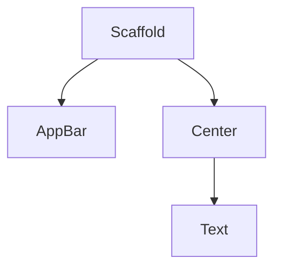

## 2.1.4 Exploring Widgets

Welcome to the exciting world of Flutter widgets! In this section, we'll dive into the building blocks of any Flutter app: widgets. Think of widgets as the LEGO pieces of your app. Just like how you can build anything with LEGO bricks, you can create amazing apps with widgets!

### What Are Widgets?

Widgets are the fundamental elements that make up the user interface (UI) in a Flutter app. They are like small pieces of a puzzle that fit together to create the whole picture. Each widget has a specific role, whether it's displaying text, arranging layout, or handling user interactions.

### Key Widgets Introduced

Let's explore some of the key widgets you'll use to build your first Flutter app:

#### Text Widget

The **Text** widget is used to display text on the screen. It's one of the simplest widgets but incredibly powerful. You can customize the text's style, size, color, and more.

```dart
Text(
  'Hello, Flutter!',
  style: TextStyle(fontSize: 24, color: Colors.blue),
)
```

#### Center Widget

The **Center** widget centers its child widget within the available space. It's perfect for making sure your content is right in the middle of the screen.

```dart
Center(
  child: Text('Centered Text'),
)
```

#### Scaffold Widget

The **Scaffold** widget provides a basic structure for your app. It includes spaces for an app bar, a body, and other elements like floating action buttons. It's like the frame of a house, giving your app a solid foundation.

```dart
Scaffold(
  appBar: AppBar(
    title: Text('My First App'),
  ),
  body: Center(
    child: Text('Hello, World!'),
  ),
)
```

#### AppBar Widget

The **AppBar** widget creates a top bar with a title, and it can also include actions like buttons. It's a common feature in many apps, providing a consistent place for navigation and actions.

```dart
AppBar(
  title: Text('App Bar Title'),
)
```

### Activity: Exploring Other Widgets

Now that you know some basic widgets, let's have some fun! Try replacing the `Center` widget in your app with other widgets like `Align` or `Padding`. Observe how these changes affect the layout and appearance of your app.

For example, using the **Padding** widget:

```dart
Padding(
  padding: EdgeInsets.all(16.0),
  child: Text('Padded Text'),
)
```

### Visualizing Widget Hierarchy

To better understand how widgets fit together, let's visualize the hierarchy of widgets in your app using a diagram. This will help you see how each widget is nested within another.



### Engaging with Widgets

Widgets are not just about functionality; they're about creativity! Ask yourself, "What other widgets can you think of that might make your app look cooler?" Maybe a **Container** for styling, or a **Column** for arranging multiple widgets vertically.

### Conclusion

Widgets are the heart of Flutter development. By understanding and experimenting with them, you can create beautiful and functional apps. Remember, just like LEGO, the possibilities are endless!

## Quiz Time!



### What is a widget in Flutter?

- [x] A building block of the user interface
- [ ] A type of database
- [ ] A programming language
- [ ] A hardware component

> **Explanation:** Widgets are the fundamental building blocks of the user interface in Flutter apps.

### Which widget is used to display text on the screen?

- [x] Text
- [ ] Center
- [ ] Scaffold
- [ ] AppBar

> **Explanation:** The Text widget is used to display text on the screen.

### What does the Center widget do?

- [x] Centers its child widget
- [ ] Displays a top bar
- [ ] Provides a basic layout structure
- [ ] Stores data

> **Explanation:** The Center widget centers its child widget within the available space.

### Which widget provides a basic structure for your app?

- [x] Scaffold
- [ ] Text
- [ ] Center
- [ ] AppBar

> **Explanation:** The Scaffold widget provides a basic structure for your app, including spaces for an app bar and body.

### What is the role of the AppBar widget?

- [x] Creates a top bar with a title
- [ ] Centers its child widget
- [ ] Displays text
- [ ] Provides padding

> **Explanation:** The AppBar widget creates a top bar with a title and can include actions like buttons.

### What can you use to add space around a widget?

- [x] Padding
- [ ] Center
- [ ] Text
- [ ] AppBar

> **Explanation:** The Padding widget is used to add space around a widget.

### Which widget would you use to arrange multiple widgets vertically?

- [x] Column
- [ ] Row
- [ ] Center
- [ ] Scaffold

> **Explanation:** The Column widget is used to arrange multiple widgets vertically.

### What is a common feature of many apps that the AppBar widget provides?

- [x] A consistent place for navigation and actions
- [ ] A centered layout
- [ ] A text display
- [ ] Padding around widgets

> **Explanation:** The AppBar widget provides a consistent place for navigation and actions, common in many apps.

### What analogy is used to describe widgets in Flutter?

- [x] LEGO pieces
- [ ] Puzzle pieces
- [ ] Building blocks
- [ ] Paintbrushes

> **Explanation:** Widgets in Flutter are described as LEGO pieces, as they are the building blocks of the app.

### True or False: Widgets can only be used for displaying text.

- [ ] True
- [x] False

> **Explanation:** False. Widgets can be used for a variety of purposes, including layout, interaction, and more, not just displaying text.


