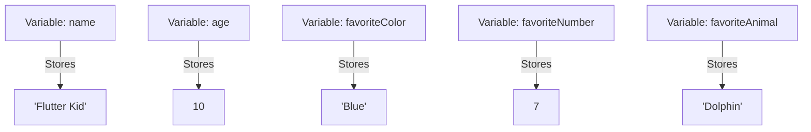

## 2.2.2 Variables: Storing Data

Welcome to the exciting world of variables in Dart! In this section, we'll explore how variables work and how they help us store and manage information in our programs. Think of variables as special containers or labeled boxes where we can keep different things, just like you might store toys or books in your room. Let's dive in and see how we can use variables to make our coding adventures even more fun!

### What Are Variables?

Imagine you have a box with a label on it. This box can hold different items, like your favorite toys or books. In programming, a variable is like that box. It has a name (the label) and can store information (the items inside). Variables help us keep track of data and use it whenever we need it in our programs.

### Naming Variables

When we create a variable, we need to give it a name. This name helps us remember what the variable is storing. It's like labeling your box so you know what's inside without opening it. In Dart, we can choose names like `name`, `age`, or `color` for our variables. Here are some tips for naming variables:

- **Be Descriptive:** Choose names that describe what the variable holds. For example, use `favoriteColor` instead of just `color`.
- **Use Lowercase Letters:** Start with a lowercase letter and use camelCase for multiple words (e.g., `myFavoriteAnimal`).
- **Avoid Spaces and Special Characters:** Use underscores or camelCase instead of spaces.

### Assigning Values to Variables

Once we have a variable, we can put information into it. This is called assigning a value. It's like placing your favorite toy inside the labeled box. In Dart, we use the `=` sign to assign values to variables. Let's look at an example:

```dart
String name = 'Flutter Kid';
int age = 10;
```

In this example, we have two variables: `name` and `age`. The `name` variable stores the text `'Flutter Kid'`, and the `age` variable stores the number `10`. Notice how we use different types of data: text (also called strings) and numbers (integers).

### Activity: Create Your Own Variables

Now it's your turn! Let's create some variables to store your favorite things. Think about your favorite color, number, or animal, and create variables for each. Here's how you can do it:

```dart
String favoriteColor = 'Blue';
int favoriteNumber = 7;
String favoriteAnimal = 'Dolphin';
```

Try it out! What are your favorite things? Create variables to store them and share with your friends or family.

### Visualizing Variables with Diagrams

To help you understand how variables store data, let's use a diagram. Imagine each variable as a box with a label and content inside. Here's a simple diagram to illustrate this concept:



In this diagram, each box represents a variable, and the arrows show what each variable is storing. This visual helps us see how variables work in our programs.

### Engagement: Share Your Variables

Now that you've created your own variables, let's share them! What did you choose for your favorite color, number, or animal? Sharing your variables is a great way to learn from each other and see the different ways we can use variables in our programs.

### Conclusion

Variables are powerful tools in programming. They help us store and manage information, making our programs more dynamic and interactive. By understanding how to name and assign values to variables, you're taking an important step in your coding journey. Keep experimenting with variables and see how they can enhance your Flutter apps!

## Quiz Time!



### What is a variable in programming?

- [x] A container for storing data
- [ ] A type of computer
- [ ] A programming language
- [ ] A game

> **Explanation:** A variable is like a container or box that stores data in a program.

### Which of the following is a good variable name for storing a person's age?

- [x] age
- [ ] 123age
- [ ] Age!
- [ ] my age

> **Explanation:** The name `age` is descriptive and follows naming conventions without spaces or special characters.

### How do you assign a value to a variable in Dart?

- [x] Using the `=` sign
- [ ] Using the `+` sign
- [ ] Using the `-` sign
- [ ] Using the `*` sign

> **Explanation:** In Dart, the `=` sign is used to assign values to variables.

### What type of data does the variable `String name = 'Flutter Kid';` store?

- [x] Text
- [ ] Number
- [ ] Boolean
- [ ] List

> **Explanation:** The variable stores a string, which is a type of text data.

### Which of the following is NOT a valid variable name?

- [ ] favoriteColor
- [x] 1stPlace
- [ ] myAge
- [ ] user_name

> **Explanation:** Variable names cannot start with a number, so `1stPlace` is not valid.

### What is the purpose of a variable in a program?

- [x] To store and manage data
- [ ] To display graphics
- [ ] To connect to the internet
- [ ] To play music

> **Explanation:** Variables are used to store and manage data in a program.

### Which of these is a correct way to declare an integer variable in Dart?

- [x] int age = 10;
- [ ] integer age = 10;
- [ ] var age = 'ten';
- [ ] int age = 'ten';

> **Explanation:** The correct way is `int age = 10;` where `int` specifies the data type and `10` is the integer value.

### What does the following code do? `String favoriteAnimal = 'Dolphin';`

- [x] Creates a variable named `favoriteAnimal` and stores the text `'Dolphin'`
- [ ] Deletes a variable named `favoriteAnimal`
- [ ] Changes the color of the text to blue
- [ ] Plays a sound

> **Explanation:** The code creates a variable named `favoriteAnimal` and assigns it the string value `'Dolphin'`.

### Can a variable name contain spaces?

- [ ] True
- [x] False

> **Explanation:** Variable names cannot contain spaces. Use camelCase or underscores instead.

### Why is it important to choose descriptive names for variables?

- [x] It makes the code easier to understand
- [ ] It makes the code run faster
- [ ] It changes the color of the text
- [ ] It increases the storage capacity

> **Explanation:** Descriptive names help make the code more readable and understandable.


