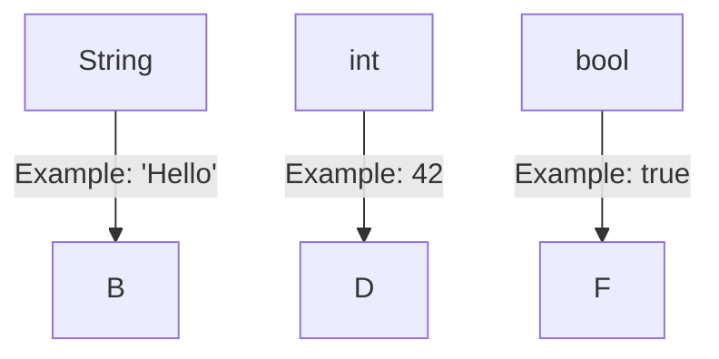

## 2.2.3 Basic Data Types

Welcome to the exciting world of Dart programming! In this section, we'll explore the basic building blocks of any program: data types. Understanding data types is crucial because they define the kind of information your program can work with. In Dart, some of the most common data types you'll encounter are **strings**, **integers**, and **booleans**. Let's dive in and see what each of these data types is all about!

### What Are Data Types?

Data types are like different kinds of boxes that hold specific types of information. Just like you wouldn't put a sandwich in a pencil box, you wouldn't store a sentence in a number data type. Each data type in Dart is designed to hold a particular kind of data.

### Strings: The Text Holders

**Strings** are used to store text. This can be anything from a single character to a whole sentence. In Dart, strings are enclosed in single or double quotes. Here's how you can create a string in Dart:

```dart
String greeting = 'Hello, world!';
```

In this example, `greeting` is a variable that holds the text "Hello, world!". Strings are incredibly useful for displaying messages, storing names, and much more.

#### Fun Activity: Create Your Own String

Try creating your own string variable and print it out. What message will you store?

```dart
String myMessage = 'Coding is fun!';
print(myMessage);
```

### Integers: The Number Crunchers

**Integers** (or `int` for short) are used to store whole numbers. These are numbers without any decimal points, like 1, 42, or 1000. Integers are perfect for counting things, keeping scores, and more. Here's an example of an integer in Dart:

```dart
int score = 100;
```

In this example, `score` is a variable that holds the number 100.

#### Fun Activity: Play with Numbers

Create an integer variable to represent your age or your favorite number and print it out.

```dart
int myAge = 12;
print(myAge);
```

### Booleans: The True or False Keepers

**Booleans** (or `bool` for short) are used to store true or false values. They are incredibly useful for making decisions in your code. For example, you might use a boolean to check if a game is over or if a user is logged in. Here's how you can create a boolean in Dart:

```dart
bool isFun = true;
```

In this example, `isFun` is a variable that holds the value `true`.

#### Fun Activity: Make Decisions

Create a boolean variable to represent whether you like ice cream and print it out.

```dart
bool likesIceCream = true;
print(likesIceCream);
```

### Putting It All Together

Now that we've learned about strings, integers, and booleans, let's see them in action together. Here's a small program that uses all three data types:

```dart
String name = 'Alex';
int age = 10;
bool lovesCoding = true;

print('Name: $name');
print('Age: $age');
print('Loves coding: $lovesCoding');
```

### Visualizing Data Types

Let's visualize these data types using a simple table:



### Engagement: Matching Game

Let's play a matching game! Match the data type to its example:

- **String**
  - A. "Flutter"
- **Integer**
  - B. 2023
- **Boolean**
  - C. false

### Best Practices and Tips

- **Naming Variables:** Choose meaningful names for your variables. Instead of `x`, use `age` or `score`.
- **Consistency:** Stick to one style of quotes for strings (single or double) to keep your code neat.
- **Boolean Logic:** Use booleans to make your code smarter with conditions and decisions.

### Common Pitfalls

- **Mismatched Quotes:** Ensure your strings start and end with the same type of quote.
- **Integer Overflow:** Be mindful of the size of numbers; Dart handles large numbers well, but it's good to be aware.
- **Boolean Confusion:** Remember that booleans can only be `true` or `false`.

## Quiz Time!



### Which data type would you use to store the text "Hello, Dart!"?

- [x] String
- [ ] int
- [ ] bool
- [ ] double

> **Explanation:** "Hello, Dart!" is text, so it should be stored in a String.

### What data type is used to store whole numbers?

- [ ] String
- [x] int
- [ ] bool
- [ ] double

> **Explanation:** Whole numbers are stored using the int data type.

### Which of the following is a boolean value?

- [ ] "true"
- [ ] 1
- [x] true
- [ ] "false"

> **Explanation:** `true` is a boolean value, while "true" is a string.

### What is the correct way to declare a string variable in Dart?

- [x] String name = 'John';
- [ ] int name = 'John';
- [ ] bool name = 'John';
- [ ] var name = 123;

> **Explanation:** Strings are declared using the String keyword followed by the variable name and value in quotes.

### How do you print the value of a variable in Dart?

- [x] print(variableName);
- [ ] echo(variableName);
- [ ] console.log(variableName);
- [ ] display(variableName);

> **Explanation:** The print() function is used to output the value of a variable in Dart.

### Which data type would you use to store the number 42?

- [ ] String
- [x] int
- [ ] bool
- [ ] double

> **Explanation:** 42 is a whole number, so it should be stored in an int.

### What is the value of the boolean expression `5 > 3`?

- [x] true
- [ ] false
- [ ] 5
- [ ] 3

> **Explanation:** The expression `5 > 3` evaluates to true because 5 is greater than 3.

### Which of the following is NOT a basic data type in Dart?

- [ ] String
- [ ] int
- [ ] bool
- [x] array

> **Explanation:** Array is not a basic data type in Dart; lists are used instead.

### Can a boolean variable hold the value "yes"?

- [ ] Yes
- [x] No

> **Explanation:** Boolean variables can only hold true or false, not "yes" or "no".

### True or False: Strings in Dart can be enclosed in either single or double quotes.

- [x] True
- [ ] False

> **Explanation:** Strings in Dart can be enclosed in either single or double quotes, allowing flexibility in how you write them.



By understanding these basic data types, you're well on your way to becoming a Dart programming whiz! Keep experimenting and have fun coding!
