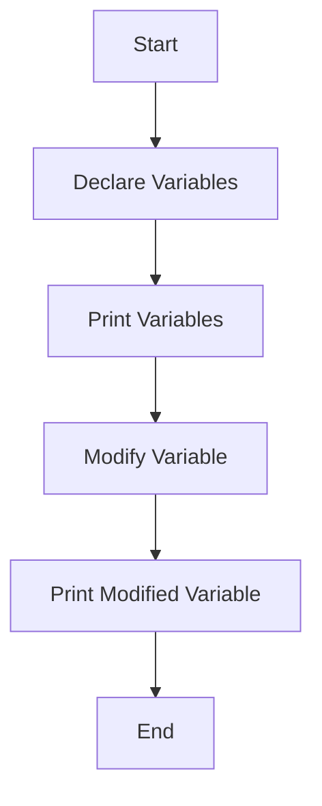

## 2.2.4 Playing with Variables

Welcome to the exciting world of variables in Dart! In this section, we'll explore how to create, use, and modify variables. Variables are like little containers that hold information for us to use in our programs. Let's dive in and see how they work!

### What Are Variables?

Variables are used in programming to store data that can be used and changed throughout a program. Think of a variable as a box with a label on it. You can put something inside the box (like a number or a word), and you can change what's inside whenever you want.

### Activity Steps: Creating and Using Variables

Let's get hands-on with variables by following these simple steps:

#### Step 1: Create Variables

First, we'll create some variables to store information about ourselves. We'll declare variables for a name, age, and favorite hobby. Here's how you can do it in Dart:

```dart
String name = 'Alex';
int age = 12;
String hobby = 'painting';
```

- **String** is a data type used for text. Here, `name` and `hobby` are Strings.
- **int** is a data type used for whole numbers. Here, `age` is an integer.

#### Step 2: Print Variables

Now that we've created our variables, let's print them to the console to see their values. This is how you can do it:

```dart
print(name);
print(age);
print(hobby);
```

When you run this code, you'll see the values of `name`, `age`, and `hobby` displayed on the screen.

#### Step 3: Modify Variables

Variables are not just for storing information; you can also change their values. Let's update the `age` variable to a new value and print it again:

```dart
age = 13;
print(age);
```

Now, when you run the code, you'll see that the age has changed from 12 to 13.

### Challenges: Experimenting with Variables

Let's make things more interesting by adding some challenges:

- **Create More Variables:** Try creating additional variables for other favorite things, like your favorite color or food.
- **Experiment with Data Types:** Use different data types such as `double` for decimal numbers or `bool` for true/false values.

### Visualizing Variable Flow

To help you understand how variables work, let's look at a diagram that shows the flow of creating and modifying variables:



This diagram illustrates the steps we took: declaring variables, printing them, modifying a variable, and printing it again.

### Step-by-Step Instructions and Explanations

1. **Declare Variables:** Use the `String` and `int` data types to create variables. This tells Dart what kind of data each variable will hold.
2. **Print Variables:** Use the `print()` function to display the values of your variables. This helps you see what's stored inside them.
3. **Modify Variables:** Change the value of a variable by assigning it a new value. This shows how variables can be updated as your program runs.

### Engagement and Encouragement

Celebrate each variable you successfully create and use! Every time you see your variables printed on the screen, you're seeing the power of programming in action. Keep experimenting and have fun with it!

### Conclusion

Playing with variables is a fundamental part of programming. By understanding how to create, use, and modify variables, you're building a strong foundation for your coding journey. Keep practicing, and soon you'll be using variables to create amazing apps and games!

## Quiz Time!



### What is a variable in programming?

- [x] A container that holds data
- [ ] A type of computer
- [ ] A programming language
- [ ] A game

> **Explanation:** A variable is a container that holds data, allowing you to store and manipulate information in your programs.

### Which data type is used for text in Dart?

- [x] String
- [ ] int
- [ ] double
- [ ] bool

> **Explanation:** The `String` data type is used for text in Dart, allowing you to store sequences of characters.

### How do you print a variable in Dart?

- [x] Using the `print()` function
- [ ] Using the `show()` function
- [ ] Using the `display()` function
- [ ] Using the `output()` function

> **Explanation:** The `print()` function is used in Dart to display the value of a variable on the console.

### What happens when you modify a variable's value?

- [x] The variable's value changes
- [ ] The program crashes
- [ ] The variable is deleted
- [ ] Nothing happens

> **Explanation:** When you modify a variable's value, the data stored in the variable changes to the new value you assign.

### Which of the following is an integer data type?

- [x] int
- [ ] String
- [ ] double
- [ ] bool

> **Explanation:** The `int` data type is used for whole numbers in Dart, representing integer values.

### Can you change the value of a variable after it's been declared?

- [x] Yes
- [ ] No

> **Explanation:** Yes, you can change the value of a variable after it's been declared by assigning it a new value.

### What is the purpose of the `print()` function?

- [x] To display information on the console
- [ ] To delete variables
- [ ] To create new variables
- [ ] To modify data types

> **Explanation:** The `print()` function is used to display information, such as variable values, on the console.

### Which of the following is a valid variable declaration in Dart?

- [x] `String name = 'Alex';`
- [ ] `int name = 'Alex';`
- [ ] `double name = 'Alex';`
- [ ] `bool name = 'Alex';`

> **Explanation:** `String name = 'Alex';` is a valid variable declaration in Dart, where `name` is a variable of type `String`.

### What is the result of modifying the `age` variable from 12 to 13?

- [x] The value of `age` becomes 13
- [ ] The value of `age` becomes 12
- [ ] The value of `age` becomes 0
- [ ] The value of `age` becomes 25

> **Explanation:** When you modify the `age` variable from 12 to 13, the value of `age` becomes 13.

### True or False: Variables can only store numbers.

- [ ] True
- [x] False

> **Explanation:** False. Variables can store different types of data, including numbers, text, and more.


