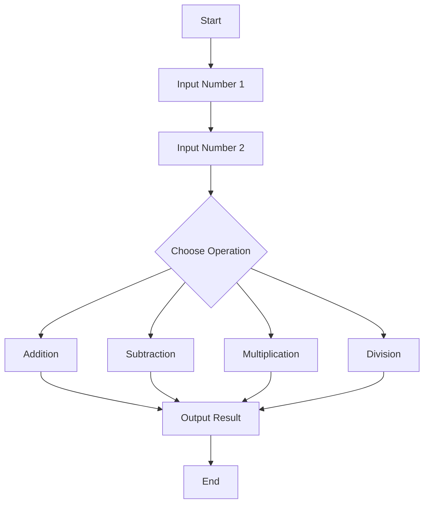

## 2.3.1 Simple Math Operations

Welcome to the exciting world of math in coding! Just like a calculator, Dart can help us perform various math operations. In this section, we'll explore how to do basic math using Dart, the programming language we use with Flutter. Let's dive in and see how Dart can make math fun and easy!

### Understanding Math Operations in Dart

Math is everywhere around us, from counting apples to measuring distances. In coding, math operations help us solve problems and create amazing apps. Dart, like many programming languages, can perform basic math operations such as addition, subtraction, multiplication, and division. Let's explore each of these operations with simple examples.

### Key Math Operations

#### 1. Addition (`+`)

Addition is the process of combining two numbers to get a total. It's like putting together two groups of objects to see how many you have in all.

**Example:**

```dart
int a = 5;
int b = 3;
print(a + b); // 8
```

In this example, we add 5 and 3 to get 8. It's as simple as that!

#### 2. Subtraction (`-`)

Subtraction is taking one number away from another. Imagine you have 5 candies, and you give 3 to a friend. How many do you have left?

**Example:**

```dart
int a = 5;
int b = 3;
print(a - b); // 2
```

Here, we subtract 3 from 5, leaving us with 2.

#### 3. Multiplication (`*`)

Multiplication is like adding a number to itself a certain number of times. If you have 3 bags with 5 apples each, how many apples do you have in total?

**Example:**

```dart
int a = 5;
int b = 3;
print(a * b); // 15
```

Multiplying 5 by 3 gives us 15, just like having 3 groups of 5 apples.

#### 4. Division (`/`)

Division is splitting a number into equal parts. If you have 6 cookies and 3 friends, how many cookies does each friend get?

**Example:**

```dart
int a = 5;
int b = 3;
print(a / b); // 1.666...
```

Dividing 5 by 3 gives us approximately 1.666, meaning each friend gets about 1 and a half cookies.

### Activity: Practice Math Operations

Now it's your turn! Create your own variables with different numbers and try performing these operations. Here's a template to get you started:

```dart
int x = 10;
int y = 4;

// Try addition
print(x + y);

// Try subtraction
print(x - y);

// Try multiplication
print(x * y);

// Try division
print(x / y);
```

### Visualizing Math Operations

Let's use a flowchart to visualize how these operations work. Imagine a simple process where you input two numbers and choose an operation to see the result.



### Real-Life Scenarios

Math operations are not just for solving problems in a book; they help us in everyday life. Here are some examples:

- **Addition:** Calculating the total cost of items in a shopping cart.
- **Subtraction:** Determining how much money you have left after buying a toy.
- **Multiplication:** Figuring out how many candies you have if each friend gives you 3.
- **Division:** Sharing a pizza equally among friends.

### Engagement: Create Your Own Math Problems

Now that you know how to perform basic math operations in Dart, try creating your own math problems. Write a small program to solve them and see the results. This practice will help you understand how powerful and fun coding can be!

## Quiz Time!



### What does the `+` operator do in Dart?

- [x] Adds two numbers together
- [ ] Subtracts one number from another
- [ ] Multiplies two numbers
- [ ] Divides one number by another

> **Explanation:** The `+` operator is used to add two numbers together in Dart.

### Which operator would you use to find the difference between two numbers?

- [ ] +
- [x] -
- [ ] *
- [ ] /

> **Explanation:** The `-` operator is used to subtract one number from another, finding the difference.

### What is the result of `5 * 3` in Dart?

- [ ] 8
- [ ] 2
- [x] 15
- [ ] 1.666...

> **Explanation:** Multiplying 5 by 3 gives 15.

### If you divide 10 by 2 in Dart, what is the result?

- [x] 5
- [ ] 2
- [ ] 20
- [ ] 0.5

> **Explanation:** Dividing 10 by 2 results in 5.

### Which of the following is a real-life example of multiplication?

- [ ] Calculating the total cost of items
- [ ] Determining change after a purchase
- [x] Figuring out total candies from multiple bags
- [ ] Sharing a pizza equally

> **Explanation:** Multiplication is like adding a number to itself multiple times, such as finding the total candies from multiple bags.

### What does the `/` operator do in Dart?

- [ ] Adds two numbers
- [ ] Subtracts one number from another
- [ ] Multiplies two numbers
- [x] Divides one number by another

> **Explanation:** The `/` operator is used to divide one number by another in Dart.

### How would you write a Dart code to add 7 and 5?

- [x] `print(7 + 5);`
- [ ] `print(7 - 5);`
- [ ] `print(7 * 5);`
- [ ] `print(7 / 5);`

> **Explanation:** To add 7 and 5, you use the `+` operator: `print(7 + 5);`.

### What is the result of `8 - 3` in Dart?

- [x] 5
- [ ] 11
- [ ] 24
- [ ] 2.666...

> **Explanation:** Subtracting 3 from 8 gives 5.

### Which operation would you use to split 12 candies equally among 4 friends?

- [ ] +
- [ ] -
- [ ] *
- [x] /

> **Explanation:** Division is used to split items equally, so you would use the `/` operator.

### True or False: Dart can only perform addition and subtraction.

- [ ] True
- [x] False

> **Explanation:** False. Dart can perform addition, subtraction, multiplication, and division.



Now that you've mastered simple math operations in Dart, you're ready to tackle more complex coding challenges. Keep practicing, and remember, math is a powerful tool in your coding adventure!
