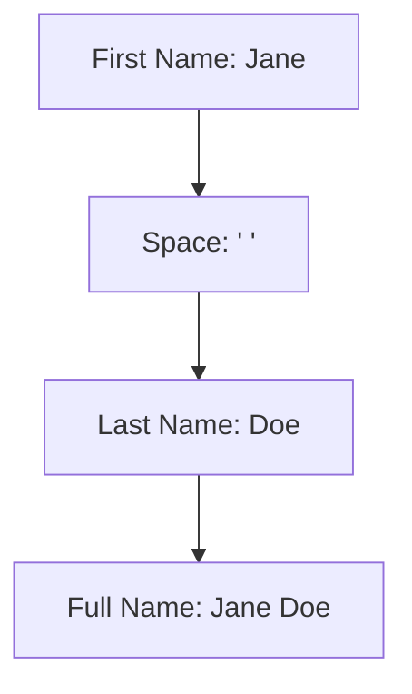

## 2.3.2 Combining Text

Welcome to the exciting world of text manipulation in Flutter! In this section, we'll explore how to combine strings, which are sequences of characters, to create longer and more meaningful messages. Think of it like putting together pieces of a puzzle to form a complete picture. This process is known as string concatenation, and it's a fundamental skill in programming.

### Understanding String Concatenation

String concatenation is the process of joining two or more strings together. In Dart, the programming language used with Flutter, we use the `+` operator to concatenate strings. This is similar to how you might add numbers together, but instead of adding values, you're joining text.

#### Key Concept: String Concatenation Using the `+` Operator

Let's dive into an example to see how this works:

```dart
String firstName = 'Jane';
String lastName = 'Doe';
String fullName = firstName + ' ' + lastName;
print(fullName); // Jane Doe
```

In this example, we have two separate strings: `firstName` and `lastName`. By using the `+` operator, we combine them into a new string called `fullName`. Notice the `' '` between `firstName` and `lastName`—this adds a space between the two names, making the full name look natural.

### Activity: Create Your Full Name

Now it's your turn! Let's create variables for your first and last names and combine them into a full name.

1. **Declare Variables:** Start by declaring two variables, one for your first name and one for your last name.
2. **Concatenate Strings:** Use the `+` operator to combine these variables into a new variable called `fullName`.
3. **Print the Result:** Use the `print()` function to display your full name.

Here's a template to get you started:

```dart
String firstName = 'YourFirstName';
String lastName = 'YourLastName';
String fullName = firstName + ' ' + lastName;
print(fullName); // YourFirstName YourLastName
```

### Visualizing String Concatenation

To help visualize how strings are combined, let's use a diagram. Imagine each string as a block, and when you concatenate them, you're stacking these blocks together to form a longer block.



In this diagram, you can see how each part connects to form the full name.

### Engaging Example: Creating Fun Sentences

Combining strings isn't just for names; you can create fun sentences too! Let's try combining different strings to make a sentence.

```dart
String greeting = 'Hello';
String name = 'World';
String punctuation = '!';
String message = greeting + ', ' + name + punctuation;
print(message); // Hello, World!
```

### Challenge: Create a Fun Sentence

Now, challenge yourself to create a fun sentence by combining different strings. Here are some ideas to get you started:

- Combine your favorite food and a fun activity.
- Create a sentence about your favorite animal and what it likes to do.
- Mix and match words to make a silly sentence.

Here's an example:

```dart
String favoriteFood = 'Pizza';
String activity = 'eating';
String sentence = 'I love ' + activity + ' ' + favoriteFood + '!';
print(sentence); // I love eating Pizza!
```

### Best Practices and Tips

- **Use Descriptive Variable Names:** When creating variables, use names that clearly describe what the string represents. This makes your code easier to read and understand.
- **Mind the Spaces:** Remember to add spaces between words when concatenating strings, just like you would in a regular sentence.
- **Experiment and Have Fun:** Don't be afraid to try different combinations and see what you can create. Coding is all about exploration and creativity!

By mastering string concatenation, you're building a strong foundation for creating dynamic and interactive apps. Keep experimenting and see how you can use this skill in your projects!

## Quiz Time!



### What is string concatenation?

- [x] Joining two or more strings together
- [ ] Splitting a string into parts
- [ ] Converting a string to uppercase
- [ ] Finding the length of a string

> **Explanation:** String concatenation is the process of joining two or more strings together to form a longer string.

### Which operator is used for string concatenation in Dart?

- [x] +
- [ ] -
- [ ] *
- [ ] /

> **Explanation:** The `+` operator is used in Dart to concatenate strings.

### What will the following code print?
```dart
String a = 'Hello';
String b = 'Flutter';
String c = a + ' ' + b;
print(c);
```

- [x] Hello Flutter
- [ ] HelloFlutter
- [ ] Hello, Flutter
- [ ] Flutter Hello

> **Explanation:** The code concatenates `a` and `b` with a space in between, resulting in "Hello Flutter".

### How can you add a space between two concatenated strings?

- [x] By adding ' ' between them
- [ ] By using the `-` operator
- [ ] By using the `*` operator
- [ ] By using the `=` operator

> **Explanation:** Adding ' ' between two strings inserts a space when concatenating them.

### What is the output of this code?
```dart
String first = 'Good';
String second = 'Morning';
String result = first + second;
print(result);
```

- [ ] Good Morning
- [x] GoodMorning
- [ ] Good, Morning
- [ ] Morning Good

> **Explanation:** The code concatenates `first` and `second` without a space, resulting in "GoodMorning".

### Why is it important to use descriptive variable names?

- [x] To make the code easier to read and understand
- [ ] To make the code run faster
- [ ] To reduce the size of the code
- [ ] To increase the number of variables

> **Explanation:** Descriptive variable names help make the code more readable and understandable.

### What will this code print?
```dart
String x = 'Coding';
String y = 'is fun';
String z = x + ' ' + y + '!';
print(z);
```

- [x] Coding is fun!
- [ ] Codingisfun!
- [ ] Coding is fun
- [ ] Coding isfun!

> **Explanation:** The code concatenates `x`, `y`, and '!' with spaces, resulting in "Coding is fun!".

### Which of the following is NOT a string concatenation?

- [ ] 'Hello' + 'World'
- [ ] 'Good' + ' ' + 'Day'
- [ ] 'First' + 'Second'
- [x] 'Split'.split('')

> **Explanation:** The `split` method is used to divide a string, not concatenate it.

### What is the purpose of the `print()` function in the examples?

- [x] To display the result of the concatenation
- [ ] To concatenate strings
- [ ] To declare variables
- [ ] To add spaces between strings

> **Explanation:** The `print()` function is used to display the output of the concatenated strings.

### True or False: String concatenation can only be used with text.

- [ ] True
- [x] False

> **Explanation:** String concatenation can be used with any data type that can be converted to a string, such as numbers.


