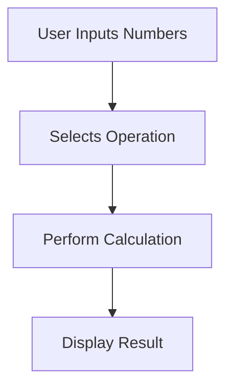

## 2.3.4 Mini Project: Calculator App

Welcome to an exciting mini-project where you'll apply your newfound Flutter skills to build a simple calculator app! This project will help you understand how to create a user interface, handle user input, and perform basic arithmetic operations. Let's dive in!

### Objective

The goal of this project is to create a calculator app that can perform basic arithmetic operations: addition, subtraction, multiplication, and division. By the end of this project, you'll have a functional app that takes two numbers as input and displays the result of the selected operation.

### Project Overview

Our calculator app will consist of:

- **Text Fields** for entering two numbers.
- **Buttons** for each arithmetic operation.
- A **Display Area** to show the result of the calculation.

### Step-by-Step Guide

#### 1. Set Up the UI

First, we need to create the user interface (UI) for our calculator. This involves setting up text fields for input and buttons for each operation.

```dart
import 'package:flutter/material.dart';

void main() {
  runApp(CalculatorApp());
}

class CalculatorApp extends StatefulWidget {
  @override
  _CalculatorAppState createState() => _CalculatorAppState();
}

class _CalculatorAppState extends State<CalculatorApp> {
  double num1 = 0;
  double num2 = 0;
  double result = 0;

  @override
  Widget build(BuildContext context) {
    return MaterialApp(
      home: Scaffold(
        appBar: AppBar(
          title: Text('Simple Calculator'),
        ),
        body: Padding(
          padding: EdgeInsets.all(16.0),
          child: Column(
            children: [
              TextField(
                decoration: InputDecoration(labelText: 'Number 1'),
                keyboardType: TextInputType.number,
                onChanged: (value) {
                  num1 = double.parse(value);
                },
              ),
              TextField(
                decoration: InputDecoration(labelText: 'Number 2'),
                keyboardType: TextInputType.number,
                onChanged: (value) {
                  num2 = double.parse(value);
                },
              ),
              SizedBox(height: 20),
              Row(
                mainAxisAlignment: MainAxisAlignment.spaceAround,
                children: [
                  ElevatedButton(
                    onPressed: () {
                      setState(() {
                        result = num1 + num2;
                      });
                    },
                    child: Text('+'),
                  ),
                  ElevatedButton(
                    onPressed: () {
                      setState(() {
                        result = num1 - num2;
                      });
                    },
                    child: Text('-'),
                  ),
                  ElevatedButton(
                    onPressed: () {
                      setState(() {
                        result = num1 * num2;
                      });
                    },
                    child: Text('*'),
                  ),
                  ElevatedButton(
                    onPressed: () {
                      setState(() {
                        result = num1 / num2;
                      });
                    },
                    child: Text('/'),
                  ),
                ],
              ),
              SizedBox(height: 20),
              Text(
                'Result: $result',
                style: TextStyle(fontSize: 24),
              ),
            ],
          ),
        ),
      ),
    );
  }
}
```

#### 2. Create Variables

In the code above, we declared three variables: `num1`, `num2`, and `result`. These variables will store the numbers entered by the user and the result of the calculation.

- **num1**: Stores the first number.
- **num2**: Stores the second number.
- **result**: Stores the result of the operation.

#### 3. Write Functions

For each arithmetic operation, we have a button that, when pressed, performs the operation and updates the `result` variable. The `setState` method is used to update the UI with the new result.

#### 4. Display Results

The result of the calculation is displayed in a `Text` widget, which updates whenever a button is pressed.

### Visuals

Let's visualize the flow of our calculator app using a Mermaid.js diagram:



### Language and Engagement

Feel free to experiment with different numbers and operations. Try adding more features, such as a clear button to reset the inputs or additional operations like modulus or exponentiation.

### Celebrate Your Achievement

Congratulations on completing your calculator app! You've learned how to set up a user interface, handle user input, and perform calculations. Keep experimenting and adding new features to enhance your app.

## Quiz Time!



### What is the primary purpose of the calculator app project?

- [x] To apply Flutter skills by building a simple calculator.
- [ ] To create a complex game.
- [ ] To learn about databases.
- [ ] To design a website.

> **Explanation:** The project is designed to help you apply your Flutter skills by building a simple calculator app.

### Which widget is used to take user input for numbers?

- [x] TextField
- [ ] ElevatedButton
- [ ] Container
- [ ] Column

> **Explanation:** The `TextField` widget is used to take user input for numbers in the app.

### What does the `setState` method do in the app?

- [x] Updates the UI with new data.
- [ ] Deletes data.
- [ ] Changes the app theme.
- [ ] Closes the app.

> **Explanation:** The `setState` method updates the UI with new data, such as the result of a calculation.

### How many arithmetic operations does the app perform?

- [x] Four
- [ ] Two
- [ ] Three
- [ ] Five

> **Explanation:** The app performs four arithmetic operations: addition, subtraction, multiplication, and division.

### What type of data do the variables `num1` and `num2` store?

- [x] Double
- [ ] String
- [ ] Integer
- [ ] Boolean

> **Explanation:** The variables `num1` and `num2` store data of type `double` to handle decimal numbers.

### Which widget is used to display the result of the calculation?

- [x] Text
- [ ] Button
- [ ] Image
- [ ] Slider

> **Explanation:** The `Text` widget is used to display the result of the calculation in the app.

### What happens when an operation button is pressed?

- [x] The corresponding arithmetic operation is performed.
- [ ] The app closes.
- [ ] The input fields are cleared.
- [ ] The app restarts.

> **Explanation:** When an operation button is pressed, the corresponding arithmetic operation is performed, and the result is displayed.

### What is the role of the `main` function in the app?

- [x] It starts the app.
- [ ] It performs calculations.
- [ ] It displays the result.
- [ ] It handles user input.

> **Explanation:** The `main` function is the entry point of the app and starts the app by calling `runApp`.

### True or False: The app can perform operations on more than two numbers at a time.

- [ ] True
- [x] False

> **Explanation:** The app is designed to perform operations on two numbers at a time.

### What is a potential feature you could add to the calculator app?

- [x] A clear button to reset inputs.
- [ ] A feature to send emails.
- [ ] A feature to play music.
- [ ] A feature to browse the web.

> **Explanation:** A potential feature to add is a clear button to reset the inputs and result.


