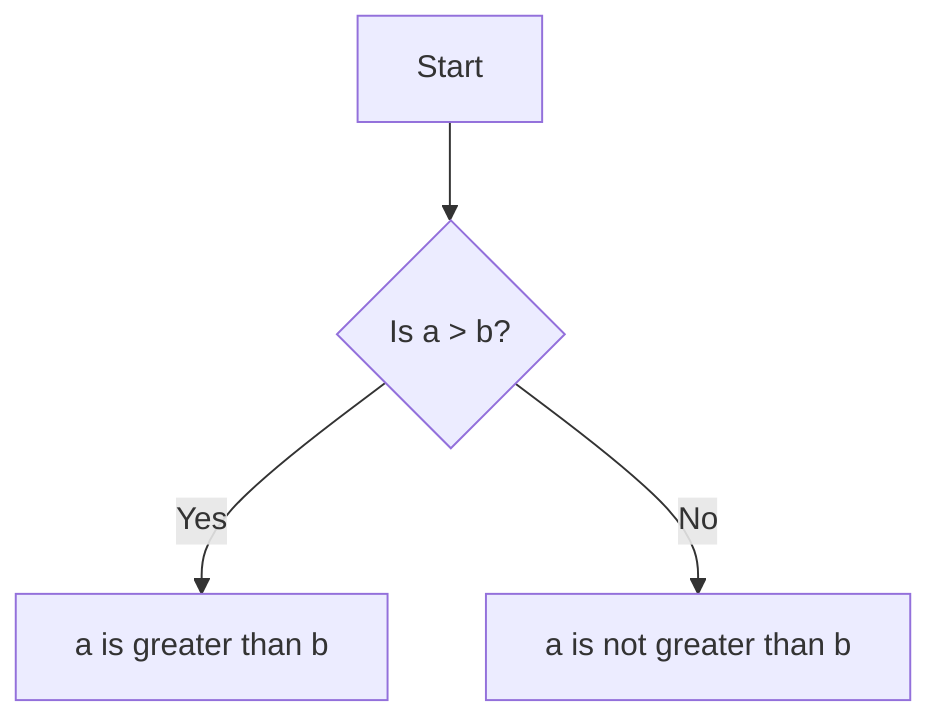

## 2.4.3 Comparing Values

In this section, we're going to explore how to compare values in your Flutter apps using comparison operators. These operators are like the decision-makers in your code, helping your app determine if something is true or false. Let's dive into the world of comparison operators and see how they can make your code smarter!

### Understanding Comparison Operators

Comparison operators are special symbols in programming that help us compare two values. They tell us whether one value is greater than, less than, equal to, or not equal to another value. These comparisons are crucial for making decisions in your code, such as deciding which path to take in a game or which message to display to the user.

#### Key Comparison Operators

Here are the key comparison operators you'll use in Dart, the programming language for Flutter:

- **Greater than (`>`):** Checks if the value on the left is greater than the value on the right.
- **Less than (`<`):** Checks if the value on the left is less than the value on the right.
- **Equal to (`==`):** Checks if the two values are equal.
- **Not equal to (`!=`):** Checks if the two values are not equal.

### Code Example: Comparing Values

Let's look at a simple code example to see these operators in action:

```dart
int a = 5;
int b = 3;

if (a > b) {
  print('a is greater than b');
} else {
  print('a is not greater than b');
}
```

In this example, we're comparing two numbers, `a` and `b`. The code checks if `a` is greater than `b`. If it is, the message "a is greater than b" is printed. Otherwise, it prints "a is not greater than b".

### Activity: Try It Yourself!

Now it's your turn! Create your own variables and use different comparison operators to make decisions in your code. Here's a fun challenge:

1. Create two variables, `x` and `y`, and assign them any numbers you like.
2. Use the comparison operators to check:
   - If `x` is less than `y`.
   - If `x` is equal to `y`.
   - If `x` is not equal to `y`.
3. Print a message for each comparison to see the result.

### Visualizing Comparisons with Mermaid.js

To help you understand how comparisons work, let's visualize them using a simple flowchart. This chart shows how different comparisons lead to different outcomes:



This flowchart represents the decision-making process in our code example. It starts by checking if `a` is greater than `b`. Depending on the result, it follows one of two paths, leading to different outcomes.

### Engaging with Comparisons

To make learning fun, let's play a mini quiz! Guess the output of these comparisons:

1. What will the code print if `a = 7` and `b = 10`?
2. What if `a = 10` and `b = 10`?
3. How about `a = 15` and `b = 5`?

### Conclusion

Comparison operators are powerful tools in programming that help your app make decisions. By understanding and using these operators, you can create more dynamic and interactive apps. Keep experimenting with different comparisons and see how they can change the behavior of your code. Happy coding!

## Quiz Time!



### What does the `>` operator do?

- [x] Checks if the value on the left is greater than the value on the right.
- [ ] Checks if the value on the left is less than the value on the right.
- [ ] Checks if the two values are equal.
- [ ] Checks if the two values are not equal.

> **Explanation:** The `>` operator is used to compare if the left value is greater than the right value.

### Which operator would you use to check if two values are equal?

- [ ] >
- [ ] <
- [x] ==
- [ ] !=

> **Explanation:** The `==` operator is used to check if two values are equal.

### What will the following code print if `a = 8` and `b = 12`?
```dart
if (a < b) {
  print('a is less than b');
} else {
  print('a is not less than b');
}
```

- [x] a is less than b
- [ ] a is not less than b
- [ ] a is equal to b
- [ ] a is greater than b

> **Explanation:** Since `a` is 8 and `b` is 12, `a < b` is true, so it prints "a is less than b".

### What does the `!=` operator check?

- [ ] If two values are equal.
- [x] If two values are not equal.
- [ ] If the left value is greater than the right value.
- [ ] If the left value is less than the right value.

> **Explanation:** The `!=` operator checks if two values are not equal.

### If `x = 5` and `y = 5`, what will `x == y` return?

- [x] True
- [ ] False
- [ ] It will cause an error.
- [ ] It will return a string.

> **Explanation:** Since both `x` and `y` are 5, `x == y` returns true.

### What is the result of `10 > 5`?

- [x] True
- [ ] False
- [ ] It will cause an error.
- [ ] It will return a string.

> **Explanation:** 10 is greater than 5, so `10 > 5` is true.

### Which operator would you use to check if one value is less than another?

- [ ] >
- [x] <
- [ ] ==
- [ ] !=

> **Explanation:** The `<` operator is used to check if one value is less than another.

### What will the following code print if `a = 3` and `b = 3`?
```dart
if (a != b) {
  print('a is not equal to b');
} else {
  print('a is equal to b');
}
```

- [ ] a is not equal to b
- [x] a is equal to b
- [ ] a is greater than b
- [ ] a is less than b

> **Explanation:** Since `a` and `b` are both 3, `a != b` is false, so it prints "a is equal to b".

### If `a = 10` and `b = 20`, what will `a >= b` return?

- [ ] True
- [x] False
- [ ] It will cause an error.
- [ ] It will return a string.

> **Explanation:** Since 10 is not greater than or equal to 20, `a >= b` returns false.

### The `==` operator is used to check if two values are not equal.

- [ ] True
- [x] False

> **Explanation:** The `==` operator checks if two values are equal, not if they are not equal.


