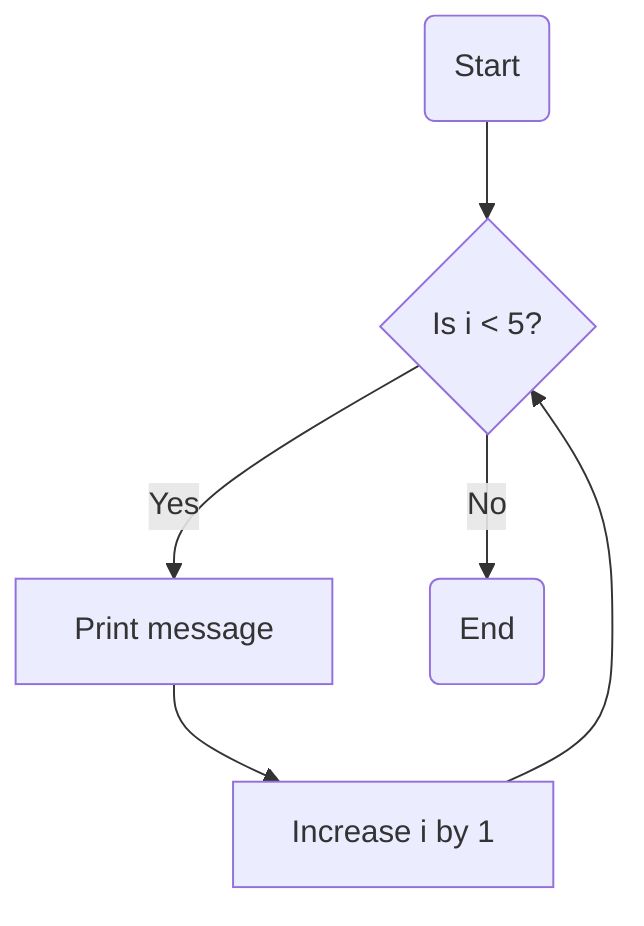

## 3.1.1 What are Loops?

Welcome to the exciting world of loops in programming! Loops are a powerful tool that help us automate repetitive tasks, making our code more efficient and easier to manage. Let's dive into what loops are, why they're useful, and how you can use them in your own coding projects.

### Understanding Loops

Imagine you have to brush your teeth every morning. You don't need to write down the steps every single day because you know the routine by heart. Similarly, in programming, loops allow us to repeat actions without having to write the same code over and over again. This is what makes loops so valuable—they save time and effort by automating repetitive tasks.

### Key Concepts

#### Repetition

Repetition is the core idea behind loops. Just like brushing your teeth every morning, loops let you repeat a set of actions multiple times. This is especially useful when you need to perform the same task with different data or conditions.

#### Efficiency

Loops make your code more efficient by reducing redundancy. Instead of writing the same lines of code repeatedly, you can use a loop to handle the repetition for you. This not only saves time but also makes your code cleaner and easier to read.

### Code Example: A Simple Loop in Dart

Let's look at a simple example of a loop in Dart, the programming language used with Flutter. This loop will print a message five times:

```dart
for (int i = 0; i < 5; i++) {
  print('This is loop number $i');
}
```

**Explanation:**

- `for`: This keyword starts the loop.
- `(int i = 0; i < 5; i++)`: This is the loop's control statement. It initializes a variable `i` at 0, checks if `i` is less than 5, and increases `i` by 1 after each loop iteration.
- `print('This is loop number $i');`: This line prints the message, including the current loop number.

### Activity: Try It Yourself!

Now it's your turn! Write a simple loop that prints your favorite number five times. Here's a template to get you started:

```dart
for (int i = 0; i < 5; i++) {
  print('My favorite number is [Your Number]');
}
```

Replace `[Your Number]` with your favorite number and see the magic of loops in action!

### Visualizing Loops with a Flowchart

To better understand how loops work, let's look at a flowchart that illustrates the process:



**Explanation:**

- **Start:** The loop begins.
- **Condition Check (Is i < 5?):** The loop checks if the condition is true.
- **Action (Print message):** If the condition is true, the action is performed.
- **Increment (Increase i by 1):** The loop variable is increased.
- **Repeat or End:** The loop repeats if the condition is still true; otherwise, it ends.

### Why Are Loops Important?

Loops are crucial in programming because they allow us to handle repetitive tasks efficiently. Imagine creating a game where you need to check the player's score every second. Without loops, you'd have to write the same code repeatedly, which is not practical. Loops make it possible to automate such tasks, freeing you to focus on more creative aspects of your project.

### Engage Your Mind

Think about this: Why do you think loops are important when creating games or apps? How could you use loops to make your projects more efficient? Discuss with your friends or write down your thoughts!

### Conclusion

Loops are a fundamental concept in programming that help us automate repetitive tasks and make our code more efficient. By understanding and using loops, you can create more dynamic and interactive applications. Keep experimenting with loops, and soon you'll be using them like a pro!

## Quiz Time!



### What is the main purpose of a loop in programming?

- [x] To repeat actions without writing the same code multiple times
- [ ] To make code run slower
- [ ] To confuse the programmer
- [ ] To delete files

> **Explanation:** Loops are used to repeat actions efficiently, saving time and effort by automating repetitive tasks.

### Which keyword is used to start a loop in Dart?

- [x] for
- [ ] repeat
- [ ] loop
- [ ] begin

> **Explanation:** The `for` keyword is used to start a loop in Dart.

### In the loop `for (int i = 0; i < 5; i++)`, what does `i++` do?

- [x] Increases the value of `i` by 1
- [ ] Decreases the value of `i` by 1
- [ ] Resets `i` to 0
- [ ] Stops the loop

> **Explanation:** `i++` increases the value of `i` by 1 after each loop iteration.

### What will the following code print?
```dart
for (int i = 0; i < 3; i++) {
  print('Hello');
}
```

- [x] Hello Hello Hello
- [ ] Hello Hello
- [ ] Hello
- [ ] Nothing

> **Explanation:** The loop runs three times, printing "Hello" each time.

### Why are loops considered efficient?

- [x] They reduce code redundancy
- [x] They automate repetitive tasks
- [ ] They make code harder to read
- [ ] They slow down the program

> **Explanation:** Loops reduce redundancy and automate tasks, making code more efficient and easier to manage.

### What is the condition in the loop `for (int i = 0; i < 5; i++)`?

- [x] i < 5
- [ ] i = 0
- [ ] i++
- [ ] print

> **Explanation:** The condition `i < 5` determines how long the loop will run.

### How many times will the loop `for (int i = 0; i < 4; i++)` run?

- [x] 4 times
- [ ] 3 times
- [ ] 5 times
- [ ] 1 time

> **Explanation:** The loop runs while `i` is less than 4, resulting in 4 iterations.

### What happens if the condition in a loop is never false?

- [x] The loop runs indefinitely
- [ ] The loop runs once
- [ ] The loop never starts
- [ ] The loop prints an error

> **Explanation:** If the condition is never false, the loop will continue to run indefinitely, creating an infinite loop.

### Can loops be used to iterate over collections like lists?

- [x] True
- [ ] False

> **Explanation:** Loops can iterate over collections such as lists, allowing you to perform actions on each item.

### What is a real-world example of using loops?

- [x] Checking a player's score every second in a game
- [ ] Writing the same code multiple times
- [ ] Deleting files automatically
- [ ] Making a website slower

> **Explanation:** Loops can automate tasks like checking scores, making them ideal for real-time applications like games.


