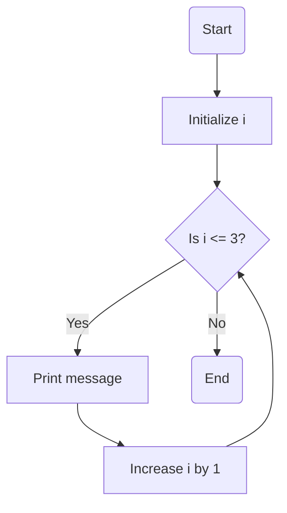

## 3.1.2 For Loops

Welcome to the exciting world of loops in programming! Today, we're going to explore a special kind of loop called the **for loop**. Imagine you have a magic wand that can repeat a task for you a certain number of times. That's exactly what a for loop does in coding!

### What is a For Loop?

A for loop is like a set of instructions that you can repeat over and over again, just like when you practice a dance move or a magic trick. You decide how many times you want to repeat the action, and the for loop takes care of the rest!

### Key Concepts of For Loops

Before we dive into coding, let's break down the key parts of a for loop:

1. **Initialization:** This is where we start our loop. We set up a counter, which is like a scorekeeper that keeps track of how many times we've repeated the action.

2. **Condition:** This tells the loop when to stop. It's like setting a goal, such as "I will practice my dance move until I've done it 10 times."

3. **Increment:** This is how we change our counter each time the loop runs. It's like taking one step forward each time you repeat the action.

### For Loop in Action

Let's see a for loop in action with a simple example. We'll write a loop that says "Hello for loop!" three times, and we'll keep track of how many times we've said it.

```dart
for (int i = 1; i <= 3; i++) {
  print('Hello for loop! Count: $i');
}
```

#### Breaking Down the Code

- **Initialization (`int i = 1;`):** We start by setting our counter `i` to 1.
- **Condition (`i <= 3;`):** The loop will keep running as long as `i` is less than or equal to 3.
- **Increment (`i++`):** After each loop, we increase `i` by 1. This is like saying, "Okay, I've done it once, now let's do it again!"

### Activity: Let's Count to 10!

Now it's your turn! Create a for loop that counts from 1 to 10 and prints each number. Here's a hint to get you started:

```dart
for (int i = 1; i <= 10; i++) {
  print(i);
}
```

Try running this code and see what happens. Can you modify it to count from 1 to 20? How about counting backwards from 10 to 1?

### Visualizing the For Loop

To help you understand how a for loop works, let's look at a diagram that shows the flow of a for loop:



This flowchart shows the steps of a for loop. We start by initializing `i`, check if `i` is less than or equal to 3, print the message, increase `i` by 1, and repeat until the condition is no longer true.

### Engaging with For Loops

For loops are incredibly powerful and can be used in many fun ways. Here are some ideas to try:

- **Modify the Loop:** Change the loop to count higher or lower and see what happens.
- **Add More Actions:** Instead of just printing a number, try printing a pattern or a series of words.
- **Create a Pattern:** Use a for loop to draw a simple pattern on the screen.

### Best Practices and Tips

- **Start Simple:** Begin with small numbers and simple actions to understand how the loop works.
- **Experiment:** Don't be afraid to change the numbers and see what happens. This is how you learn!
- **Debugging:** If your loop isn't working as expected, check your initialization, condition, and increment.

### Common Pitfalls

- **Infinite Loops:** Make sure your condition will eventually become false, or your loop will run forever!
- **Off-by-One Errors:** Double-check your condition to ensure you're looping the correct number of times.

By mastering for loops, you're taking a big step in your coding journey. They are a fundamental tool that will help you build amazing projects in the future. Keep experimenting and have fun with your loops!

## Quiz Time!



### What is the purpose of a for loop?

- [x] To repeat a set of instructions a specific number of times
- [ ] To perform a task only once
- [ ] To store data
- [ ] To create a new variable

> **Explanation:** A for loop is used to repeat a set of instructions a specific number of times, making it a powerful tool for tasks that require repetition.

### What does the initialization part of a for loop do?

- [x] It sets up the starting value of the loop counter
- [ ] It checks the condition to stop the loop
- [ ] It increases the counter each time the loop runs
- [ ] It prints a message

> **Explanation:** The initialization part of a for loop sets up the starting value of the loop counter, which is crucial for controlling the loop's execution.

### In the code `for (int i = 1; i <= 3; i++)`, what does `i++` do?

- [x] It increases the value of `i` by 1 each time the loop runs
- [ ] It decreases the value of `i` by 1 each time the loop runs
- [ ] It keeps the value of `i` the same
- [ ] It resets `i` to 0

> **Explanation:** The `i++` part of the loop increases the value of `i` by 1 each time the loop runs, allowing the loop to progress towards its stopping condition.

### What happens if the condition in a for loop is always true?

- [x] The loop will run forever (infinite loop)
- [ ] The loop will never run
- [ ] The loop will run only once
- [ ] The loop will print an error

> **Explanation:** If the condition in a for loop is always true, the loop will run forever, creating an infinite loop. It's important to ensure the condition will eventually become false.

### How can you modify a for loop to count backwards?

- [x] Use a decrement operator like `i--`
- [ ] Use an increment operator like `i++`
- [ ] Change the initialization to a higher number
- [ ] Remove the condition

> **Explanation:** To count backwards, you can use a decrement operator like `i--`, which decreases the counter each time the loop runs.

### What is a common mistake when using for loops?

- [x] Off-by-one errors
- [ ] Using too many variables
- [ ] Not using enough print statements
- [ ] Forgetting to declare a function

> **Explanation:** A common mistake with for loops is off-by-one errors, where the loop runs one time too many or too few due to incorrect conditions.

### Which part of the for loop determines when the loop stops?

- [x] The condition
- [ ] The initialization
- [ ] The increment
- [ ] The print statement

> **Explanation:** The condition part of the for loop determines when the loop stops, as it is checked before each iteration to decide if the loop should continue.

### What is the output of the following code: `for (int i = 1; i <= 3; i++) { print(i); }`?

- [x] 1 2 3
- [ ] 1 2
- [ ] 1 2 3 4
- [ ] 3 2 1

> **Explanation:** The loop starts at 1 and prints each number until it reaches 3, resulting in the output "1 2 3".

### How can you ensure a for loop doesn't run forever?

- [x] Make sure the condition will eventually become false
- [ ] Use a very large number in the condition
- [ ] Avoid using a counter
- [ ] Use a print statement

> **Explanation:** To ensure a for loop doesn't run forever, make sure the condition will eventually become false, allowing the loop to terminate.

### True or False: A for loop can only count upwards.

- [ ] True
- [x] False

> **Explanation:** False. A for loop can count both upwards and downwards, depending on how the increment or decrement is set.


