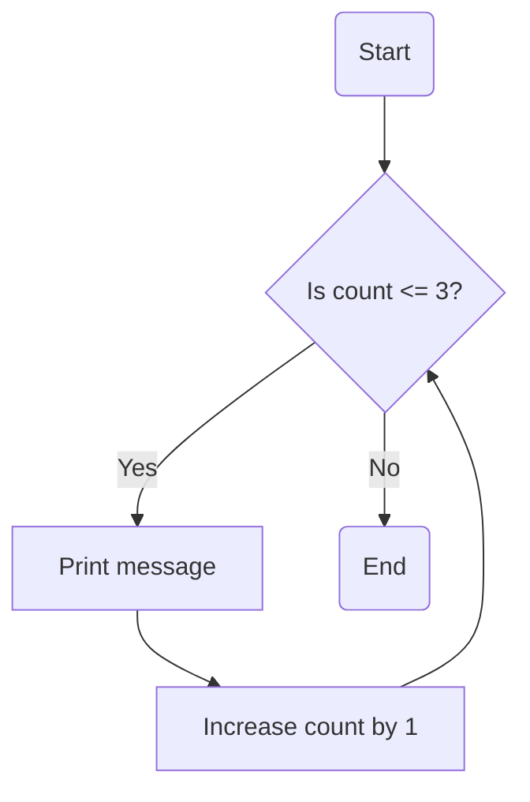

## 3.1.3 While Loops

Welcome to the exciting world of loops in coding! In this section, we will dive into **while loops**, a powerful tool that helps us repeat actions in our code until a certain condition is met. Understanding while loops will give you more control over how your programs run and allow you to create more dynamic and interactive applications.

### What is a While Loop?

A **while loop** is a type of loop that continues to execute a block of code as long as a specified condition is true. It's like a game where you keep playing until you reach a certain score or a task you keep doing until it's completed.

#### How While Loops Work

While loops check a condition before executing the code inside the loop. If the condition is true, the code runs. After the code runs, the condition is checked again. This process repeats until the condition becomes false, at which point the loop stops.

Here's a simple analogy: Imagine you are filling a bucket with water. You keep pouring water into the bucket **while** it is not full. Once the bucket is full, you stop pouring.

### Key Concepts of While Loops

#### Condition Checking

The heart of a while loop is its condition. The loop will continue to execute as long as this condition remains true. It's crucial to ensure that something within the loop changes the condition to false eventually; otherwise, the loop will run forever, which we call an **infinite loop**.

#### Potential Infinite Loops

An infinite loop occurs when the condition never becomes false. This can cause your program to freeze or crash. To prevent infinite loops, make sure that the condition will eventually be met. This usually involves changing a variable inside the loop that affects the condition.

### Code Example: While Loop in Dart

Let's look at a simple example of a while loop in Dart, the programming language used with Flutter:

```dart
int count = 1;
while (count <= 3) {
  print('Hello while loop! Count: $count');
  count++;
}
```

**Explanation:**

- We start with a variable `count` set to 1.
- The while loop checks if `count` is less than or equal to 3.
- If true, it prints a message and increases `count` by 1.
- This process repeats until `count` is greater than 3.

### Activity: Create Your Own While Loop

Now it's your turn! Try writing a while loop that continues until a variable reaches the number 5. Here's a template to get you started:

```dart
int number = 1;
while (number <= 5) {
  print('Current number is: $number');
  number++;
}
```

### Visualizing While Loops with Flowcharts

Visual aids can help us understand how while loops work. Here's a flowchart that represents the while loop process:



This flowchart shows the decision-making process of a while loop, highlighting how the loop continues to execute as long as the condition is true.

### When to Use While Loops

While loops are particularly useful when you don't know in advance how many times you need to repeat an action. For example, you might use a while loop to keep asking a user for input until they provide a valid response.

#### Comparing While Loops and For Loops

- **For Loops:** Best when you know the exact number of iterations.
- **While Loops:** Ideal when the number of iterations depends on a condition.

### Engagement: Discussing Real-World Scenarios

Think about situations in everyday life where you repeat an action until a condition is met. For example, you might keep practicing a musical instrument until you can play a song perfectly. Discuss with a friend or family member how this relates to while loops in coding.

### Best Practices and Common Pitfalls

- **Ensure Termination:** Always make sure the loop will eventually stop by changing the condition within the loop.
- **Debugging:** If your program seems stuck, check for infinite loops.
- **Readability:** Keep your loop conditions simple and easy to understand.

By mastering while loops, you'll be able to write more flexible and powerful code. Keep experimenting and exploring different ways to use loops in your projects!

## Quiz Time!



### What is a while loop?

- [x] A loop that continues as long as a condition is true
- [ ] A loop that runs a fixed number of times
- [ ] A loop that never stops
- [ ] A loop that only runs once

> **Explanation:** A while loop continues to execute as long as the specified condition remains true.

### What is a potential risk of using while loops?

- [x] Creating an infinite loop
- [ ] Running out of memory
- [ ] Making the code too short
- [ ] Using too many variables

> **Explanation:** If the condition in a while loop never becomes false, it can create an infinite loop.

### How can you prevent an infinite loop?

- [x] Ensure the condition will eventually be false
- [ ] Use more variables
- [ ] Avoid using conditions
- [ ] Make the loop run faster

> **Explanation:** To prevent an infinite loop, make sure something within the loop changes the condition to false eventually.

### In the provided code example, what does the `count++` line do?

- [x] Increases the value of count by 1
- [ ] Decreases the value of count by 1
- [ ] Resets count to 0
- [ ] Prints the value of count

> **Explanation:** The `count++` line increases the value of `count` by 1 each time the loop runs.

### When is a while loop more useful than a for loop?

- [x] When the number of iterations is unknown
- [ ] When you need to run the loop exactly 10 times
- [ ] When you want to avoid using conditions
- [ ] When you want to use fewer lines of code

> **Explanation:** A while loop is more useful when the number of iterations depends on a condition rather than a fixed number.

### What does the condition in a while loop determine?

- [x] Whether the loop continues or stops
- [ ] How fast the loop runs
- [ ] How many variables are used
- [ ] The color of the text

> **Explanation:** The condition in a while loop determines whether the loop continues to execute or stops.

### What is the purpose of the flowchart in the article?

- [x] To visually represent the while loop process
- [ ] To show how to draw shapes
- [ ] To list all possible loop conditions
- [ ] To compare while loops with for loops

> **Explanation:** The flowchart visually represents the decision-making process of a while loop.

### What happens if the condition in a while loop is initially false?

- [x] The loop does not execute
- [ ] The loop runs once
- [ ] The loop runs infinitely
- [ ] The loop prints an error

> **Explanation:** If the condition is initially false, the loop does not execute at all.

### What is the result of the following code snippet?
```dart
int number = 1;
while (number <= 5) {
  print('Current number is: $number');
  number++;
}
```

- [x] It prints numbers 1 to 5
- [ ] It prints numbers 1 to 4
- [ ] It prints numbers 1 to 6
- [ ] It prints nothing

> **Explanation:** The loop prints numbers from 1 to 5, incrementing `number` each time.

### True or False: A while loop always runs at least once.

- [ ] True
- [x] False

> **Explanation:** A while loop only runs if the condition is true at the start. If the condition is false initially, the loop does not run at all.


