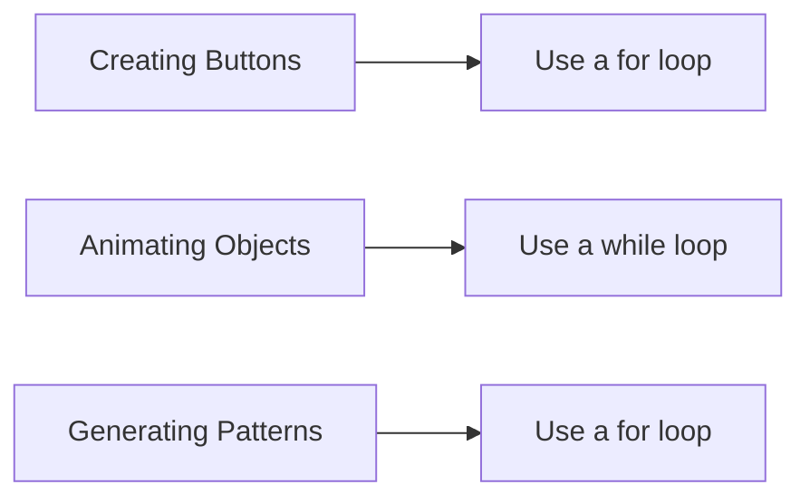

## 3.1.4 When to Use Loops

Welcome to the exciting world of loops! In this section, we'll explore how loops can be your best friend when it comes to making your code efficient and powerful. Loops are like magic spells in coding—they help you automate repetitive tasks, saving you time and effort. Let's dive into the practical applications of loops in app development and see how they can make your coding journey smoother and more fun!

### Understanding the Power of Loops

Loops are a fundamental concept in programming that allow you to repeat a block of code multiple times. This is incredibly useful when you have tasks that need to be done over and over again. Instead of writing the same code repeatedly, you can use a loop to do it for you. This not only makes your code cleaner but also reduces the chances of errors.

### Key Concepts of Using Loops

#### Efficiency: Automating Repetitive Tasks

One of the main reasons to use loops is efficiency. Imagine you are building an app that displays a list of items, like a shopping list or a gallery of images. Instead of writing code to display each item individually, you can use a loop to automate the process. This makes your code shorter, easier to read, and more efficient.

#### Examples of Loop Applications

Let's look at some examples where loops can be incredibly helpful:

1. **Creating Multiple Buttons:**
   - If your app needs several buttons, such as a calculator with numbers 0-9, you can use a loop to create them all at once.

2. **Animating Objects:**
   - In a game, you might want to animate characters or objects. Loops can help you update their positions or appearances over time.

3. **Generating Patterns:**
   - Whether it's a pattern of stars or a grid layout, loops can help you generate complex designs with minimal code.

4. **Updating Scores in a Game:**
   - As players progress through levels, loops can be used to update scores or other game statistics efficiently.

### Activity: Brainstorming Loop Applications

Now it's your turn! Think about the apps you want to create or have already started working on. Can you identify tasks that are repetitive and could benefit from using loops? Here are some questions to get you started:

- Do you have a list of items that need to be displayed?
- Are there animations or movements that repeat?
- Is there a pattern or design that repeats across your app?

Write down your ideas and see how you can incorporate loops to make your code more efficient.

### Visualizing Loop Scenarios

To help you visualize where loops can be applied, let's look at a simple diagram using Mermaid.js:

This diagram shows different scenarios where loops can be applied in app development. Each task can be automated using a specific type of loop, making your code more streamlined and effective.

### Relating Loops to Real-Life Tasks

To make loops easier to understand, let's relate them to real-life tasks. Imagine you're setting up chairs for a party. Instead of placing each chair one by one, you could use a loop to place them in rows automatically. Similarly, loops in coding help you automate repetitive tasks, making your work faster and more efficient.

### Encouragement to Explore Loops

As you continue your coding journey, think about how loops can simplify your projects. Whether you're building a game, an educational app, or a utility tool, loops can help you manage repetitive tasks with ease. Experiment with different types of loops and see how they can enhance your coding skills.

Remember, loops are a powerful tool in your coding toolbox. Use them wisely, and you'll be able to create amazing apps with less effort!

## Quiz Time!



### What is the main benefit of using loops in coding?

- [x] Automating repetitive tasks
- [ ] Making code longer
- [ ] Increasing the number of errors
- [ ] Slowing down the app

> **Explanation:** Loops help automate repetitive tasks, making code more efficient and reducing the chances of errors.

### Which type of loop would you use to create multiple buttons in an app?

- [x] For loop
- [ ] While loop
- [ ] Infinite loop
- [ ] Do-while loop

> **Explanation:** A for loop is ideal for creating multiple buttons because it allows you to iterate a specific number of times.

### How can loops help in animating objects in a game?

- [x] By updating positions or appearances over time
- [ ] By making objects disappear
- [ ] By stopping all animations
- [ ] By creating static images

> **Explanation:** Loops can be used to update the positions or appearances of objects over time, creating animations.

### What is a real-life example of a task that could be automated with a loop?

- [x] Placing chairs in rows for a party
- [ ] Writing a single letter
- [ ] Turning on a light switch
- [ ] Eating a sandwich

> **Explanation:** Placing chairs in rows is a repetitive task that can be automated with a loop.

### Which loop is best for generating patterns in an app?

- [x] For loop
- [ ] While loop
- [ ] Infinite loop
- [ ] Do-while loop

> **Explanation:** A for loop is suitable for generating patterns because it allows you to repeat a block of code a specific number of times.

### How do loops contribute to code efficiency?

- [x] By reducing the amount of code needed
- [ ] By making code harder to read
- [ ] By increasing the number of lines
- [ ] By complicating the logic

> **Explanation:** Loops reduce the amount of code needed by automating repetitive tasks, making the code more efficient.

### What should you consider when deciding to use a loop in your app?

- [x] Whether the task is repetitive
- [ ] Whether the task is unique
- [ ] Whether the task is simple
- [ ] Whether the task is complex

> **Explanation:** Loops are best used for tasks that are repetitive and need to be performed multiple times.

### Can loops be used to update scores in a game?

- [x] Yes
- [ ] No

> **Explanation:** Loops can be used to update scores or other game statistics efficiently as players progress through levels.

### What is a key concept of using loops?

- [x] Efficiency
- [ ] Complexity
- [ ] Confusion
- [ ] Length

> **Explanation:** Efficiency is a key concept of using loops, as they help automate repetitive tasks.

### True or False: Loops can make your code more error-prone.

- [ ] True
- [x] False

> **Explanation:** Loops actually help reduce errors by automating repetitive tasks and making code more efficient.


