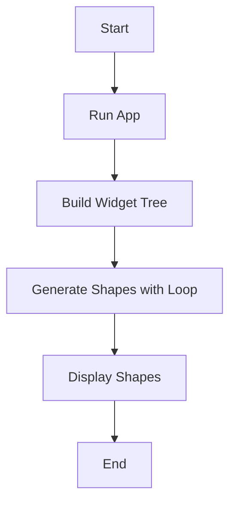

## 3.2.1 Drawing Shapes

Welcome to the exciting world of drawing shapes with Flutter! In this section, we will explore how to create basic shapes using loops and widgets. This is a fun way to see how coding can bring art to life on your screen. Let's dive in!

### Objective

Our goal is to teach you how to draw basic shapes in Flutter using loops. By the end of this section, you'll be able to create multiple shapes efficiently and even design your own patterns.

### Explanation

In coding, loops are like magic tools that help us repeat actions without writing the same code over and over again. Imagine you want to draw five circles on the screen. Instead of writing code for each circle, you can use a loop to do it all at once! This saves time and makes your code neat and tidy.

### Key Concepts

#### Shape Widgets

In Flutter, we use widgets to create everything you see on the screen. To draw shapes, we can use a widget called `Container`. A `Container` can be styled to look like different shapes by adjusting its properties.

#### Positioning

Positioning is all about deciding where your shapes will appear on the screen. You can use rows, columns, and other layout widgets to arrange your shapes just the way you like.

### Code Example

Let's look at a simple example of how to draw a row of blue squares using Flutter:

```dart
import 'package:flutter/material.dart';

void main() {
  runApp(ShapesApp());
}

class ShapesApp extends StatelessWidget {
  @override
  Widget build(BuildContext context) {
    return MaterialApp(
      home: Scaffold(
        appBar: AppBar(
          title: Text('Drawing Shapes'),
        ),
        body: Center(
          child: Row(
            mainAxisAlignment: MainAxisAlignment.center,
            children: List.generate(5, (index) {
              return Container(
                width: 50,
                height: 50,
                margin: EdgeInsets.all(5),
                color: Colors.blue,
              );
            }),
          ),
        ),
      ),
    );
  }
}
```

#### How It Works

- **`List.generate(5, (index) {...})`:** This line creates a list of five `Container` widgets. Each `Container` is a blue square.
- **`Container`:** This widget is styled to be 50x50 pixels with a blue color.
- **`Row`:** The `Row` widget arranges the squares in a horizontal line.

### Activity

Now it's your turn! Try modifying the code to draw different shapes or change the colors. Here are some ideas:

- Change the color of the squares to red or green.
- Make the squares larger or smaller.
- Add more squares to the row.

### Visuals

To help you understand how the app works, here's a flowchart that outlines the structure of our shape-drawing app:



### Language

Remember, coding is all about experimenting and having fun. Don't be afraid to try new things and see what happens. You might discover a cool new pattern or design!

### Engagement

Challenge yourself to create your own unique pattern. Can you make a checkerboard design? How about a rainbow of colors? The possibilities are endless!

### Best Practices

- **Keep Your Code Clean:** Use comments to explain what your code does. This will help you and others understand it better.
- **Experiment:** Try changing different parts of the code to see what happens. This is a great way to learn.
- **Ask for Help:** If you get stuck, don't hesitate to ask a friend or teacher for help.

### Common Pitfalls

- **Forgetting to Save:** Always save your changes before running the app.
- **Syntax Errors:** Double-check your code for typos or missing brackets.

### Conclusion

Drawing shapes with Flutter is a fantastic way to see your code come to life. By using loops and widgets, you can create beautiful patterns and designs. Keep experimenting and have fun!

## Quiz Time!



### What widget is used to draw shapes in Flutter?

- [x] Container
- [ ] Text
- [ ] Button
- [ ] Image

> **Explanation:** The `Container` widget is used to draw shapes by adjusting its properties like width, height, and color.

### What is the purpose of using loops in drawing shapes?

- [x] To repeat actions efficiently
- [ ] To make the app slower
- [ ] To add more colors
- [ ] To delete shapes

> **Explanation:** Loops help repeat actions efficiently, allowing you to draw multiple shapes without writing repetitive code.

### Which property of the `Container` widget changes its color?

- [x] color
- [ ] width
- [ ] height
- [ ] margin

> **Explanation:** The `color` property of the `Container` widget is used to change its color.

### How can you arrange shapes horizontally in Flutter?

- [x] Use a Row widget
- [ ] Use a Column widget
- [ ] Use a Stack widget
- [ ] Use a ListView widget

> **Explanation:** The `Row` widget arranges its children horizontally.

### What does `List.generate(5, (index) {...})` do in the code example?

- [x] Creates a list of five widgets
- [ ] Deletes five widgets
- [ ] Changes the color of five widgets
- [ ] Moves five widgets

> **Explanation:** `List.generate(5, (index) {...})` creates a list of five widgets.

### What happens if you change the `mainAxisAlignment` property in a `Row`?

- [x] It changes the alignment of the children
- [ ] It changes the color of the children
- [ ] It changes the size of the children
- [ ] It deletes the children

> **Explanation:** The `mainAxisAlignment` property changes how the children are aligned within the `Row`.

### What is a common mistake when using loops in Flutter?

- [x] Forgetting to save changes
- [ ] Using too many colors
- [ ] Making shapes too small
- [ ] Using too few widgets

> **Explanation:** A common mistake is forgetting to save changes before running the app.

### How can you make a `Container` look like a circle?

- [x] Set the `borderRadius` property
- [ ] Set the `color` property
- [ ] Set the `width` property
- [ ] Set the `height` property

> **Explanation:** Setting the `borderRadius` property can make a `Container` look like a circle.

### What should you do if you get stuck while coding?

- [x] Ask for help
- [ ] Delete your code
- [ ] Stop coding
- [ ] Ignore the problem

> **Explanation:** If you get stuck, it's always a good idea to ask for help from a friend or teacher.

### True or False: Experimenting with code is a great way to learn.

- [x] True
- [ ] False

> **Explanation:** Experimenting with code helps you understand how different parts work and can lead to discovering new things.


