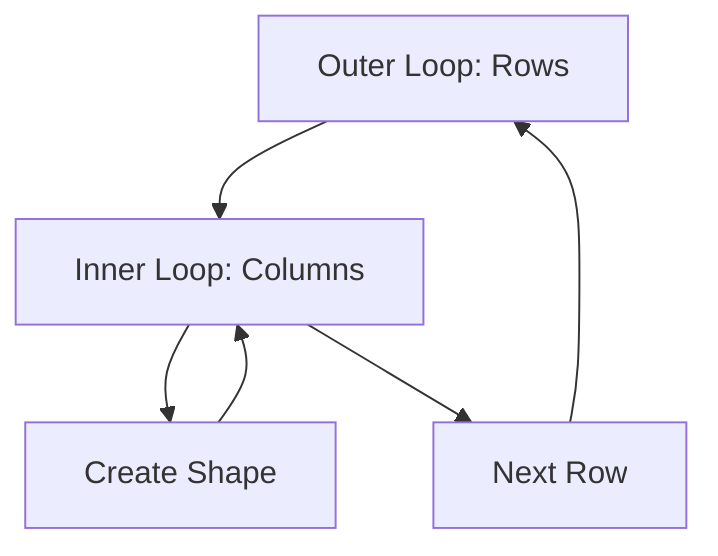

## 3.2.2 Using Loops for Patterns

Welcome to the exciting world of creating visual patterns using loops in Flutter! In this section, we'll explore how loops can help us generate repeating patterns in our app's user interface without writing repetitive code. By the end of this lesson, you'll be able to create dynamic and adaptable UIs that can change based on data or user input.

### Objective

Our goal is to understand how loops can be used to create patterns like rows of stars, checkerboards, or stripes. We'll learn how to use Flutter's `List.generate` to efficiently create multiple widgets and build dynamic UIs.

### Key Concepts

#### List.generate

In Flutter, `List.generate` is a powerful tool that allows us to create a list of widgets dynamically. This means we can generate multiple widgets based on a specific pattern or condition without having to write each widget manually.

#### Dynamic UI

A dynamic UI is one that can change and adapt based on data or user interactions. By using loops, we can create interfaces that are flexible and responsive, making our apps more interactive and engaging.

### Code Example

Let's dive into a practical example to see how loops can create a checkerboard pattern using Flutter:

```dart
import 'package:flutter/material.dart';

void main() {
  runApp(PatternApp());
}

class PatternApp extends StatelessWidget {
  @override
  Widget build(BuildContext context) {
    return MaterialApp(
      home: Scaffold(
        appBar: AppBar(
          title: Text('Patterns with Loops'),
        ),
        body: Center(
          child: Column(
            mainAxisAlignment: MainAxisAlignment.center,
            children: List.generate(5, (row) {
              return Row(
                mainAxisAlignment: MainAxisAlignment.center,
                children: List.generate(5, (col) {
                  return Container(
                    width: 30,
                    height: 30,
                    margin: EdgeInsets.all(2),
                    color: (row + col) % 2 == 0 ? Colors.red : Colors.white,
                  );
                }),
              );
            }),
          ),
        ),
      ),
    );
  }
}
```

#### Explanation

- **List.generate(5, (row) {...}):** This creates a list of 5 rows. Each row is generated by the inner loop.
- **List.generate(5, (col) {...}):** Inside each row, we generate 5 columns, creating a grid.
- **Container:** Each cell in the grid is a `Container` widget with a fixed size and margin.
- **Color Condition:** The color of each container is determined by the condition `(row + col) % 2 == 0`. This creates a checkerboard pattern by alternating colors.

### Activity

Now it's your turn! Try changing the pattern by modifying the condition in the color assignment or adjusting the number of rows and columns. What happens if you change the colors or the size of the containers?

### Visuals

To better understand how nested loops create grid patterns, let's look at a diagram:



This diagram shows how the outer loop controls the rows, while the inner loop creates columns within each row. Each iteration of the inner loop generates a shape (in this case, a colored square), and once a row is complete, the outer loop moves to the next row.

### Language and Engagement

Think of this process like arranging tiles on a grid or drawing on graph paper. Each square is like a tile, and the loops help us place them in the right order to create a pattern. Encourage kids to experiment with different patterns and see how small changes in the code can lead to big changes in the output.

### Best Practices

- **Experiment:** Encourage experimentation with different patterns and colors.
- **Understand Conditions:** Pay attention to how conditions affect the pattern.
- **Keep Code Clean:** Use comments to explain your code and keep it organized.

### Common Pitfalls

- **Off-by-One Errors:** Be careful with loop indices to avoid missing or extra elements.
- **Complex Conditions:** Start with simple conditions and gradually increase complexity.

### Conclusion

Using loops to create patterns is a fun and powerful way to build dynamic UIs in Flutter. By understanding how loops work and experimenting with different conditions, you can create a wide variety of patterns and designs. Keep practicing, and soon you'll be able to design your own unique patterns!

## Quiz Time!



### What is the purpose of using loops in creating patterns?

- [x] To avoid writing repetitive code
- [ ] To make the code more complex
- [ ] To slow down the app
- [ ] To use more memory

> **Explanation:** Loops help avoid repetitive code by automating the creation of patterns, making the code more efficient and easier to manage.

### What does `List.generate` do in Flutter?

- [x] Creates a list of widgets dynamically
- [ ] Deletes widgets
- [ ] Changes widget colors
- [ ] Animates widgets

> **Explanation:** `List.generate` is used to create a list of widgets dynamically based on a specified pattern or condition.

### In the code example, what pattern is created by the condition `(row + col) % 2 == 0`?

- [x] Checkerboard pattern
- [ ] Striped pattern
- [ ] Circular pattern
- [ ] Random pattern

> **Explanation:** The condition `(row + col) % 2 == 0` creates a checkerboard pattern by alternating colors based on the sum of row and column indices.

### What happens if you increase the number of rows in the `List.generate` function?

- [x] More rows are added to the pattern
- [ ] The pattern becomes smaller
- [ ] The pattern disappears
- [ ] The pattern becomes circular

> **Explanation:** Increasing the number of rows in `List.generate` adds more rows to the pattern, expanding the grid vertically.

### How can you change the colors in the pattern?

- [x] Modify the color condition in the code
- [ ] Change the app's theme
- [ ] Use a different widget
- [ ] Adjust the screen brightness

> **Explanation:** You can change the colors in the pattern by modifying the color condition in the code, such as changing the colors assigned to the containers.

### What is a dynamic UI?

- [x] A user interface that adapts based on data
- [ ] A static user interface
- [ ] A user interface with no interaction
- [ ] A user interface that uses only one color

> **Explanation:** A dynamic UI is one that can change and adapt based on data or user interactions, making it flexible and responsive.

### Why is it important to keep code clean and organized?

- [x] To make it easier to read and maintain
- [ ] To make it harder to understand
- [ ] To increase file size
- [ ] To slow down the app

> **Explanation:** Keeping code clean and organized makes it easier to read, understand, and maintain, which is important for long-term development.

### What analogy can help understand loops creating patterns?

- [x] Arranging tiles on a grid
- [ ] Baking a cake
- [ ] Driving a car
- [ ] Flying a kite

> **Explanation:** Arranging tiles on a grid is a helpful analogy for understanding how loops create patterns, as each tile represents a widget in the grid.

### What is a common pitfall when using loops for patterns?

- [x] Off-by-one errors
- [ ] Using too many colors
- [ ] Not enough widgets
- [ ] Too much memory usage

> **Explanation:** Off-by-one errors are common when using loops, as incorrect indices can lead to missing or extra elements in the pattern.

### True or False: Loops can only create simple patterns.

- [ ] True
- [x] False

> **Explanation:** False. Loops can create a wide variety of patterns, from simple to complex, depending on the conditions and logic used.


