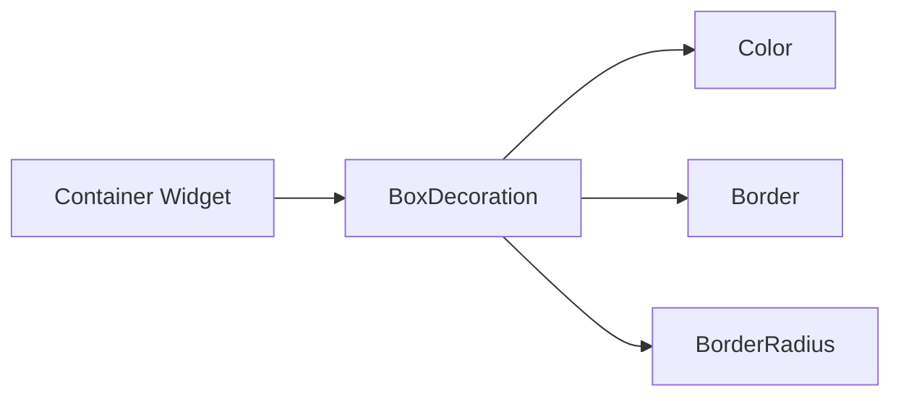

## 3.2.3 Colors and Styles

Welcome to the exciting world of colors and styles in Flutter! In this section, we'll explore how to make your apps more visually appealing by adding colors and styles to the shapes and patterns you create. Colors and styles not only make your app look great but also help differentiate elements, making them easier to understand and interact with.

### Why Colors and Styles Matter

Imagine a world without colors—everything would look the same, right? Colors bring life to our surroundings, and the same goes for apps. By using different colors, you can make your app more engaging and fun to use. Styles, on the other hand, add depth and character to your app elements, such as borders, shadows, and sizes, making them stand out.

### Key Concepts

#### Colors

In Flutter, colors are used to paint widgets, making them vibrant and eye-catching. You can use predefined colors from the `Colors` class or create your own custom colors. Here's a quick look at how colors can be applied to widgets:

- **Predefined Colors:** Flutter provides a wide range of predefined colors that you can use directly, such as `Colors.red`, `Colors.blue`, and `Colors.green`.
- **Custom Colors:** You can create custom colors using the `Color` class with RGB values.

#### Styling

Styling involves adding visual enhancements to your widgets, such as:

- **Borders:** Define the outline of a widget, making it distinct from others.
- **Shadows:** Add depth to widgets, giving them a 3D effect.
- **Sizes:** Adjust the width and height to fit your design needs.

### Code Example

Let's dive into a practical example where we'll create a colorful pattern using Flutter. This example will show you how to use colors and styles to make your patterns pop!

```dart
import 'package:flutter/material.dart';

void main() {
  runApp(StyledPatternApp());
}

class StyledPatternApp extends StatelessWidget {
  @override
  Widget build(BuildContext context) {
    return MaterialApp(
      home: Scaffold(
        appBar: AppBar(
          title: Text('Colored Patterns'),
        ),
        body: Center(
          child: Column(
            mainAxisAlignment: MainAxisAlignment.center,
            children: List.generate(5, (row) {
              return Row(
                mainAxisAlignment: MainAxisAlignment.center,
                children: List.generate(5, (col) {
                  return Container(
                    width: 30,
                    height: 30,
                    margin: EdgeInsets.all(2),
                    decoration: BoxDecoration(
                      color: Colors.primaries[(row + col) % Colors.primaries.length],
                      border: Border.all(color: Colors.black),
                      borderRadius: BorderRadius.circular(5),
                    ),
                  );
                }),
              );
            }),
          ),
        ),
      ),
    );
  }
}
```

### Understanding the Code

- **Colors.primaries:** This is a list of primary colors provided by Flutter. We use it to assign different colors to each square in our pattern.
- **Border:** Adds a black border around each square, making them distinct.
- **BorderRadius:** Rounds the corners of each square, giving them a softer look.

### Activity: Experiment with Colors and Styles

Now it's your turn! Try changing the `BoxDecoration` properties in the code above to see how different colors and styles affect the appearance of your pattern. Here are some ideas:

- Change the `color` property to use a custom color.
- Modify the `border` to use a different color or thickness.
- Adjust the `borderRadius` to see how it changes the shape.

### Visualizing Styling with Mermaid.js

To better understand how styling properties affect widgets, let's look at a simple diagram:



This diagram shows how a `Container` widget can be styled using `BoxDecoration`, which includes properties like `Color`, `Border`, and `BorderRadius`.

### Creative Challenge: Rainbow Pattern

Challenge yourself to create a rainbow pattern using the concepts you've learned. Try using a gradient of colors to make your pattern look like a rainbow. You can also add borders or shadows to enhance the effect.

### Best Practices and Tips

- **Consistency:** Use a consistent color scheme throughout your app to create a cohesive look.
- **Contrast:** Ensure there is enough contrast between text and background colors for readability.
- **Experiment:** Don't be afraid to try different styles and colors to see what works best for your design.

### Common Pitfalls

- **Overuse of Colors:** Too many colors can make your app look cluttered. Stick to a few complementary colors.
- **Ignoring Accessibility:** Ensure your color choices are accessible to all users, including those with color blindness.

### Conclusion

Adding colors and styles to your Flutter apps can transform them from simple to stunning. By experimenting with different combinations, you can create unique and engaging designs that capture users' attention. Remember, the key is to have fun and let your creativity shine!

## Let's Get Creative!

Now that you've learned about colors and styles, it's time to put your skills to the test. Create your own colorful patterns and share them with friends and family. Who knows, you might inspire someone else to start their coding journey!

## Quiz Time!



### What is the purpose of using colors in Flutter apps?

- [x] To make the app visually appealing
- [ ] To increase the app's performance
- [ ] To reduce the app's size
- [ ] To make the app run faster

> **Explanation:** Colors are used to make the app visually appealing and engaging for users.

### Which class in Flutter provides predefined colors?

- [x] Colors
- [ ] Styles
- [ ] Widgets
- [ ] Material

> **Explanation:** The `Colors` class in Flutter provides a wide range of predefined colors.

### What property is used to add a border to a widget in Flutter?

- [x] Border
- [ ] Shadow
- [ ] Padding
- [ ] Margin

> **Explanation:** The `Border` property is used to add a border to a widget in Flutter.

### How can you create a custom color in Flutter?

- [x] Using the Color class with RGB values
- [ ] Using the Styles class
- [ ] Using the Widgets class
- [ ] Using the Material class

> **Explanation:** You can create a custom color in Flutter using the `Color` class with RGB values.

### What does the BorderRadius property do?

- [x] Rounds the corners of a widget
- [ ] Changes the color of a widget
- [ ] Adds a shadow to a widget
- [ ] Increases the size of a widget

> **Explanation:** The `BorderRadius` property rounds the corners of a widget, giving it a softer look.

### What is a common pitfall when using colors in apps?

- [x] Overuse of colors
- [ ] Using too few colors
- [ ] Not using any colors
- [ ] Using only black and white

> **Explanation:** Overuse of colors can make an app look cluttered and confusing.

### Why is contrast important in app design?

- [x] For readability and accessibility
- [ ] To make the app look colorful
- [ ] To increase app speed
- [ ] To reduce app size

> **Explanation:** Contrast is important for readability and accessibility, ensuring text is easy to read against the background.

### What is the role of shadows in styling widgets?

- [x] To add depth and a 3D effect
- [ ] To change the color of a widget
- [ ] To increase the size of a widget
- [ ] To reduce the app's performance

> **Explanation:** Shadows add depth and a 3D effect to widgets, making them stand out.

### Can you use both predefined and custom colors in a single app?

- [x] True
- [ ] False

> **Explanation:** You can use both predefined and custom colors in a single app to create a unique design.

### What should you consider when choosing colors for your app?

- [x] Accessibility and contrast
- [ ] The app's performance
- [ ] The app's size
- [ ] The app's speed

> **Explanation:** When choosing colors for your app, consider accessibility and contrast to ensure a good user experience.


