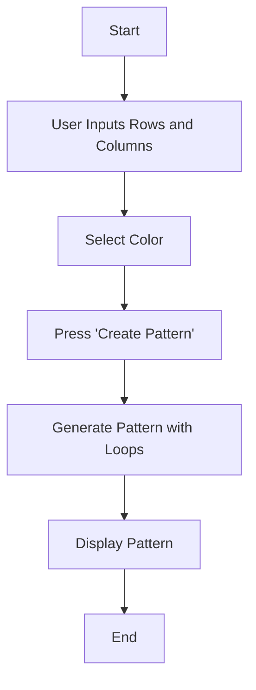

## 3.2.4 Mini Project: Pattern Maker

Welcome to the exciting world of pattern creation! In this mini-project, you'll learn how to build a Pattern Maker app using Flutter. This app will allow you to design your own patterns by choosing the number of rows and columns, as well as selecting colors. Let's dive into the world of loops, user inputs, and dynamic UI updates!

### Objective

The goal of this project is to apply your knowledge of loops and styling in Flutter to create a fun and interactive Pattern Maker app. You'll learn how to handle user inputs and dynamically update the UI to display beautiful patterns.

### Project Overview

In this project, you'll build an app where users can:

- Choose the number of rows and columns for their pattern.
- Select a color for the pattern.
- Generate and display the pattern on the screen.

### Step-by-Step Guide

Let's break down the process of building the Pattern Maker app into manageable steps:

#### 1. Set Up the UI

First, we'll create the user interface (UI) for our app. This includes input fields for the number of rows and columns, as well as color pickers for selecting the pattern color.

#### 2. Create Variables

Next, we'll declare variables to store the user inputs. These variables will help us generate the pattern based on the user's choices.

#### 3. Generate Pattern

Using loops, we'll create the pattern by iterating over the number of rows and columns specified by the user. This is where the magic of loops comes into play!

#### 4. Display Pattern

Finally, we'll display the generated pattern on the screen, allowing users to see their creations come to life.

### Code Example

Here's a complete code example to help you build the Pattern Maker app:

```dart
import 'package:flutter/material.dart';

void main() {
  runApp(PatternMakerApp());
}

class PatternMakerApp extends StatefulWidget {
  @override
  _PatternMakerAppState createState() => _PatternMakerAppState();
}

class _PatternMakerAppState extends State<PatternMakerApp> {
  int rows = 3;
  int cols = 3;
  Color selectedColor = Colors.blue;

  @override
  Widget build(BuildContext context) {
    return MaterialApp(
      home: Scaffold(
        appBar: AppBar(
          title: Text('Pattern Maker'),
        ),
        body: Padding(
          padding: EdgeInsets.all(16.0),
          child: Column(
            children: [
              TextField(
                decoration: InputDecoration(labelText: 'Number of Rows'),
                keyboardType: TextInputType.number,
                onChanged: (value) {
                  setState(() {
                    rows = int.parse(value);
                  });
                },
              ),
              TextField(
                decoration: InputDecoration(labelText: 'Number of Columns'),
                keyboardType: TextInputType.number,
                onChanged: (value) {
                  setState(() {
                    cols = int.parse(value);
                  });
                },
              ),
              SizedBox(height: 10),
              Row(
                children: [
                  Text('Select Color: '),
                  DropdownButton<Color>(
                    value: selectedColor,
                    items: Colors.primaries.map((Color color) {
                      return DropdownMenuItem<Color>(
                        value: color,
                        child: Container(
                          width: 24,
                          height: 24,
                          color: color,
                        ),
                      );
                    }).toList(),
                    onChanged: (Color? newColor) {
                      setState(() {
                        selectedColor = newColor!;
                      });
                    },
                  ),
                ],
              ),
              SizedBox(height: 20),
              ElevatedButton(
                onPressed: () {
                  setState(() {}); // Refresh the UI to display the pattern
                },
                child: Text('Create Pattern'),
              ),
              SizedBox(height: 20),
              Expanded(
                child: GridView.builder(
                  gridDelegate: SliverGridDelegateWithFixedCrossAxisCount(
                    crossAxisCount: cols,
                  ),
                  itemCount: rows * cols,
                  itemBuilder: (context, index) {
                    return Container(
                      margin: EdgeInsets.all(2),
                      color: selectedColor,
                    );
                  },
                ),
              ),
            ],
          ),
        ),
      ),
    );
  }
}
```

### Visuals

To help you understand the flow of the Pattern Maker app, here's a Mermaid.js diagram outlining the process:



### Language and Engagement

This project is all about creativity and fun! As you build your Pattern Maker app, feel free to experiment with different settings to see what unique designs you can create. Encourage your friends to try it out and share their patterns too!

### Best Practices and Tips

- **Error Handling:** Make sure to handle cases where users might input invalid numbers or leave fields empty.
- **UI Design:** Keep the interface simple and intuitive. Use clear labels and buttons to guide users.
- **Experimentation:** Encourage kids to try different combinations of rows, columns, and colors to see how the patterns change.

### Conclusion

Congratulations on building your very own Pattern Maker app! You've learned how to use loops and user inputs to create dynamic and interactive designs. Keep experimenting and have fun creating new patterns!

## Quiz Time!



### What is the main purpose of the Pattern Maker app?

- [x] To allow users to create patterns by selecting rows, columns, and colors.
- [ ] To draw pictures on the screen.
- [ ] To play music.
- [ ] To calculate math problems.

> **Explanation:** The Pattern Maker app is designed to let users create patterns by choosing the number of rows, columns, and colors.

### Which Flutter widget is used to create a grid layout in the app?

- [ ] ListView
- [x] GridView
- [ ] Column
- [ ] Row

> **Explanation:** The `GridView` widget is used to create a grid layout in the Flutter app.

### How do you update the UI in Flutter when user inputs change?

- [ ] By restarting the app.
- [x] By using `setState()`.
- [ ] By closing the app.
- [ ] By using a different widget.

> **Explanation:** The `setState()` method is used in Flutter to update the UI when user inputs or other state changes occur.

### What type of input is used for selecting colors in the app?

- [ ] TextField
- [ ] Slider
- [x] DropdownButton
- [ ] Checkbox

> **Explanation:** A `DropdownButton` is used in the app to allow users to select colors from a list.

### What is the role of loops in the Pattern Maker app?

- [ ] To play sounds.
- [x] To generate the pattern based on user inputs.
- [ ] To display images.
- [ ] To send messages.

> **Explanation:** Loops are used in the Pattern Maker app to generate the pattern by iterating over the number of rows and columns specified by the user.

### What happens when the "Create Pattern" button is pressed?

- [x] The pattern is generated and displayed on the screen.
- [ ] The app closes.
- [ ] The app restarts.
- [ ] The app plays a sound.

> **Explanation:** When the "Create Pattern" button is pressed, the app generates the pattern and displays it on the screen.

### Which method is used to handle changes in the number of rows and columns?

- [ ] initState()
- [ ] dispose()
- [x] onChanged()
- [ ] build()

> **Explanation:** The `onChanged()` method is used to handle changes in the number of rows and columns when the user inputs new values.

### What is the default color used in the Pattern Maker app?

- [ ] Red
- [ ] Green
- [x] Blue
- [ ] Yellow

> **Explanation:** The default color used in the Pattern Maker app is blue, as specified in the `selectedColor` variable.

### Can users change the number of rows and columns after the pattern is created?

- [x] True
- [ ] False

> **Explanation:** Users can change the number of rows and columns at any time, and the pattern will update accordingly when they press the "Create Pattern" button.

### What is the main benefit of using loops in this project?

- [x] To efficiently create patterns without writing repetitive code.
- [ ] To make the app slower.
- [ ] To complicate the code.
- [ ] To reduce user interaction.

> **Explanation:** Loops allow for efficient pattern creation by reducing the need for repetitive code, making the app more dynamic and flexible.


