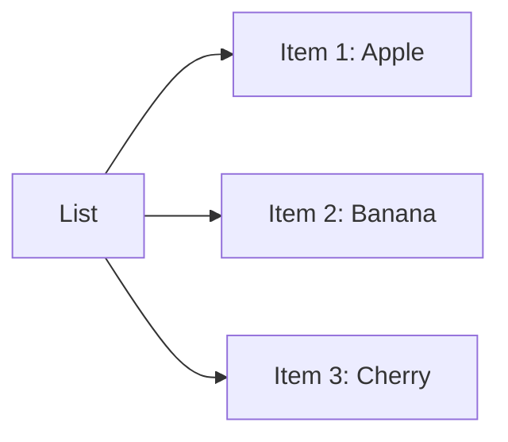

## 3.3.1 What are Lists?

Welcome to the exciting world of lists! In this section, we'll explore what lists are, how they work, and why they're so useful in coding. Lists are like magical baskets that can hold multiple items, making them perfect for organizing and managing data in your apps. Let's dive in and discover the wonders of lists!

### What is a List?

Imagine you have a basket, and you want to fill it with your favorite fruits: apples, bananas, and cherries. This basket is like a list in programming. A list is a collection of items, all neatly organized in a specific order. You can think of a list as a way to store multiple pieces of information in one place.

In programming, lists are incredibly useful because they allow us to group related items together. Whether it's a list of books, a collection of games, or a series of numbers, lists help us manage and access these items efficiently.

### Creating Lists

Creating a list in Dart is simple and straightforward. You can declare a list by specifying the type of items it will hold and then initializing it with the items you want to include. Here's how you can create a list of your favorite fruits:

```dart
List<String> favoriteFruits = ['Apple', 'Banana', 'Cherry'];
```

In this example, `List<String>` tells Dart that we're creating a list of strings (text items). The items inside the square brackets `['Apple', 'Banana', 'Cherry']` are the fruits we're adding to our list.

### Accessing Items in a List

Once you've created a list, you can easily access its items using their index. An index is like a label that tells you the position of an item in the list. In Dart, indexes start at 0, which means the first item in the list has an index of 0, the second item has an index of 1, and so on.

Let's see how we can access and print the first fruit in our list:

```dart
print(favoriteFruits[0]); // Output: Apple
```

In this code snippet, `favoriteFruits[0]` retrieves the first item in the list, which is "Apple". You can use this method to access any item in the list by changing the index number.

### Activity: Create Your Own List

Now it's your turn! Let's create a list of your favorite animals and print each one using its index. Here's a template to get you started:

```dart
List<String> favoriteAnimals = ['Dog', 'Cat', 'Elephant'];
print(favoriteAnimals[0]); // Output: Dog
print(favoriteAnimals[1]); // Output: Cat
print(favoriteAnimals[2]); // Output: Elephant
```

Try adding more animals to your list and see how you can access them using their indexes.

### Visualizing Lists

To help you visualize how lists work, let's use a simple diagram. Imagine each item in the list is connected to the next, forming a chain of items:



In this diagram, you can see how each item is part of the list, just like links in a chain.

### Everyday Examples of Lists

Lists are all around us! Here are some everyday examples to help you understand how lists are used:

- **Shopping List:** A list of items you need to buy from the store.
- **Playlist:** A collection of songs you want to listen to.
- **To-Do List:** Tasks you need to complete during the day.

Think about other things you might want to store in lists, like your favorite games, books, or even your top movies. Lists are a powerful tool for organizing and managing information.

### Conclusion

Lists are an essential part of programming, allowing us to store and manage multiple items efficiently. By understanding how to create and access lists, you can start building more complex and organized apps. Keep experimenting with lists, and soon you'll be using them like a pro!

## Quiz Time!



### What is a list in programming?

- [x] A collection of items stored in a specific order
- [ ] A single item stored in a variable
- [ ] A type of loop in programming
- [ ] A function that performs calculations

> **Explanation:** A list is a collection of items stored in a specific order, allowing you to manage multiple pieces of information together.

### How do you create a list of strings in Dart?

- [x] `List<String> myList = ['Item1', 'Item2'];`
- [ ] `String myList = ['Item1', 'Item2'];`
- [ ] `List myList = 'Item1', 'Item2';`
- [ ] `var myList = 'Item1', 'Item2';`

> **Explanation:** In Dart, you create a list of strings by using `List<String>` followed by the items in square brackets.

### What is the index of the first item in a list?

- [x] 0
- [ ] 1
- [ ] -1
- [ ] 10

> **Explanation:** In programming, the index of the first item in a list is 0.

### How do you access the second item in a list called `myList`?

- [x] `myList[1]`
- [ ] `myList[0]`
- [ ] `myList[2]`
- [ ] `myList[3]`

> **Explanation:** To access the second item in a list, you use the index 1, as indexes start at 0.

### Which of the following is NOT an example of a list?

- [ ] A shopping list
- [ ] A playlist
- [x] A single book
- [ ] A to-do list

> **Explanation:** A single book is not a list; it's just one item. Lists contain multiple items.

### What type of data can a list hold?

- [x] Any type of data
- [ ] Only numbers
- [ ] Only text
- [ ] Only images

> **Explanation:** Lists can hold any type of data, including numbers, text, and more.

### Can a list contain different types of data?

- [x] Yes
- [ ] No

> **Explanation:** Yes, a list can contain different types of data, though it's common to store similar types for consistency.

### What does the following code print? `print(['Apple', 'Banana'][1]);`

- [ ] Apple
- [x] Banana
- [ ] Cherry
- [ ] Error

> **Explanation:** The code prints "Banana" because it accesses the item at index 1 in the list.

### What is the purpose of using lists in programming?

- [x] To store and manage multiple items efficiently
- [ ] To perform calculations
- [ ] To create loops
- [ ] To define functions

> **Explanation:** Lists are used to store and manage multiple items efficiently in programming.

### True or False: Lists are only used in Dart.

- [ ] True
- [x] False

> **Explanation:** False. Lists are a common data structure used in many programming languages, not just Dart.


