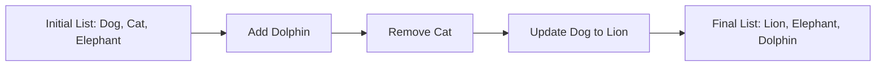

## 3.3.3 Modifying Lists

Welcome to the exciting world of lists in Dart! Lists are like magical containers that hold a collection of items. Imagine having a box where you can store your favorite toys, books, or even snacks. Just like you can add new toys to your box, take some out, or swap one toy for another, you can do the same with lists in your code. Let's dive into how we can modify lists by adding, removing, and updating items.

### Understanding Lists

Before we start modifying lists, let's quickly recap what a list is. A list is a collection of items that can be of any type, such as numbers, strings, or even other lists. Lists are ordered, which means each item has a specific position, starting from zero.

### Key Concepts of Modifying Lists

#### Adding Items

Adding items to a list is like putting new toys into your toy box. In Dart, you can use the `add` method to add a single item or `addAll` to add multiple items at once.

- **Using `add`:** This method adds a single item to the end of the list.
- **Using `addAll`:** This method adds multiple items to the list at once.

#### Removing Items

Removing items from a list is like taking toys out of your toy box. You can use the `remove` method to remove a specific item or `removeAt` to remove an item at a specific position.

- **Using `remove`:** This method removes the first occurrence of a specified item.
- **Using `removeAt`:** This method removes the item at a specified index.

#### Updating Items

Updating items in a list is like swapping one toy for another. You can change the value of an item at a specific index by assigning a new value to it.

### Code Example

Let's see how these concepts work in a simple Dart program:

```dart
void main() {
  List<String> favoriteBooks = ['Harry Potter', 'Percy Jackson'];
  
  // Adding an item
  favoriteBooks.add('The Hobbit');
  
  // Removing an item
  favoriteBooks.remove('Percy Jackson');
  
  // Updating an item
  favoriteBooks[0] = 'The Lord of the Rings';
  
  print(favoriteBooks); // Output: ['The Lord of the Rings', 'The Hobbit']
}
```

In this example, we start with a list of favorite books. We add "The Hobbit" to the list, remove "Percy Jackson", and update "Harry Potter" to "The Lord of the Rings". The final list contains "The Lord of the Rings" and "The Hobbit".

### Activity: Modify Your Own List

Now it's your turn! Try creating a list of your favorite animals. Add a new animal to your list, remove one you no longer like, and change another to a different animal. Here's a starting point:

```dart
void main() {
  List<String> favoriteAnimals = ['Dog', 'Cat', 'Elephant'];
  
  // Add a new animal
  favoriteAnimals.add('Dolphin');
  
  // Remove an animal
  favoriteAnimals.remove('Cat');
  
  // Update an animal
  favoriteAnimals[0] = 'Lion';
  
  print(favoriteAnimals); // Output: ['Lion', 'Elephant', 'Dolphin']
}
```

### Visualizing List Modifications

Let's visualize how our list changes with each modification using a diagram:



### Best Practices and Tips

- **Consistency:** Always check the index before updating or removing items to avoid errors.
- **Clarity:** Use meaningful names for your lists to make your code easier to understand.
- **Experimentation:** Try different combinations of adding, removing, and updating to see how your list changes.

### Common Pitfalls

- **Index Out of Range:** Be careful when accessing or modifying items by index. Ensure the index exists in the list.
- **Removing Non-Existent Items:** If you try to remove an item that isn't in the list, nothing will happen, but it's good to check first.

### Encouragement

Modifying lists is a powerful tool in programming. It allows you to manage collections of data dynamically. Keep experimenting with different lists and modifications to see what you can create!

## Quiz Time!



### What method would you use to add a single item to a list in Dart?

- [x] add
- [ ] addAll
- [ ] remove
- [ ] update

> **Explanation:** The `add` method is used to add a single item to the end of a list in Dart.

### Which method removes the first occurrence of a specified item from a list?

- [x] remove
- [ ] removeAt
- [ ] add
- [ ] update

> **Explanation:** The `remove` method removes the first occurrence of a specified item from a list.

### How do you update an item at a specific index in a list?

- [x] By assigning a new value to the index
- [ ] Using the add method
- [ ] Using the remove method
- [ ] Using the addAll method

> **Explanation:** You update an item at a specific index by assigning a new value to that index.

### What will the following code output?
```dart
List<String> colors = ['Red', 'Green', 'Blue'];
colors.removeAt(1);
print(colors);
```

- [x] ['Red', 'Blue']
- [ ] ['Red', 'Green']
- [ ] ['Green', 'Blue']
- [ ] ['Red', 'Green', 'Blue']

> **Explanation:** The `removeAt(1)` method removes the item at index 1, which is 'Green', resulting in ['Red', 'Blue'].

### Which method would you use to add multiple items to a list at once?

- [ ] add
- [x] addAll
- [ ] remove
- [ ] removeAt

> **Explanation:** The `addAll` method is used to add multiple items to a list at once.

### What happens if you try to remove an item that isn't in the list?

- [x] Nothing happens
- [ ] An error occurs
- [ ] The list becomes empty
- [ ] The last item is removed

> **Explanation:** If you try to remove an item that isn't in the list, nothing happens.

### How can you ensure you don't access an index that doesn't exist in a list?

- [x] Check the list's length before accessing
- [ ] Always use the first index
- [ ] Use the add method
- [ ] Use the remove method

> **Explanation:** Checking the list's length before accessing an index ensures you don't access an index that doesn't exist.

### What is the initial index of a list in Dart?

- [x] 0
- [ ] 1
- [ ] -1
- [ ] 10

> **Explanation:** The initial index of a list in Dart is 0.

### Which method would you use to remove an item at a specific position in a list?

- [ ] add
- [ ] addAll
- [x] removeAt
- [ ] update

> **Explanation:** The `removeAt` method is used to remove an item at a specific position in a list.

### True or False: Lists in Dart can only hold items of the same type.

- [x] True
- [ ] False

> **Explanation:** Lists in Dart are typically used to hold items of the same type, although you can create lists that hold different types using dynamic typing.


