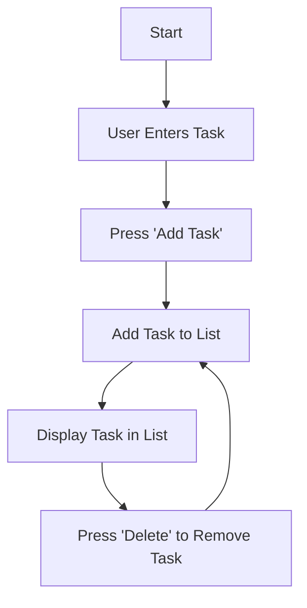

## 3.3.4 Mini Project: To-Do List App

Welcome to your next coding adventure! In this mini project, we'll be building a simple yet functional To-Do List app using Flutter. This project will help you understand how to manipulate lists, handle user input, and create a user-friendly interface. Let's dive in!

### Objective

The main goal of this project is to apply list manipulation techniques by creating an app where users can add tasks to a list, view them, and remove completed tasks. This will enhance your understanding of how lists work in programming and how to interact with them in a Flutter app.

### Project Overview

Our To-Do List app will have the following features:
- An input field for users to add new tasks.
- A display area to show the list of tasks.
- Functionality to remove tasks once they are completed.

### Step-by-Step Guide

Let's break down the process of building our To-Do List app into manageable steps.

#### 1. Set Up the UI

First, we need to set up the user interface (UI) of our app. This includes creating input fields for adding tasks and a list display area.

- **Input Field:** We'll use a `TextField` widget to allow users to enter new tasks.
- **List Display:** A `ListView` widget will be used to display the tasks.

#### 2. Create a List Variable

Next, we need to declare a list variable to store our to-do items. This list will hold all the tasks that the user adds.

```dart
List<String> tasks = [];
```

#### 3. Add Tasks

We'll write a function to add new tasks to our list. This function will take the text from the input field and add it to the list.

```dart
void addTask() {
  setState(() {
    tasks.add(_controller.text);
    _controller.clear();
  });
}
```

#### 4. Display Tasks

To display each task in the UI, we'll use a loop within a `ListView.builder`. This allows us to dynamically create a list of widgets based on the number of tasks.

```dart
Expanded(
  child: ListView.builder(
    itemCount: tasks.length,
    itemBuilder: (context, index) {
      return ListTile(
        title: Text(tasks[index]),
        trailing: IconButton(
          icon: Icon(Icons.delete),
          onPressed: () => removeTask(index),
        ),
      );
    },
  ),
)
```

#### 5. Remove Tasks

Finally, we'll implement functionality to remove tasks when they are completed. This involves writing a function that removes a task from the list based on its index.

```dart
void removeTask(int index) {
  setState(() {
    tasks.removeAt(index);
  });
}
```

### Complete Code Example

Here's the complete code for our To-Do List app:

```dart
import 'package:flutter/material.dart';

void main() {
  runApp(ToDoListApp());
}

class ToDoListApp extends StatefulWidget {
  @override
  _ToDoListAppState createState() => _ToDoListAppState();
}

class _ToDoListAppState extends State<ToDoListApp> {
  final TextEditingController _controller = TextEditingController();
  List<String> tasks = [];

  void addTask() {
    setState(() {
      tasks.add(_controller.text);
      _controller.clear();
    });
  }

  void removeTask(int index) {
    setState(() {
      tasks.removeAt(index);
    });
  }

  @override
  Widget build(BuildContext context) {
    return MaterialApp(
      home: Scaffold(
        appBar: AppBar(
          title: Text('To-Do List'),
        ),
        body: Padding(
          padding: EdgeInsets.all(16.0),
          child: Column(
            children: [
              TextField(
                controller: _controller,
                decoration: InputDecoration(labelText: 'Enter a task'),
              ),
              SizedBox(height: 10),
              ElevatedButton(
                onPressed: addTask,
                child: Text('Add Task'),
              ),
              SizedBox(height: 20),
              Expanded(
                child: ListView.builder(
                  itemCount: tasks.length,
                  itemBuilder: (context, index) {
                    return ListTile(
                      title: Text(tasks[index]),
                      trailing: IconButton(
                        icon: Icon(Icons.delete),
                        onPressed: () => removeTask(index),
                      ),
                    );
                  },
                ),
              ),
            ],
          ),
        ),
      ),
    );
  }
}
```

### Visuals

Let's visualize the flow of our To-Do List app using a Mermaid.js diagram:



### Engagement and Creativity

Congratulations on building your To-Do List app! This project is a great starting point for exploring more complex app functionalities. Here are some ideas to extend your app:
- Add a feature to mark tasks as completed without removing them.
- Implement a filter to show only completed or pending tasks.
- Allow users to edit existing tasks.

### Best Practices and Tips

- **Keep Your Code Organized:** Use functions to separate different parts of your code, making it easier to read and maintain.
- **Test Your App:** Regularly test your app to ensure all features work as expected.
- **Experiment:** Don't be afraid to try new things and see what works best for your app.

### Common Pitfalls

- **Forgetting to Call `setState`:** Remember to call `setState` whenever you modify the list to update the UI.
- **Handling Empty Inputs:** Ensure that users cannot add empty tasks by checking the input before adding it to the list.

### Conclusion

You've successfully created a To-Do List app using Flutter! This project has taught you how to manipulate lists, handle user input, and create a simple yet effective user interface. Keep experimenting and adding new features to your app. Happy coding!

## Quiz Time!



### What is the main purpose of the To-Do List app project?

- [x] To apply list manipulation techniques
- [ ] To learn about databases
- [ ] To create a complex game
- [ ] To build a chat application

> **Explanation:** The main purpose of the To-Do List app project is to apply list manipulation techniques by creating an app where users can add, view, and remove tasks.

### Which widget is used to allow users to enter new tasks?

- [ ] ListView
- [x] TextField
- [ ] ElevatedButton
- [ ] ListTile

> **Explanation:** The `TextField` widget is used to allow users to enter new tasks in the app.

### What function is used to add a new task to the list?

- [ ] removeTask()
- [x] addTask()
- [ ] build()
- [ ] main()

> **Explanation:** The `addTask()` function is used to add a new task to the list.

### How are tasks displayed in the UI?

- [ ] Using a Text widget
- [x] Using a ListView.builder
- [ ] Using a Column widget
- [ ] Using a Row widget

> **Explanation:** Tasks are displayed in the UI using a `ListView.builder`, which dynamically creates a list of widgets based on the number of tasks.

### What does the `removeTask()` function do?

- [x] Removes a task from the list
- [ ] Adds a task to the list
- [ ] Displays tasks in the UI
- [ ] Clears the input field

> **Explanation:** The `removeTask()` function removes a task from the list based on its index.

### What is the purpose of calling `setState()` in the app?

- [x] To update the UI when the list changes
- [ ] To initialize the app
- [ ] To create a new widget
- [ ] To handle user input

> **Explanation:** Calling `setState()` updates the UI when the list changes, ensuring that the app reflects the current state of the list.

### What is a potential extension for the To-Do List app?

- [x] Marking tasks as completed
- [ ] Adding a chat feature
- [ ] Integrating a weather API
- [ ] Creating a game loop

> **Explanation:** A potential extension for the To-Do List app is to add a feature that allows users to mark tasks as completed.

### Which widget is used to display each task in the list?

- [ ] TextField
- [ ] ElevatedButton
- [x] ListTile
- [ ] Container

> **Explanation:** The `ListTile` widget is used to display each task in the list, providing a title and an optional trailing icon.

### What should you do if users can add empty tasks?

- [x] Check the input before adding it to the list
- [ ] Allow empty tasks
- [ ] Remove the input field
- [ ] Disable the add button

> **Explanation:** To prevent users from adding empty tasks, you should check the input before adding it to the list.

### True or False: The To-Do List app can only display tasks but cannot remove them.

- [ ] True
- [x] False

> **Explanation:** False. The To-Do List app can both display tasks and remove them when they are completed.


