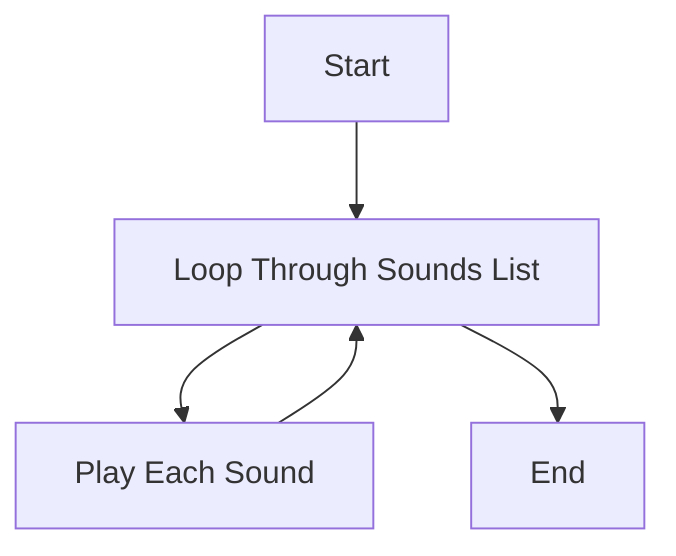

## 3.4.1 Music with Code

Welcome to the exciting world of music coding! In this section, we will explore how you can use loops and lists in Flutter to create your own simple music or rhythms. By repeating sounds or patterns, you can compose unique music sequences that are both fun and educational. Let's dive into the magical combination of music and code!

### Understanding the Basics

Before we start coding, let's understand some key concepts that will help us create music with code:

#### Sound Files

Sound files are digital recordings of sounds. In our project, we'll use sound files like `sound1.mp3`, `sound2.mp3`, and `sound3.mp3` to create music. These files need to be added to your project's assets so that your app can access and play them.

#### Playing Sounds in a Loop

Loops are powerful tools in programming that allow us to repeat a set of instructions. By using loops, we can play sound files repeatedly to create rhythms and patterns. This is similar to how a drummer might repeat a beat to create a rhythm in a song.

### Key Concepts

- **Loops:** A way to repeat actions, such as playing a sound multiple times.
- **Lists:** A collection of items, like sound files, that we can loop through to play each sound.

### Code Example: Creating a Simple Music App

Let's create a simple Flutter app that plays a sequence of sounds using loops and lists. Here's a step-by-step guide with code:

```dart
import 'package:flutter/material.dart';
import 'package:audioplayers/audioplayers.dart';

void main() {
  runApp(MusicApp());
}

class MusicApp extends StatefulWidget {
  @override
  _MusicAppState createState() => _MusicAppState();
}

class _MusicAppState extends State<MusicApp> {
  final AudioPlayer _player = AudioPlayer();
  List<String> sounds = ['sound1.mp3', 'sound2.mp3', 'sound3.mp3'];

  void playSounds() async {
    for (String sound in sounds) {
      await _player.play(AssetSource(sound));
      await Future.delayed(Duration(seconds: 1)); // Delay to allow sound to play
    }
  }

  @override
  Widget build(BuildContext context) {
    return MaterialApp(
      home: Scaffold(
        appBar: AppBar(
          title: Text('Music with Code'),
        ),
        body: Center(
          child: ElevatedButton(
            onPressed: playSounds,
            child: Text('Play Music'),
          ),
        ),
      ),
    );
  }
}
```

**Note:** Ensure the sound files (`sound1.mp3`, `sound2.mp3`, `sound3.mp3`) are added to the project's assets.

### Activity: Create Your Own Music Sequence

Now it's your turn! Try adding your own sound files to the project and modify the list to create different music sequences. Here's how you can do it:

1. **Add Your Sound Files:** Place your sound files in the `assets` folder of your Flutter project.
2. **Update the List:** Modify the `sounds` list in the code to include your new sound files.
3. **Experiment:** Change the order of sounds or add more sounds to create unique rhythms.

### Visualizing the Flow

Let's visualize how our app plays multiple sounds using a loop. The following Mermaid.js diagram shows the flow of our music-playing logic:



### Fun with Music and Code

Creating music with code is not only fun but also a great way to learn about loops and lists. Here are some tips to make the most of your music coding experience:

- **Experiment with Different Sounds:** Try using different types of sounds, like drum beats or piano notes, to create various musical styles.
- **Create Patterns:** Use loops to repeat certain sounds and create patterns or rhythms.
- **Share Your Creations:** Show your friends and family the music you've created with code!

### Engagement: Encourage Creativity

Encourage kids to experiment with different sounds and create their own melodies. Music coding is a fantastic way to express creativity and learn programming concepts at the same time. Who knows, you might discover a hidden talent for music composition!

## Quiz Time!



### What is the purpose of using loops in music coding?

- [x] To repeat sounds and create rhythms
- [ ] To change the color of the app
- [ ] To make the app run faster
- [ ] To display images

> **Explanation:** Loops are used to repeat sounds, allowing us to create rhythms and patterns in music coding.

### What do we need to add to our project to play sound files?

- [x] Sound files in the assets folder
- [ ] Images in the assets folder
- [ ] Text files in the assets folder
- [ ] Video files in the assets folder

> **Explanation:** Sound files must be added to the project's assets folder so the app can access and play them.

### Which package is used to play audio in the provided code example?

- [x] audioplayers
- [ ] flutter_audio
- [ ] sound_player
- [ ] music_flutter

> **Explanation:** The `audioplayers` package is used to play audio files in the Flutter app.

### What is the role of the `playSounds` function in the code?

- [x] To play each sound in the list sequentially
- [ ] To stop all sounds
- [ ] To change the app's background color
- [ ] To display a message

> **Explanation:** The `playSounds` function loops through the list of sounds and plays each one sequentially.

### How can you create different music sequences in the app?

- [x] By adding different sound files to the list
- [ ] By changing the app's theme
- [ ] By modifying the app's layout
- [ ] By using different fonts

> **Explanation:** You can create different music sequences by adding different sound files to the list and modifying their order.

### What does the `Future.delayed` function do in the code?

- [x] It adds a delay between playing each sound
- [ ] It speeds up the sound playback
- [ ] It changes the sound volume
- [ ] It stops the sound playback

> **Explanation:** The `Future.delayed` function adds a delay between playing each sound, allowing the sound to play fully before the next one starts.

### What is the purpose of the `ElevatedButton` in the app?

- [x] To trigger the `playSounds` function when pressed
- [ ] To change the app's title
- [ ] To display an image
- [ ] To stop the music

> **Explanation:** The `ElevatedButton` triggers the `playSounds` function when pressed, starting the music sequence.

### What is a list in programming?

- [x] A collection of items, like sound files
- [ ] A single number
- [ ] A type of loop
- [ ] A function

> **Explanation:** A list is a collection of items, such as sound files, that can be looped through in programming.

### How can you make your music app more interactive?

- [x] By adding more buttons for different sound sequences
- [ ] By changing the app's font
- [ ] By removing the sound files
- [ ] By making the app smaller

> **Explanation:** Adding more buttons for different sound sequences can make the music app more interactive and fun.

### True or False: Loops can only be used for playing sounds.

- [ ] True
- [x] False

> **Explanation:** False. Loops can be used for many purposes in programming, such as iterating over lists, repeating actions, and more.



By exploring music with code, you've taken another step in your coding journey. Keep experimenting, and who knows what amazing tunes you'll create next!
