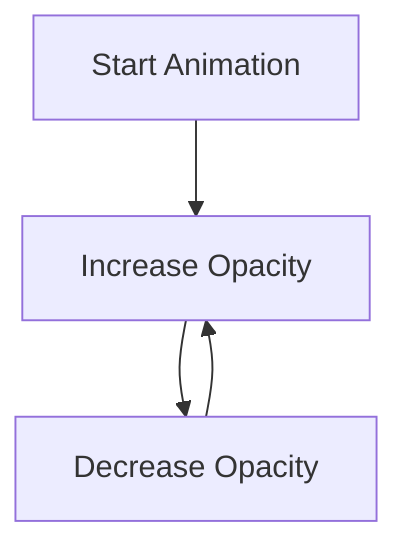

## 3.4.2 Animation Basics

Welcome to the magical world of animations in Flutter! Just like how cartoons come to life with movement, animations in apps make things move or change smoothly. In this section, we'll explore how to create simple animations using Flutter, understand the role of loops in controlling animations, and have fun experimenting with different effects.

### What are Animations?

Animations are a way to make things move or change over time. Imagine a cartoon character walking across the screen or a button that changes color when you press it. These are animations! They make apps more engaging and fun to use.

### Key Concepts

#### Animated Widgets

In Flutter, we have special widgets called "Animated Widgets" that help us create animations easily. These widgets can change their properties, like size, color, or position, over time.

#### Controlling Animation Speed

The speed of an animation is how fast or slow it changes. We can use loops to control this speed, making animations smooth and continuous.

### Let's Create a Simple Animation

We'll create a basic animation where a purple square fades in and out. This will help us understand how animations work in Flutter.

#### Code Example

Here's a simple Flutter app that demonstrates a basic animation:

```dart
import 'package:flutter/material.dart';

void main() {
  runApp(AnimationApp());
}

class AnimationApp extends StatefulWidget {
  @override
  _AnimationAppState createState() => _AnimationAppState();
}

class _AnimationAppState extends State<AnimationApp> with SingleTickerProviderStateMixin {
  late AnimationController _controller;

  @override
  void initState() {
    super.initState();
    _controller = AnimationController(
      duration: Duration(seconds: 2),
      vsync: this,
    )..repeat(reverse: true);
  }

  @override
  void dispose() {
    _controller.dispose();
    super.dispose();
  }

  @override
  Widget build(BuildContext context) {
    return MaterialApp(
      home: Scaffold(
        appBar: AppBar(
          title: Text('Basic Animation'),
        ),
        body: Center(
          child: AnimatedBuilder(
            animation: _controller,
            builder: (context, child) {
              return Opacity(
                opacity: _controller.value,
                child: Container(
                  width: 100,
                  height: 100,
                  color: Colors.purple,
                ),
              );
            },
          ),
        ),
      ),
    );
  }
}
```

#### How It Works

- **AnimationController:** This is the heart of the animation. It controls the animation's duration and repeats it.
- **AnimatedBuilder:** This widget rebuilds the UI whenever the animation changes, allowing us to animate the opacity of the square.
- **Opacity:** We change the opacity of the square from 0 (invisible) to 1 (fully visible) and back, creating a fade-in and fade-out effect.

### Activity: Modify the Animation

Now it's your turn! Try changing the color, size, or speed of the animated widget. What happens if you make the duration shorter or longer? Experiment and see the effects!

### Visualizing Animation Flow

Here's a simple diagram to show how the animation flow is controlled by the loop:



### Engagement: Create Your Own Animations

Challenge yourself to create different types of animations. Can you make a shape move across the screen? Or change colors in a rainbow pattern? Use your imagination and have fun!

### Best Practices and Tips

- **Start Simple:** Begin with basic animations and gradually add complexity.
- **Experiment:** Try different properties and see how they affect the animation.
- **Keep it Smooth:** Use loops to ensure animations are smooth and continuous.

Animations are a powerful tool to make your apps more dynamic and engaging. With practice, you'll be able to create amazing effects that bring your ideas to life!

## Quiz Time!



### What is the main purpose of animations in apps?

- [x] To make things move or change smoothly
- [ ] To make apps run faster
- [ ] To add more text to the screen
- [ ] To increase the app's size

> **Explanation:** Animations make things move or change smoothly, enhancing the user experience.

### Which widget in Flutter is used to create animations?

- [ ] Text
- [x] AnimatedBuilder
- [ ] ListView
- [ ] Column

> **Explanation:** AnimatedBuilder is used to create animations by rebuilding the UI when the animation changes.

### What does the AnimationController do?

- [ ] Controls the app's layout
- [x] Controls the animation's duration and repeats it
- [ ] Manages user input
- [ ] Handles network requests

> **Explanation:** AnimationController manages the duration and repetition of animations.

### How can you change the speed of an animation?

- [x] By adjusting the duration in the AnimationController
- [ ] By changing the color of the widget
- [ ] By resizing the widget
- [ ] By adding more text

> **Explanation:** The speed of an animation can be changed by adjusting the duration in the AnimationController.

### What happens when you set the opacity of a widget to 0?

- [x] The widget becomes invisible
- [ ] The widget changes color
- [ ] The widget moves to the top
- [ ] The widget becomes larger

> **Explanation:** Setting the opacity to 0 makes the widget invisible.

### What is the role of the AnimatedBuilder widget?

- [ ] To handle user input
- [x] To rebuild the UI when the animation changes
- [ ] To manage network requests
- [ ] To display images

> **Explanation:** AnimatedBuilder rebuilds the UI whenever the animation changes, allowing for dynamic updates.

### How can loops be used in animations?

- [x] To control the timing and repetition of animations
- [ ] To add more widgets to the screen
- [ ] To change the app's theme
- [ ] To manage user accounts

> **Explanation:** Loops control the timing and repetition of animations, ensuring smooth transitions.

### What is the effect of setting the animation duration to a longer time?

- [x] The animation becomes slower
- [ ] The animation becomes faster
- [ ] The animation stops
- [ ] The animation changes color

> **Explanation:** A longer duration makes the animation slower, as it takes more time to complete.

### Can you change the size of a widget using animations?

- [x] True
- [ ] False

> **Explanation:** Yes, you can animate the size of a widget by changing its dimensions over time.

### What is a fun challenge you can try with animations?

- [x] Creating a moving shape or changing colors
- [ ] Deleting all widgets
- [ ] Making the app crash
- [ ] Removing animations

> **Explanation:** A fun challenge is to create a moving shape or change colors, enhancing creativity and learning.


