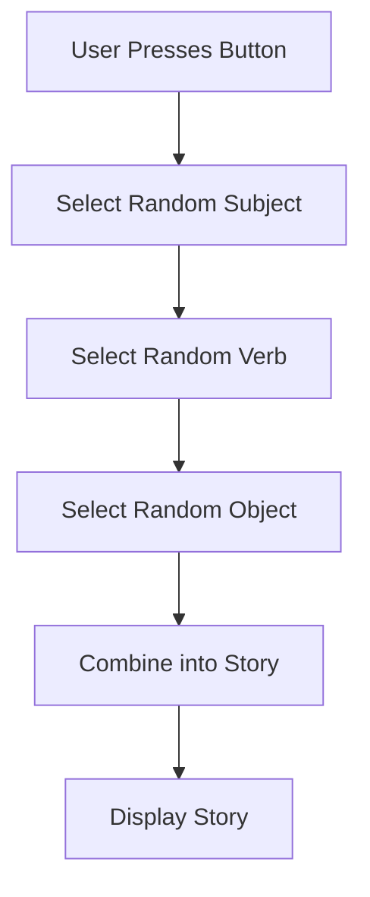

## 3.4.3 Story Generator

Welcome to the exciting world of story generation! In this section, we will learn how to combine loops and lists to create a simple yet fascinating story generator app using Flutter. This app will produce random stories every time you press a button, sparking creativity and fun.

### Objective

The goal is to build an app that randomly selects words and phrases from predefined lists to create unique stories. This project will help you understand how to use loops, lists, and random selection in your code.

### Explanation

By using lists to store different parts of a sentence, such as subjects, verbs, and objects, we can randomly select one item from each list to form a complete sentence. This method allows us to generate a variety of stories with just a few lines of code.

### Key Concepts

#### Random Selection

Random selection is the process of choosing an item from a list at random. In our app, we will use the `Random` class from Dart to achieve this. This randomness is what makes each story unique and exciting.

#### String Manipulation

String manipulation involves combining different strings (words or phrases) to form a coherent sentence. We will use string interpolation in Dart to easily combine our randomly selected words into a story.

### Code Example

Let's dive into the code to see how we can create our story generator app.

```dart
import 'package:flutter/material.dart';
import 'dart:math';

void main() {
  runApp(StoryGeneratorApp());
}

class StoryGeneratorApp extends StatefulWidget {
  @override
  _StoryGeneratorAppState createState() => _StoryGeneratorAppState();
}

class _StoryGeneratorAppState extends State<StoryGeneratorApp> {
  final List<String> subjects = ['The cat', 'A robot', 'My friend'];
  final List<String> verbs = ['jumps', 'runs', 'flies'];
  final List<String> objects = ['over the fence', 'through the park', 'into space'];
  String story = 'Press the button to generate a story!';

  void generateStory() {
    final random = Random();
    String subject = subjects[random.nextInt(subjects.length)];
    String verb = verbs[random.nextInt(verbs.length)];
    String object = objects[random.nextInt(objects.length)];
    setState(() {
      story = '$subject $verb $object.';
    });
  }

  @override
  Widget build(BuildContext context) {
    return MaterialApp(
      home: Scaffold(
        appBar: AppBar(
          title: Text('Story Generator'),
        ),
        body: Padding(
          padding: EdgeInsets.all(16.0),
          child: Column(
            mainAxisAlignment: MainAxisAlignment.center,
            children: [
              Text(
                story,
                style: TextStyle(fontSize: 20),
                textAlign: TextAlign.center,
              ),
              SizedBox(height: 20),
              ElevatedButton(
                onPressed: generateStory,
                child: Text('Generate Story'),
              ),
            ],
          ),
        ),
      ),
    );
  }
}
```

### Activity

To make the stories more varied and interesting, try adding more subjects, verbs, and objects to the lists. Here are some ideas to get you started:

- **Subjects:** The dog, An alien, My teacher
- **Verbs:** dances, sings, explores
- **Objects:** on the moon, in the jungle, at the beach

### Visuals

To better understand how the story generator works, let's look at a flowchart that illustrates the process of creating a story.



### Language

Use engaging language to inspire creativity and storytelling. Encourage kids to imagine different scenarios and characters that could appear in their stories.

### Engagement

Encourage kids to write down their favorite generated stories and share them with friends and family. This activity not only enhances their coding skills but also boosts their creativity and storytelling abilities.

## Quiz Time!



### What is the main purpose of the story generator app?

- [x] To create random and unique stories using loops and lists.
- [ ] To generate random numbers.
- [ ] To display static text.
- [ ] To create a calculator app.

> **Explanation:** The story generator app is designed to create random and unique stories by selecting random words from lists and combining them into sentences.

### Which Dart class is used for random selection in the story generator app?

- [x] Random
- [ ] Math
- [ ] List
- [ ] String

> **Explanation:** The `Random` class in Dart is used to generate random numbers, which helps in selecting random items from lists.

### What are the three main lists used in the story generator app?

- [x] Subjects, verbs, objects
- [ ] Numbers, letters, symbols
- [ ] Colors, shapes, sizes
- [ ] Animals, plants, minerals

> **Explanation:** The app uses three lists: subjects, verbs, and objects, to form complete sentences.

### How does the app update the story when a new one is generated?

- [x] By using the `setState` method
- [ ] By restarting the app
- [ ] By using a loop
- [ ] By creating a new widget

> **Explanation:** The `setState` method is used to update the UI with a new story when the button is pressed.

### What is string interpolation in Dart?

- [x] Combining strings using the `$` symbol
- [ ] Dividing strings into parts
- [ ] Sorting strings alphabetically
- [ ] Converting strings to numbers

> **Explanation:** String interpolation in Dart allows you to insert variables into strings using the `$` symbol.

### What should you do to make the stories more varied?

- [x] Add more subjects, verbs, and objects to the lists.
- [ ] Use fewer words in the lists.
- [ ] Remove the random selection.
- [ ] Use only one list.

> **Explanation:** Adding more words to the lists increases the variety of possible stories.

### What is the initial story displayed in the app?

- [x] "Press the button to generate a story!"
- [ ] "Once upon a time..."
- [ ] "Hello, World!"
- [ ] "The end."

> **Explanation:** The initial story is a prompt for the user to press the button to generate a new story.

### How can you share your favorite generated stories?

- [x] Write them down and share with friends and family.
- [ ] Keep them a secret.
- [ ] Delete them immediately.
- [ ] Only share them online.

> **Explanation:** Sharing stories with friends and family can be a fun and engaging activity.

### What is the role of the `ElevatedButton` in the app?

- [x] To trigger the story generation when pressed.
- [ ] To display the story.
- [ ] To change the app's theme.
- [ ] To close the app.

> **Explanation:** The `ElevatedButton` is used to trigger the `generateStory` function, which creates a new story.

### True or False: The story generator app can only create one story.

- [ ] True
- [x] False

> **Explanation:** False. The app can create multiple unique stories by randomly selecting different words each time the button is pressed.


