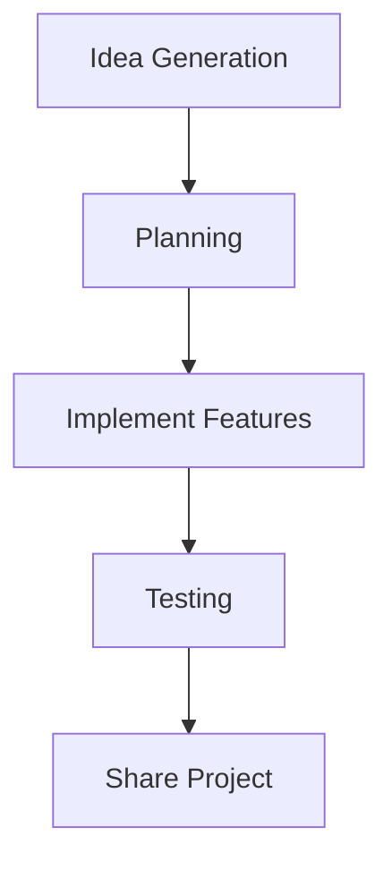

## 3.4.4 Challenge: Your Creative Project

Congratulations on reaching this exciting part of your coding journey! You've learned about loops and lists, two powerful tools in programming. Now, it's time to put your skills to the test by creating something unique and personal. This challenge is all about using your imagination and coding knowledge to build a project that you can be proud of. Let's dive into the creative process!

### Objective

The goal of this challenge is to encourage you to apply loops and lists in a personal project of your choice. Whether it's a game, a drawing app, or a personalized story generator, the possibilities are endless. This is your chance to be creative and have fun with coding!

### Explanation

Now that you've mastered loops and lists, you have the building blocks to create something amazing. Loops help you repeat actions efficiently, while lists allow you to organize and manage data. By combining these concepts, you can build dynamic and interactive applications.

### Guidelines

#### 1. Brainstorm Ideas

Start by thinking about what you want to create. Here are some ideas to get you started:

- **Game:** Design a simple game where players collect items, avoid obstacles, or solve puzzles.
- **Drawing App:** Create an app that lets users draw shapes or patterns using loops.
- **Story Generator:** Develop a program that generates random stories using lists of characters, settings, and events.

Remember, the best projects come from ideas that excite you!

#### 2. Plan the Project

Once you have an idea, it's time to plan. Outline the features you want to include and how you'll use loops and lists. Consider the following:

- **Features:** What will your project do? What are the main functions?
- **Loops:** How will you use loops to repeat actions or create patterns?
- **Lists:** What data will you store in lists? How will you access and modify this data?

Use a flowchart to visualize your project plan. Here's an example using Mermaid.js:



#### 3. Build the Project

Now, it's time to start coding! Use the knowledge you've gained to bring your project to life. Remember to:

- **Start Small:** Begin with the basic features and gradually add more complexity.
- **Experiment:** Try different approaches and see what works best.
- **Learn from Mistakes:** Mistakes are part of the learning process. Don't be afraid to try again.

Here's a simple code snippet to get you started with a list and loop:

```dart
void main() {
  List<String> items = ['Apple', 'Banana', 'Cherry'];
  
  for (String item in items) {
    print('I have a $item');
  }
}
```

This code creates a list of items and uses a loop to print each one.

#### 4. Test and Share

Once your project is built, it's time to test it. Run your app to see how it works and make any necessary adjustments. After testing, share your creation with friends or family. They can provide valuable feedback and help you improve your project.

### Tips

- **Start Small:** Focus on a few key features and build from there.
- **Embrace Mistakes:** Mistakes are learning opportunities. Use them to improve your skills.
- **Seek Inspiration:** Look back at examples from the book or explore other projects online for ideas.

### Visuals

Visual planning can help you organize your thoughts and project structure. Use diagrams to map out your ideas and components. Here's a simple flowchart to guide your project development:


### Engagement

Celebrate the completion of your project, no matter how simple it may be. Every project is a step forward in your coding journey. Share your success with others and encourage them to try coding too!

### Conclusion

This challenge is your opportunity to unleash your creativity and apply what you've learned. Remember, coding is not just about solving problems—it's also about creating and exploring new possibilities. Keep experimenting, learning, and having fun with your projects. Who knows, your project today might inspire the next big thing tomorrow!

## Quiz Time!



### What is the main goal of this creative project challenge?

- [x] To apply loops and lists in a personal project
- [ ] To memorize coding syntax
- [ ] To compete with others
- [ ] To learn about databases

> **Explanation:** The challenge encourages applying loops and lists creatively in a personal project.

### Which of the following is a suggested project idea?

- [x] A drawing app
- [ ] A weather forecasting app
- [ ] A financial calculator
- [ ] A text editor

> **Explanation:** A drawing app is one of the suggested ideas to apply loops creatively.

### What should you do after brainstorming ideas?

- [x] Plan the project
- [ ] Start coding immediately
- [ ] Share the idea with friends
- [ ] Delete the ideas

> **Explanation:** Planning the project helps outline features and how loops and lists will be used.

### How can loops be used in a project?

- [x] To repeat actions efficiently
- [ ] To store data
- [ ] To design user interfaces
- [ ] To encrypt data

> **Explanation:** Loops are used to repeat actions efficiently in programming.

### What is a benefit of using lists in your project?

- [x] Organizing and managing data
- [ ] Designing graphics
- [ ] Enhancing security
- [ ] Improving speed

> **Explanation:** Lists help organize and manage data effectively.

### What is an important step after building your project?

- [x] Test and share the project
- [ ] Delete the project
- [ ] Start a new project
- [ ] Ignore feedback

> **Explanation:** Testing and sharing the project helps improve it and gain feedback.

### What should you do if you make a mistake while coding?

- [x] Learn from it and try again
- [ ] Give up
- [ ] Ignore it
- [ ] Start a new project

> **Explanation:** Mistakes are learning opportunities, and trying again helps improve skills.

### What is a good way to visualize your project plan?

- [x] Using flowcharts
- [ ] Writing a long essay
- [ ] Drawing a picture
- [ ] Creating a video

> **Explanation:** Flowcharts help visualize project plans and structure.

### Why is it important to start small when building your project?

- [x] To focus on key features and build gradually
- [ ] To finish quickly
- [ ] To avoid mistakes
- [ ] To impress others

> **Explanation:** Starting small allows you to focus on key features and gradually add complexity.

### True or False: Sharing your project with others can provide valuable feedback.

- [x] True
- [ ] False

> **Explanation:** Sharing your project helps gain feedback and improve it.


