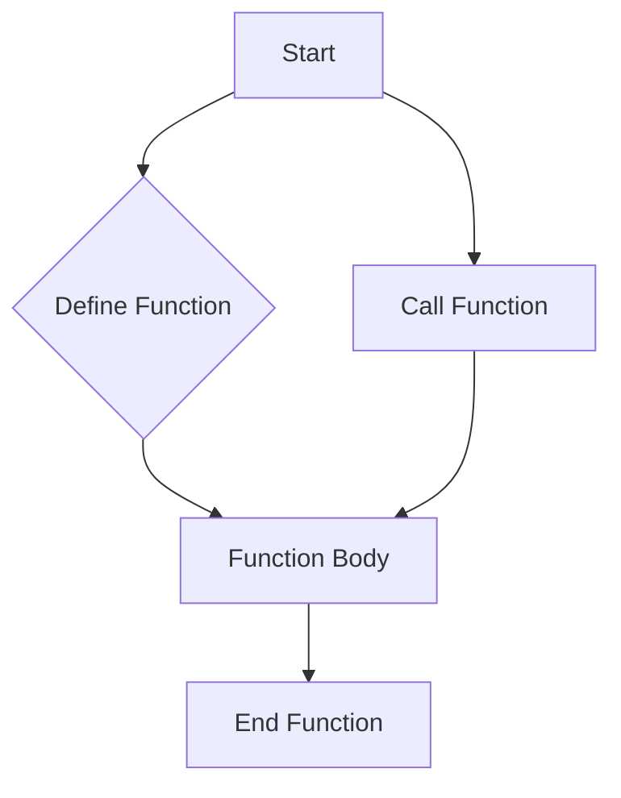

## 4.1.1 What is a Function?

Welcome to the exciting world of functions in programming! In this section, we'll explore what functions are, why they're important, and how you can use them to make your coding life easier and more fun. Let's dive in!

### Understanding Functions

Imagine you're baking a cake. You have a recipe that tells you exactly what to do: mix the ingredients, bake at a certain temperature, and so on. In programming, a function is like that recipe. It's a set of instructions that tells the computer what to do. Once you have a function, you can use it over and over again, just like you can bake the same cake multiple times using the same recipe.

### Why Use Functions?

Functions are incredibly useful in programming for several reasons:

- **Reusability:** Once you write a function, you can use it as many times as you need without rewriting the same code. This saves time and effort.
- **Modularity:** Functions help break down complex problems into smaller, more manageable pieces. This makes your code easier to understand and maintain.
- **Organization:** By grouping related code into functions, your programs become more organized and easier to read.

### Key Concepts

Let's explore some key concepts related to functions:

#### Reusability

Think of a function as a magic spell. Once you've learned the spell, you can cast it whenever you need. Similarly, once you've written a function, you can call it whenever you need to perform that specific task.

#### Modularity

Imagine building a LEGO castle. You don't build it all at once; you build it piece by piece. Functions allow you to build your program piece by piece, making it easier to manage and understand.

### Code Example

Let's look at a simple example of a function in Dart, the programming language we use with Flutter:

```dart
void greet() {
  print('Hello, friend!');
}

void main() {
  greet(); // Calls the greet function
}
```

In this example, we define a function called `greet`. This function doesn't take any inputs and simply prints "Hello, friend!" to the screen. In the `main` function, we call `greet()`, which executes the instructions inside the `greet` function.

### Activity: Write Your Own Function

Now it's your turn! Let's write a simple function that prints your favorite greeting message and call it multiple times:

```dart
void sayHello() {
  print('Hello, Flutter!');
}

void main() {
  sayHello();
  sayHello();
  sayHello();
}
```

Try running this code. What do you see? Notice how the `sayHello` function is called three times, and each time it prints "Hello, Flutter!" to the screen.

### Visualizing Functions

To help you understand how functions work, let's look at a flowchart that shows how a function is defined and called:



In this flowchart, we start by defining a function. The function has a body, which contains the instructions. Once the function is defined, we can call it, which means executing the instructions inside the function body.

### Engaging with Functions

Think about your daily life. Can you think of something you do repeatedly that could use a set of instructions? Maybe it's brushing your teeth or tying your shoes. Just like these tasks, functions help us automate repetitive tasks in programming.

### Conclusion

Functions are powerful tools in programming that help us write efficient, organized, and reusable code. By understanding and using functions, you can make your programs more modular and easier to manage. Keep practicing, and soon you'll be creating your own functions to solve all sorts of problems!

## Quiz Time!



### What is a function in programming?

- [x] A set of instructions that performs a specific task
- [ ] A type of variable that stores data
- [ ] A tool for debugging code
- [ ] A way to style text in an app

> **Explanation:** A function is a set of instructions that performs a specific task, similar to a recipe.

### Why are functions useful in programming?

- [x] They allow code to be reused multiple times
- [ ] They make code run faster
- [ ] They are only used for styling apps
- [ ] They are used to store data

> **Explanation:** Functions allow code to be reused multiple times, making programming more efficient.

### What does the following Dart function do?
```dart
void greet() {
  print('Hello, friend!');
}
```

- [x] Prints "Hello, friend!" to the screen
- [ ] Stores a greeting message
- [ ] Changes the background color
- [ ] Creates a new variable

> **Explanation:** The function `greet` prints "Hello, friend!" to the screen when called.

### How do you call a function in Dart?

- [x] By writing the function's name followed by parentheses
- [ ] By declaring a new variable
- [ ] By using a loop
- [ ] By creating a new class

> **Explanation:** You call a function by writing its name followed by parentheses, like `greet()`.

### What is the purpose of the `main` function in Dart?

- [x] It serves as the entry point of the program
- [ ] It stores all the variables
- [ ] It styles the app
- [ ] It is used for debugging

> **Explanation:** The `main` function is the entry point of a Dart program where execution starts.

### What is modularity in programming?

- [x] Breaking down code into smaller, manageable pieces
- [ ] Making code run faster
- [ ] Styling the user interface
- [ ] Storing data in variables

> **Explanation:** Modularity involves breaking down code into smaller, manageable pieces, making it easier to understand and maintain.

### How many times is the `sayHello` function called in the following code?
```dart
void sayHello() {
  print('Hello, Flutter!');
}

void main() {
  sayHello();
  sayHello();
  sayHello();
}
```

- [x] Three times
- [ ] Once
- [ ] Twice
- [ ] Four times

> **Explanation:** The `sayHello` function is called three times in the `main` function.

### What is the output of the following code?
```dart
void greet() {
  print('Hi there!');
}

void main() {
  greet();
  greet();
}
```

- [x] Hi there! Hi there!
- [ ] Hi there!
- [ ] Hello, friend!
- [ ] No output

> **Explanation:** The `greet` function is called twice, so "Hi there!" is printed twice.

### Can functions take inputs and return outputs?

- [x] True
- [ ] False

> **Explanation:** Functions can take inputs (parameters) and return outputs, making them versatile tools in programming.

### What analogy is used to describe functions in this section?

- [x] A recipe or a magic spell
- [ ] A book or a library
- [ ] A car or a bicycle
- [ ] A computer or a phone

> **Explanation:** Functions are compared to a recipe or a magic spell, as they provide a set of instructions that can be reused.


