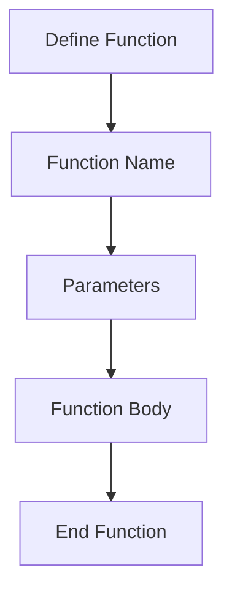

## 4.1.2 Creating Functions

Welcome to the exciting world of functions in Dart! Functions are like little helpers in your code that perform specific tasks. They make your code organized and reusable. In this section, we'll learn how to create our own functions, understand their structure, and see them in action with some fun examples.

### What is a Function?

A function is a block of code designed to perform a particular task. Think of it as a recipe in a cookbook. Just like a recipe tells you how to make a dish, a function tells the computer how to perform a task.

### Understanding Function Syntax

Let's break down the syntax of a function in Dart:

- **`void` keyword:** This indicates that the function does not return any value. We'll explore functions that return values later.
- **Function name:** This is the name you give to your function. It should be descriptive of what the function does, like `addNumbers` or `showMessage`.
- **Parentheses `()`**: These are used to pass information to the function, known as parameters. We'll learn more about parameters in the next sections.
- **Curly braces `{}`**: These enclose the body of the function, where you write the code that performs the task.

Here's a simple example:

```dart
void addNumbers() {
  int a = 5;
  int b = 3;
  int sum = a + b;
  print('Sum: $sum');
}

void main() {
  addNumbers(); // Calls the addNumbers function
}
```

### Key Concepts

#### Function Declaration

Declaring a function means defining it so that it can be used in your program. In the example above, `addNumbers` is a function that adds two numbers and prints the result.

#### Naming Functions

Choosing a meaningful name for your function is important. It should clearly describe what the function does. For instance, `addNumbers` is a good name because it tells us that the function adds numbers.

### Hands-On Activity: Create Your Own Function

Let's create a function that displays your name. This is a simple yet powerful way to see functions in action.

```dart
void displayName() {
  String name = 'Alex';
  print('My name is $name');
}

void main() {
  displayName();
}
```

Try changing the name in the `displayName` function to your own name and see what happens when you run the code!

### Visualizing Functions

To better understand the structure of a function, let's use a diagram:



This flowchart shows the basic components of a function. You start by defining the function, give it a name, optionally add parameters, write the function body, and then end the function.

### Best Practices

- **Choose Descriptive Names:** Make sure your function names clearly describe what they do.
- **Keep It Simple:** Start with simple functions and gradually move to more complex ones.
- **Practice:** The more you practice writing functions, the more comfortable you'll become.

### Common Pitfalls

- **Forgetting to Call the Function:** Remember to call your function in the `main` function, or it won't run.
- **Naming Conflicts:** Avoid using the same name for different functions or variables to prevent confusion.

### Encouragement

Creating functions is a big step in your coding journey. It allows you to write cleaner and more efficient code. Keep experimenting with different functions, and don't be afraid to make mistakes. That's how we learn!

## Quiz Time!



### What is the purpose of the `void` keyword in a function?

- [x] It indicates that the function does not return any value.
- [ ] It specifies the function's name.
- [ ] It defines the function's parameters.
- [ ] It ends the function.

> **Explanation:** The `void` keyword is used to indicate that a function does not return any value.

### What should a function name describe?

- [x] What the function does.
- [ ] The programming language used.
- [ ] The computer's operating system.
- [ ] The author's favorite color.

> **Explanation:** A function name should clearly describe the task the function performs.

### What do parentheses `()` in a function declaration indicate?

- [x] They are used to pass information to the function.
- [ ] They define the function's name.
- [ ] They end the function.
- [ ] They are used for comments.

> **Explanation:** Parentheses are used to pass parameters to the function.

### What do curly braces `{}` enclose in a function?

- [x] The body of the function.
- [ ] The function's name.
- [ ] The function's return type.
- [ ] The function's parameters.

> **Explanation:** Curly braces enclose the body of the function, where the code is written.

### Which of the following is a good function name?

- [x] calculateSum
- [ ] x
- [x] displayMessage
- [ ] doSomething

> **Explanation:** Good function names are descriptive, like `calculateSum` and `displayMessage`.

### What happens if you forget to call a function in `main`?

- [x] The function will not run.
- [ ] The program will crash.
- [ ] The function will run automatically.
- [ ] The function will return an error.

> **Explanation:** If you don't call a function in `main`, it won't run.

### What is the first step in creating a function?

- [x] Define the function.
- [ ] Call the function.
- [x] Name the function.
- [ ] End the function.

> **Explanation:** The first step is to define and name the function.

### What is the purpose of the `main` function?

- [x] To serve as the entry point of the program.
- [ ] To define all other functions.
- [ ] To store variables.
- [ ] To print messages.

> **Explanation:** The `main` function is the entry point where the program starts execution.

### Which keyword is used to declare a function that does not return a value?

- [x] void
- [ ] int
- [ ] return
- [ ] function

> **Explanation:** The `void` keyword is used for functions that do not return a value.

### True or False: A function can have the same name as a variable in the same scope.

- [ ] True
- [x] False

> **Explanation:** A function cannot have the same name as a variable in the same scope to avoid naming conflicts.



Keep practicing, and soon you'll be creating amazing functions with ease!
