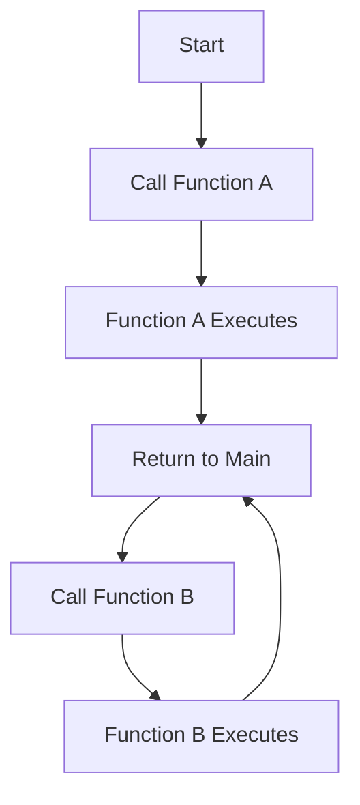

## 4.1.3 Calling Functions

Welcome to the exciting world of calling functions! In this section, we'll explore how to execute or "call" functions within your code. Functions are like little helpers that perform specific tasks whenever you need them. Let's dive in and learn how to make these helpers work for us!

### What Does It Mean to Call a Function?

Calling a function is like giving a command to your computer to perform a specific task. Imagine you have a robot, and you want it to wave its hand. You would press a button labeled "Wave Hand," and the robot would execute that action. Similarly, in coding, when you call a function, you're telling the computer to run the set of instructions defined in that function.

### Key Concepts

#### Function Invocation

Function invocation is the process of calling a function. To invoke a function, you use its name followed by parentheses. This tells the computer to execute the code inside the function. Here's the basic syntax:

```dart
functionName();
```

#### Calling Multiple Times

One of the great things about functions is that you can call them as many times as you need. This means you can reuse the same set of instructions without having to write the code again. Let's see this in action with a simple example.

### Code Example: Calling a Function

Let's create a function called `sayHi` that prints a friendly greeting. We'll call this function multiple times to see how it works.

```dart
void sayHi() {
  print('Hi there!');
}

void main() {
  sayHi(); // First call
  sayHi(); // Second call
  sayHi(); // Third call
}
```

In this example, the `sayHi` function is called three times. Each time it's called, it prints "Hi there!" to the console. Notice how we only wrote the function once, but we can use it whenever we need.

### Activity: Create and Call Multiple Functions

Now it's your turn! Let's create two functions: one to say hello and another to say goodbye. Then, we'll call them in different parts of our `main` function.

```dart
void sayHello() {
  print('Hello!');
}

void sayGoodbye() {
  print('Goodbye!');
}

void main() {
  sayHello();
  sayGoodbye();
  sayHello();
}
```

Try running this code. You'll see that the functions are called in the order they appear in the `main` function. This flexibility allows you to control when and how often each function is executed.

### Visualizing Function Calls

To better understand how function calls work, let's use a flowchart to visualize the process. This diagram shows the flow of calling two functions, `Function A` and `Function B`.



This flowchart illustrates how the program starts, calls `Function A`, executes it, returns to the main flow, and then calls `Function B`.

### Relatable Examples

Think of calling a function like pressing a button in a video game to make your character jump. Each time you press the button, the character performs the jump action. Similarly, each time you call a function, it performs its task.

### Engagement: Experiment with Function Calls

Now that you know how to call functions, try thinking of different places in your code where you can call them to see different results. For example, you could create a function to change the color of a character in a game and call it whenever the character collects a power-up.

### Best Practices and Tips

- **Keep Functions Simple:** Each function should perform a single task. This makes your code easier to read and maintain.
- **Name Functions Clearly:** Use descriptive names for your functions so that anyone reading your code can understand what they do.
- **Reuse Functions:** Take advantage of functions to avoid repeating code. This makes your programs more efficient and easier to update.

By understanding how to call functions, you're taking a big step in becoming a skilled coder. Functions are powerful tools that help you organize your code and make it more efficient. Keep practicing, and soon you'll be creating amazing projects with ease!

## Quiz Time!



### What is the purpose of calling a function in code?

- [x] To execute a set of instructions defined in the function
- [ ] To define a new function
- [ ] To delete a function
- [ ] To rename a function

> **Explanation:** Calling a function means executing the set of instructions defined within that function.

### How do you call a function named `greet` in Dart?

- [x] greet();
- [ ] call greet;
- [ ] function greet();
- [ ] greet[];

> **Explanation:** To call a function in Dart, you use the function name followed by parentheses.

### Can you call a function more than once in your code?

- [x] Yes
- [ ] No

> **Explanation:** Functions can be called multiple times, allowing you to reuse the same code whenever needed.

### What does the following code do?
```dart
void wave() {
  print('Waving!');
}

void main() {
  wave();
  wave();
}
```

- [x] Prints "Waving!" twice
- [ ] Prints "Waving!" once
- [ ] Prints "Waving!" three times
- [ ] Does nothing

> **Explanation:** The `wave` function is called twice, so it prints "Waving!" each time.

### Which of the following is a correct way to call a function named `jump`?

- [x] jump();
- [ ] jump;
- [ ] call jump();
- [ ] function jump();

> **Explanation:** The correct syntax to call a function is using the function name followed by parentheses.

### What happens if you call a function that doesn't exist?

- [x] An error occurs
- [ ] The program runs normally
- [ ] The function is created automatically
- [ ] Nothing happens

> **Explanation:** Calling a non-existent function results in an error because the program cannot find the function definition.

### Why is it beneficial to call functions multiple times?

- [x] To reuse code and avoid repetition
- [ ] To make the code longer
- [ ] To confuse the reader
- [ ] To delete the function

> **Explanation:** Calling functions multiple times allows you to reuse code, making your program more efficient and easier to maintain.

### What is the output of the following code?
```dart
void sayHello() {
  print('Hello!');
}

void main() {
  sayHello();
  sayHello();
  sayHello();
}
```

- [x] "Hello!" printed three times
- [ ] "Hello!" printed once
- [ ] "Hello!" printed twice
- [ ] No output

> **Explanation:** The `sayHello` function is called three times, so "Hello!" is printed each time.

### What is a function invocation?

- [x] The process of calling a function
- [ ] The process of defining a function
- [ ] The process of deleting a function
- [ ] The process of renaming a function

> **Explanation:** Function invocation refers to the process of calling a function to execute its code.

### True or False: Functions can only be called once in a program.

- [ ] True
- [x] False

> **Explanation:** Functions can be called multiple times within a program, allowing for code reuse and efficiency.


