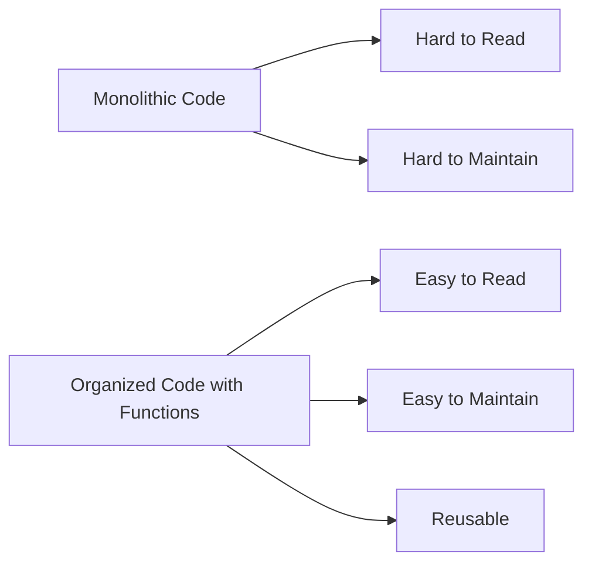

## 4.1.4 Benefits of Functions

Welcome to the exciting world of functions in programming! Just like how having organized tools makes building a project easier, using functions in your code can make your programming journey smoother and more enjoyable. In this section, we'll explore the many benefits of functions and how they can transform your coding experience.

### Why Use Functions?

Functions are like the drawers in a toolbox. Imagine trying to build something with all your tools scattered around. It would be chaotic and time-consuming! Functions help us organize our code, making it easier to read, maintain, and reuse. Let's dive into the key benefits of using functions.

### Key Concepts

#### 1. Code Reusability

One of the greatest advantages of functions is code reusability. Instead of writing the same code over and over again, you can write a function once and use it whenever you need it. This saves time and reduces the chances of making mistakes.

**Example:**

```dart
void greetUser(String name) {
  print('Hello, $name!');
}

void main() {
  greetUser('Alice');
  greetUser('Bob');
  greetUser('Charlie');
}
```

In this example, the `greetUser` function is used to greet different users. Instead of writing the `print` statement multiple times, we simply call the function with different names. This makes our code cleaner and more efficient.

#### 2. Organization

Functions help keep your code tidy by separating tasks into manageable pieces. Just like organizing your room into sections for toys, books, and clothes, functions allow you to group related instructions together. This makes your code easier to understand and navigate.

**Real-World Analogy:**

Think of functions as folders on your computer. Each folder contains related files, making it easy to find what you need. Similarly, functions group related code, making your program more organized.

#### 3. Maintainability

When your code is organized into functions, it's easier to update or fix. If there's a bug or you need to make a change, you can do so in one place without having to search through your entire codebase. This is especially helpful as your projects grow larger and more complex.

**Example:**

Imagine you have a function that calculates the area of a rectangle. If you need to change the formula, you only need to update it in the function, and all parts of your program that use this function will automatically use the updated version.

### Activity: Refactor Your Code

Let's practice using functions by refactoring a long piece of code. Take a look at the following code snippet:

```dart
void main() {
  print('Hello, Alice!');
  print('Hello, Bob!');
  print('Hello, Charlie!');
  print('Hello, Dave!');
  print('Hello, Eve!');
}
```

**Task:** Refactor this code by creating a function called `greetUser` that takes a name as a parameter and prints the greeting. Then, call this function for each name.

**Solution:**

```dart
void greetUser(String name) {
  print('Hello, $name!');
}

void main() {
  greetUser('Alice');
  greetUser('Bob');
  greetUser('Charlie');
  greetUser('Dave');
  greetUser('Eve');
}
```

By using the `greetUser` function, we've made the code more organized and reusable.

### Visualizing the Benefits

To better understand the benefits of functions, let's look at a visual comparison between monolithic code and organized code with functions.



As you can see, organized code with functions is easier to read, maintain, and reuse compared to monolithic code.

### Real-World Applications

Think about situations in your coding projects where functions could make your work easier and more organized. Here are a few examples:

- **Game Development:** Use functions to handle player actions, such as jumping or collecting items.
- **Web Development:** Create functions to validate user input or fetch data from a server.
- **App Development:** Use functions to manage user interactions, like button clicks or form submissions.

### Conclusion

Functions are powerful tools that can greatly enhance your programming skills. By making your code more reusable, organized, and maintainable, functions help you build better projects with less effort. As you continue your coding journey, think about how you can use functions to simplify and improve your code.

## Quiz Time!



### What is one of the main benefits of using functions in programming?

- [x] Code Reusability
- [ ] Code Complexity
- [ ] Code Obfuscation
- [ ] Code Duplication

> **Explanation:** Functions allow you to reuse code by writing it once and using it multiple times, which is known as code reusability.

### How do functions help with code organization?

- [x] By grouping related tasks together
- [ ] By making code longer
- [ ] By adding more variables
- [ ] By increasing the number of lines

> **Explanation:** Functions group related tasks together, making the code more organized and easier to navigate.

### What is a real-world analogy for functions in programming?

- [x] Folders on a computer
- [ ] A messy room
- [ ] A broken toy
- [ ] A tangled rope

> **Explanation:** Functions are like folders on a computer, organizing related files (or code) together.

### Why is maintainability an important benefit of functions?

- [x] It makes it easier to update or fix code
- [ ] It makes code harder to understand
- [ ] It increases the number of bugs
- [ ] It makes code run slower

> **Explanation:** Functions improve maintainability by allowing updates or fixes to be made in one place, reducing the risk of errors.

### In the provided code example, what does the `greetUser` function do?

- [x] Prints a greeting message with a given name
- [ ] Calculates the area of a rectangle
- [ ] Sorts a list of numbers
- [ ] Draws a shape on the screen

> **Explanation:** The `greetUser` function prints a greeting message with the name provided as an argument.

### How can functions make your code more efficient?

- [x] By reducing repetition
- [ ] By increasing the number of variables
- [ ] By adding more loops
- [ ] By making code longer

> **Explanation:** Functions reduce repetition by allowing you to write code once and reuse it, making your code more efficient.

### What is a practical example of using functions in game development?

- [x] Handling player actions like jumping
- [ ] Drawing random shapes
- [ ] Printing numbers
- [ ] Sorting a list

> **Explanation:** In game development, functions can handle player actions like jumping, making the code organized and reusable.

### What does the `main` function do in the provided code example?

- [x] Calls the `greetUser` function with different names
- [ ] Calculates the sum of two numbers
- [ ] Draws a circle on the screen
- [ ] Sorts a list of names

> **Explanation:** The `main` function calls the `greetUser` function with different names to print greeting messages.

### How do functions contribute to cleaner code?

- [x] By separating tasks into smaller, manageable pieces
- [ ] By adding more lines of code
- [ ] By increasing the number of variables
- [ ] By making code harder to read

> **Explanation:** Functions separate tasks into smaller, manageable pieces, contributing to cleaner and more organized code.

### True or False: Functions can only be used once in a program.

- [ ] True
- [x] False

> **Explanation:** False. Functions can be used multiple times in a program, making them reusable and efficient.


