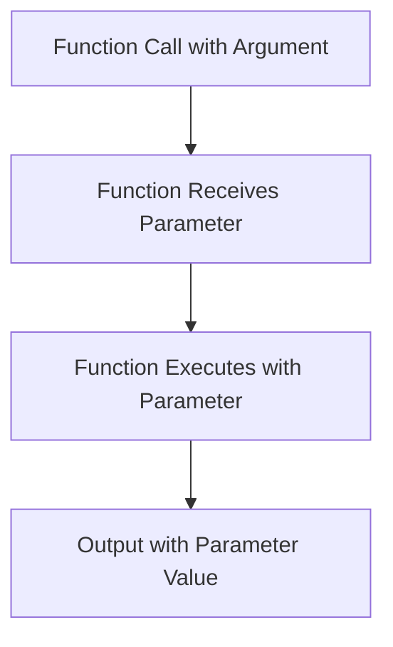

## 4.2.1 Passing Information

Welcome to the exciting world of functions in Flutter! In this section, we'll explore how to pass information to functions using parameters. Understanding this concept is crucial as it allows us to create flexible and reusable code. Let's dive in!

### What are Parameters?

Parameters are like special containers that hold information we want to give to a function. Think of them as the ingredients you provide to a recipe. Just as a recipe needs ingredients to make a delicious dish, a function needs parameters to perform its task.

### Parameters vs. Arguments

Before we go further, it's important to understand the difference between parameters and arguments:

- **Parameters** are placeholders in the function definition. They specify what kind of information the function expects.
- **Arguments** are the actual values you pass to the function when you call it. They fill in the placeholders.

Here's a simple analogy: Imagine a function as a mailbox. The parameter is the label on the mailbox that says "letters," and the argument is the actual letter you put inside.

### Passing Information with Parameters

Let's see how we can pass information to a function using parameters with a practical example:

```dart
void greetUser(String name) {
  print('Hello, $name!');
}

void main() {
  greetUser('Alice'); // 'Alice' is the argument
  greetUser('Bob');
}
```

In this example, `greetUser` is a function that takes one parameter, `name`. When we call `greetUser('Alice')`, the argument `'Alice'` is passed to the function, and it prints "Hello, Alice!".

### Multiple Parameters

Functions can also take more than one parameter. This allows us to pass multiple pieces of information at once. Let's modify our example to greet users with their names and ages:

```dart
void greetUser(String name, int age) {
  print('Hello, $name! You are $age years old.');
}

void main() {
  greetUser('Alice', 10);
  greetUser('Bob', 12);
}
```

Here, `greetUser` takes two parameters: `name` and `age`. When we call `greetUser('Alice', 10)`, it prints "Hello, Alice! You are 10 years old."

### Activity: Your Favorite Color

Now it's your turn! Let's create a function that takes your favorite color as a parameter and prints a message using that color:

```dart
void favoriteColor(String color) {
  print('My favorite color is $color!');
}

void main() {
  favoriteColor('Blue');
  favoriteColor('Green');
}
```

Try running this code and see how it prints your favorite colors. You can change the colors to whatever you like!

### Visualizing Parameters with Mermaid.js

To help you understand how parameters work, let's look at a visual representation:



In this diagram, you can see how the function call starts with an argument, which is then received as a parameter by the function. The function executes using this parameter, and finally, the output is generated with the parameter value.

### Engage Your Imagination

Think about different types of information you might want to pass to your functions. It could be names, numbers, colors, or even more complex data like lists or objects. The possibilities are endless!

### Best Practices and Tips

- **Use Descriptive Parameter Names:** Choose names that clearly describe the information they hold. This makes your code easier to read and understand.
- **Keep Functions Focused:** Each function should perform a specific task. If you find a function doing too much, consider breaking it into smaller functions.
- **Test with Different Arguments:** Experiment with various arguments to see how your function behaves. This helps ensure your function works as expected.

### Common Pitfalls

- **Mismatched Types:** Ensure the arguments you pass match the parameter types. For example, if a function expects a `String`, passing an `int` will cause an error.
- **Missing Arguments:** If a function requires parameters, make sure to provide the necessary arguments when calling it.

By understanding how to pass information to functions using parameters, you're building a strong foundation for writing efficient and reusable code. Keep experimenting and exploring new ways to use functions in your projects!

## Quiz Time!



### What is a parameter in a function?

- [x] A placeholder for information in the function definition
- [ ] The actual value passed to the function
- [ ] A type of variable
- [ ] A function's return value

> **Explanation:** A parameter is a placeholder in the function definition that specifies what kind of information the function expects.

### What is an argument in a function call?

- [ ] A placeholder for information in the function definition
- [x] The actual value passed to the function
- [ ] A type of variable
- [ ] A function's return value

> **Explanation:** An argument is the actual value you pass to the function when you call it, filling in the parameter placeholders.

### How many parameters can a function have?

- [ ] Only one
- [ ] Two
- [x] As many as needed
- [ ] None

> **Explanation:** A function can have as many parameters as needed to perform its task.

### In the code `greetUser('Alice')`, what is 'Alice'?

- [ ] A parameter
- [x] An argument
- [ ] A function
- [ ] A variable

> **Explanation:** 'Alice' is the argument passed to the function `greetUser`.

### What will the function `favoriteColor('Red')` print?

- [ ] 'My favorite color is Blue!'
- [x] 'My favorite color is Red!'
- [ ] 'My favorite color is Green!'
- [ ] 'My favorite color is Yellow!'

> **Explanation:** The function will print 'My favorite color is Red!' because 'Red' is the argument passed to the function.

### What is the difference between parameters and arguments?

- [x] Parameters are placeholders; arguments are actual values
- [ ] Parameters are actual values; arguments are placeholders
- [ ] They are the same thing
- [ ] Parameters are functions; arguments are variables

> **Explanation:** Parameters are placeholders in the function definition, while arguments are the actual values passed when calling the function.

### Can a function have no parameters?

- [x] Yes
- [ ] No

> **Explanation:** Yes, a function can have no parameters if it doesn't need any information to perform its task.

### What is a common mistake when passing arguments to a function?

- [ ] Using too many arguments
- [x] Mismatched types
- [ ] Using descriptive names
- [ ] Testing with different arguments

> **Explanation:** A common mistake is passing arguments that don't match the expected parameter types, leading to errors.

### Why is it important to use descriptive parameter names?

- [x] It makes the code easier to read and understand
- [ ] It makes the code run faster
- [ ] It reduces the number of parameters needed
- [ ] It prevents errors

> **Explanation:** Descriptive parameter names make the code easier to read and understand, helping others (and yourself) know what the function does.

### True or False: Functions can only take one parameter.

- [ ] True
- [x] False

> **Explanation:** False. Functions can take multiple parameters to perform their tasks.


