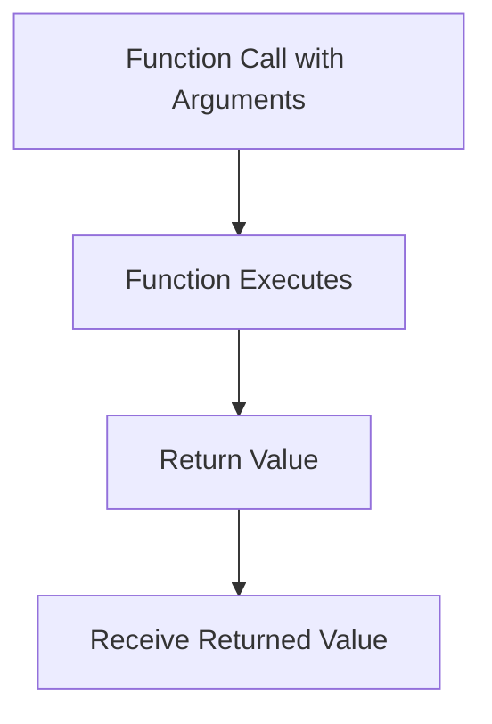

## 4.2.2 Getting Results Back

Welcome to an exciting part of your coding journey where we explore how functions can give us back results! In this section, we'll learn about return values in Dart functions and how they can be used to make our code more powerful and flexible.

### What is a Return Value?

A return value is like a gift that a function gives back to you after it has completed its task. When you call a function, it can perform calculations or operations and then send back a result that you can use elsewhere in your program. This is incredibly useful because it allows you to break down complex problems into smaller, manageable pieces.

### The Return Keyword

In Dart, we use the `return` keyword to specify what value a function should give back. This keyword tells the function, "Hey, this is the result you need to send back to whoever called you!"

Let's look at a simple example:

```dart
int add(int a, int b) {
  return a + b;
}

void main() {
  int sum = add(5, 3);
  print('Sum: $sum'); // Sum: 8
}
```

In this example, the `add` function takes two numbers, `a` and `b`, adds them together, and then uses the `return` keyword to send the result back. When we call `add(5, 3)`, it returns `8`, which we store in the variable `sum`.

### Using Returned Values

Once a function returns a value, you can assign it to a variable, print it, or use it in further calculations. This makes your code more modular and easier to understand.

Here's a step-by-step breakdown of how you can use returned values:

1. **Call the Function:** Use the function name followed by parentheses to call it, passing any required arguments.
2. **Capture the Result:** Assign the returned value to a variable.
3. **Use the Result:** Print the result or use it in other parts of your code.

### Activity: Create Your Own Function

Now it's your turn! Let's create a function that multiplies two numbers and returns the result. Then, we'll use that result in our `main` function.

```dart
int multiply(int x, int y) {
  return x * y;
}

void main() {
  int product = multiply(4, 6);
  print('Product: $product'); // Product: 24
}
```

In this activity, the `multiply` function takes two numbers, `x` and `y`, multiplies them, and returns the product. We then call this function in `main`, capture the result in the `product` variable, and print it.

### Visualizing the Flow of Data

To help you understand how data flows from a function call to a return value, let's use a Mermaid.js diagram:



This diagram shows the process from calling a function with arguments, executing the function, returning a value, and finally receiving that value in your code.

### Encouragement to Explore

Now that you know how to get results back from functions, try creating your own functions that perform different calculations. You could make a function that calculates the area of a rectangle, the average of a list of numbers, or even something fun like converting temperatures from Celsius to Fahrenheit!

Remember, the key to mastering coding is practice and experimentation. So, don't hesitate to play around with different ideas and see what you can create.

## Quiz Time!



### What is a return value in a function?

- [x] The result a function gives back after execution
- [ ] The input a function receives
- [ ] The name of the function
- [ ] The parameters of the function

> **Explanation:** A return value is the result that a function gives back after it has completed its task.


### Which keyword is used to specify what a function should return in Dart?

- [x] return
- [ ] output
- [ ] result
- [ ] giveback

> **Explanation:** The `return` keyword is used in Dart to specify what value a function should return.


### In the code `int sum = add(5, 3);`, what does `sum` represent?

- [x] The variable storing the returned value
- [ ] The function name
- [ ] The parameters of the function
- [ ] The return keyword

> **Explanation:** `sum` is the variable that stores the value returned by the `add` function.


### What does the `multiply` function return in the example provided?

- [x] The product of two numbers
- [ ] The sum of two numbers
- [ ] The difference between two numbers
- [ ] The division of two numbers

> **Explanation:** The `multiply` function returns the product of the two numbers passed to it.


### How can you use a returned value in your code?

- [x] Assign it to a variable
- [x] Print it
- [ ] Ignore it
- [ ] Use it as a function name

> **Explanation:** You can assign a returned value to a variable or print it for further use in your code.


### What happens if a function does not have a return statement?

- [x] It returns `null` by default
- [ ] It returns `0`
- [ ] It causes an error
- [ ] It returns the function name

> **Explanation:** If a function does not have a return statement, it returns `null` by default.


### Can a function return multiple values directly in Dart?

- [ ] Yes
- [x] No
- [ ] Only if it is a special function
- [ ] Only in certain conditions

> **Explanation:** In Dart, a function cannot return multiple values directly. However, you can return a list or a map to achieve similar functionality.


### What is the purpose of the `main` function in Dart?

- [x] It is the entry point of the program
- [ ] It is used to return values
- [ ] It is a special type of variable
- [ ] It is used to declare functions

> **Explanation:** The `main` function is the entry point of a Dart program where execution starts.


### What does the `print` function do in Dart?

- [x] Displays output to the console
- [ ] Returns a value
- [ ] Calls another function
- [ ] Declares a variable

> **Explanation:** The `print` function is used to display output to the console in Dart.


### True or False: A function can return a value and still perform other tasks.

- [x] True
- [ ] False

> **Explanation:** A function can perform various tasks and still return a value at the end of its execution.



By understanding how to get results back from functions, you're building a strong foundation for creating more complex and interactive programs. Keep experimenting and have fun coding!
