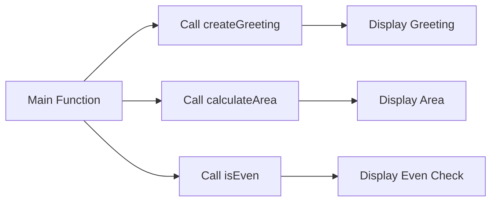

## 4.2.3 Function Examples

Welcome to the exciting world of functions in Dart! Functions are like little helpers in your code that can perform tasks for you. They make your code cleaner, easier to read, and more powerful. In this section, we'll explore different types of functions and see how they can be used to accomplish a variety of tasks. Let's dive in!

### Understanding Functions

Functions are blocks of code designed to perform specific tasks. They can take inputs, process them, and return outputs. Functions help us avoid repeating code and make our programs more organized.

### Different Return Types

Functions can return different types of values. Here are some examples:

- **Void:** A function that doesn't return anything.
- **int:** A function that returns an integer.
- **String:** A function that returns a string of text.
- **bool:** A function that returns a true or false value.

### Functions with Multiple Parameters

Functions can also take multiple pieces of information, called parameters, to perform their tasks. This allows them to be flexible and handle different scenarios.

### Code Examples

Let's look at some practical examples of functions in Dart:

```dart
// Function that returns a greeting message
String createGreeting(String name) {
  return 'Welcome, $name!';
}

// Function that calculates the area of a rectangle
double calculateArea(double length, double width) {
  return length * width;
}

// Function that checks if a number is even
bool isEven(int number) {
  return number % 2 == 0;
}

void main() {
  String greeting = createGreeting('Charlie');
  print(greeting); // Welcome, Charlie!

  double area = calculateArea(5.0, 3.0);
  print('Area: $area'); // Area: 15.0

  bool evenCheck = isEven(4);
  print('Is 4 even? $evenCheck'); // Is 4 even? true
}
```

#### Explanation:

- **`createGreeting`:** This function takes a name as a parameter and returns a personalized greeting message.
- **`calculateArea`:** This function calculates the area of a rectangle using its length and width.
- **`isEven`:** This function checks if a given number is even and returns a boolean value (`true` or `false`).

### Activity: Create Your Own Functions

Now it's your turn! Try creating functions that perform different tasks. Here are some ideas:

1. **Concatenate Strings:** Write a function that takes two strings and combines them into one.
2. **Subtract Numbers:** Create a function that subtracts one number from another.
3. **Check Palindrome:** Develop a function that checks if a word is the same forwards and backwards.

### Visualizing Function Interactions

Let's visualize how these functions interact within the `main` function using a Mermaid.js diagram:



### Encouragement and Engagement

Functions are incredibly powerful tools in programming. They allow you to break down complex problems into smaller, manageable tasks. As you practice creating and using functions, think about how they can simplify your code and make it more efficient.

Challenge yourself to come up with unique tasks that functions can perform. Implement them and see how they work. Remember, the more you practice, the better you'll become at coding!

## Quiz Time!



### What is a function in programming?

- [x] A block of code designed to perform a specific task
- [ ] A type of variable
- [ ] A programming language
- [ ] An error message

> **Explanation:** A function is a block of code designed to perform a specific task, making code reusable and organized.

### What does the `createGreeting` function return?

- [x] A personalized greeting message
- [ ] An integer
- [ ] A boolean value
- [ ] A void type

> **Explanation:** The `createGreeting` function returns a personalized greeting message as a string.

### What is the return type of the `calculateArea` function?

- [ ] int
- [x] double
- [ ] String
- [ ] bool

> **Explanation:** The `calculateArea` function returns a double, which represents the area of a rectangle.

### What does the `isEven` function check?

- [x] If a number is even
- [ ] If a number is odd
- [ ] If a number is positive
- [ ] If a number is negative

> **Explanation:** The `isEven` function checks if a number is even by returning true or false.

### How many parameters does the `calculateArea` function take?

- [ ] One
- [x] Two
- [ ] Three
- [ ] None

> **Explanation:** The `calculateArea` function takes two parameters: length and width.

### What is the purpose of a void function?

- [x] To perform a task without returning a value
- [ ] To return an integer
- [ ] To return a string
- [ ] To return a boolean

> **Explanation:** A void function performs a task but does not return any value.

### Which function would you use to combine two strings?

- [x] A function that concatenates strings
- [ ] A function that subtracts numbers
- [ ] A function that checks for even numbers
- [ ] A function that calculates area

> **Explanation:** A function that concatenates strings is used to combine two strings into one.

### What is a parameter in a function?

- [x] An input to the function
- [ ] An output of the function
- [ ] A type of variable
- [ ] A programming language

> **Explanation:** A parameter is an input to the function, allowing it to perform tasks with different data.

### Can a function return more than one type of value?

- [ ] True
- [x] False

> **Explanation:** A function can only return one type of value, but it can perform various tasks before returning.

### What is the benefit of using functions in programming?

- [x] They make code reusable and organized
- [ ] They make code longer
- [ ] They make code harder to read
- [ ] They increase errors

> **Explanation:** Functions make code reusable and organized, simplifying complex tasks and reducing repetition.



Congratulations on exploring the world of functions in Dart! Keep practicing and experimenting with different functions to enhance your coding skills. Happy coding!
