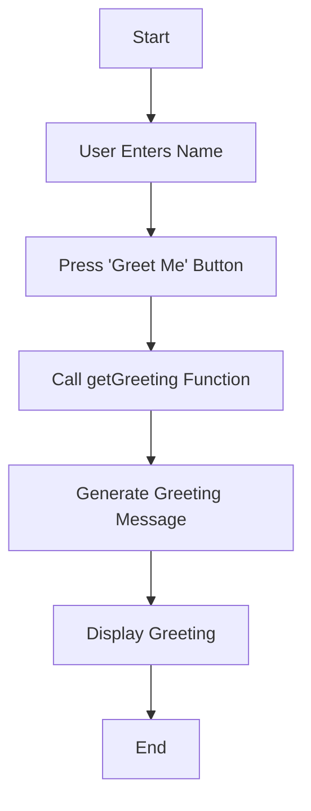

## 4.2.4 Mini Project: Personalized Greeter

Welcome to an exciting mini-project where you'll build a Personalized Greeter app using Flutter! This project will help you apply your knowledge of functions, parameters, and return values in a fun and interactive way. Let's dive in and create an app that greets users with a personalized message!

### Project Overview

In this project, you'll create a simple app that allows users to enter their name and receive a personalized greeting. This app will help you understand how to use functions to process user input and return customized messages.

### Step-by-Step Guide

Let's break down the process into manageable steps to ensure you understand each part of the project.

#### 1. Set Up the UI

First, we'll create a user interface (UI) that includes a text input field for the user's name and a button to generate the greeting. Here's how you can set up the UI:

- **Text Input Field:** This is where users will enter their name.
- **Button:** When pressed, this button will trigger the greeting function.
- **Text Display:** This will show the personalized greeting message.

#### 2. Create the Greeting Function

Next, we'll write a function that takes the user's name as a parameter and returns a personalized greeting message. This function will be the heart of our app.

```dart
String getGreeting(String name) {
  return 'Hello, $name! Welcome to Flutter!';
}
```

This function is simple yet powerful. It takes a `String` parameter called `name` and returns a greeting message that includes the user's name.

#### 3. Handle User Input

We'll capture the user's input from the text field using a `TextEditingController`. This controller will help us manage the text input and retrieve the user's name when needed.

#### 4. Display the Greeting

When the user presses the button, we'll call the `getGreeting` function and display the returned greeting message. Let's see how this is done in the complete code example below:

```dart
import 'package:flutter/material.dart';

void main() {
  runApp(PersonalizedGreeterApp());
}

class PersonalizedGreeterApp extends StatefulWidget {
  @override
  _PersonalizedGreeterAppState createState() => _PersonalizedGreeterAppState();
}

class _PersonalizedGreeterAppState extends State<PersonalizedGreeterApp> {
  final TextEditingController _controller = TextEditingController();
  String greeting = 'Enter your name and press the button!';

  String getGreeting(String name) {
    return 'Hello, $name! Welcome to Flutter!';
  }

  void generateGreeting() {
    setState(() {
      greeting = getGreeting(_controller.text);
    });
  }

  @override
  Widget build(BuildContext context) {
    return MaterialApp(
      home: Scaffold(
        appBar: AppBar(
          title: Text('Personalized Greeter'),
        ),
        body: Padding(
          padding: EdgeInsets.all(16.0),
          child: Column(
            children: [
              TextField(
                controller: _controller,
                decoration: InputDecoration(labelText: 'Enter your name'),
              ),
              SizedBox(height: 10),
              ElevatedButton(
                onPressed: generateGreeting,
                child: Text('Greet Me'),
              ),
              SizedBox(height: 20),
              Text(
                greeting,
                style: TextStyle(fontSize: 24),
                textAlign: TextAlign.center,
              ),
            ],
          ),
        ),
      ),
    );
  }
}
```

#### 5. Test the App

Now it's time to test your app! Run the app, enter different names, and observe the personalized greetings. This is a great opportunity to see your code in action and make any necessary adjustments.

### Visualizing the App Flow

To better understand the flow of the Personalized Greeter app, let's use a Mermaid.js diagram:



This flowchart outlines the steps from when the user enters their name to when the greeting is displayed.

### Encouragement and Customization

Congratulations on building your Personalized Greeter app! You've learned how to use functions, parameters, and return values to create a dynamic and interactive app. Here are some ways you can customize and enhance your app:

- **Change the Greeting Message:** Modify the `getGreeting` function to include different messages or add emojis for a fun touch.
- **Add Colors:** Use Flutter's styling options to change the text color or background color based on the greeting.
- **Include More Features:** Consider adding a feature that remembers the user's name for future greetings.

Remember, coding is all about creativity and experimentation. Don't be afraid to try new things and make the app your own!

## Quiz Time!



### What is the primary purpose of the `getGreeting` function in the Personalized Greeter app?

- [x] To generate a personalized greeting message using the user's name.
- [ ] To capture the user's input from the text field.
- [ ] To display the greeting message on the screen.
- [ ] To handle button press events.

> **Explanation:** The `getGreeting` function is designed to take the user's name as a parameter and return a personalized greeting message.

### Which widget is used to capture user input in the Personalized Greeter app?

- [x] TextField
- [ ] ElevatedButton
- [ ] Text
- [ ] Container

> **Explanation:** The `TextField` widget is used to capture user input, allowing users to enter their name.

### How does the app update the greeting message when the button is pressed?

- [x] By calling the `generateGreeting` function, which updates the state.
- [ ] By directly modifying the `Text` widget.
- [ ] By using a `setState` call without a function.
- [ ] By restarting the app.

> **Explanation:** The `generateGreeting` function is called when the button is pressed, and it uses `setState` to update the greeting message.

### What role does the `TextEditingController` play in the app?

- [x] It manages the text input and retrieves the user's name.
- [ ] It displays the greeting message.
- [ ] It handles button press events.
- [ ] It styles the text input field.

> **Explanation:** The `TextEditingController` is used to manage the text input and retrieve the user's name from the `TextField`.

### What happens when the `generateGreeting` function is called?

- [x] The greeting message is updated with the user's name.
- [ ] The app restarts.
- [ ] The text input field is cleared.
- [ ] The button is disabled.

> **Explanation:** When `generateGreeting` is called, it updates the greeting message with the user's name by calling the `getGreeting` function.

### How can you customize the greeting message in the app?

- [x] By modifying the `getGreeting` function.
- [ ] By changing the `TextField` widget.
- [ ] By altering the `TextEditingController`.
- [ ] By editing the `MaterialApp` widget.

> **Explanation:** You can customize the greeting message by modifying the `getGreeting` function to include different text or emojis.

### What is the purpose of the `setState` method in the app?

- [x] To update the UI when the greeting message changes.
- [ ] To initialize the app.
- [ ] To capture user input.
- [ ] To handle errors.

> **Explanation:** The `setState` method is used to update the UI when the greeting message changes, ensuring the new message is displayed.

### Which Flutter widget is used to create a button in the app?

- [x] ElevatedButton
- [ ] TextField
- [ ] Container
- [ ] Scaffold

> **Explanation:** The `ElevatedButton` widget is used to create a button that users can press to generate the greeting.

### What is the initial value of the `greeting` variable in the app?

- [x] "Enter your name and press the button!"
- [ ] "Hello, World!"
- [ ] "Welcome to Flutter!"
- [ ] "Please enter your name."

> **Explanation:** The initial value of the `greeting` variable is "Enter your name and press the button!", which prompts the user to interact with the app.

### True or False: The Personalized Greeter app can be customized to include additional features such as color changes.

- [x] True
- [ ] False

> **Explanation:** True. The app can be customized to include additional features such as color changes, different greeting messages, and more.



With this project, you've taken a significant step forward in your coding journey. Keep experimenting, learning, and having fun with Flutter!
