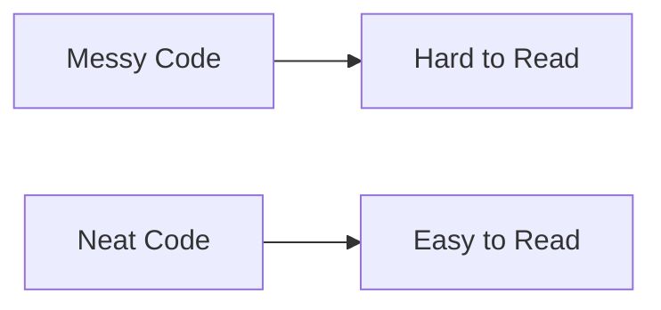

## 4.3.1 Keeping Code Neat

Welcome to the world of neat and tidy code! Just like keeping your room clean helps you find your toys and books easily, writing clean and organized code makes it easier to understand and fix. In this section, we'll explore why neat code is important and how you can keep your code tidy and readable.

### Why is Neat Code Important?

Imagine trying to find your favorite toy in a messy room. It would take a lot of time and effort, right? The same goes for code. When your code is neat, it's easier to read, understand, and maintain. This is especially important when working on larger projects or when other people need to read your code.

### Key Concepts for Neat Code

Let's dive into some key concepts that will help you keep your code neat and organized.

#### 1. Indentation

Indentation is like the spacing between words in a sentence. It helps show the structure of your code, making it easier to see which parts belong together. In Dart, we use spaces to indent our code. Here's an example:

```dart
// Neat Code
void addNumbers(int a, int b) {
  int sum = a + b;
  print('Sum: $sum');
}

// Messy Code
void addNumbers(int a,int b){int sum=a+b;print('Sum: $sum');}
```

In the neat code example, you can see how the indentation makes it clear where the function starts and ends.

#### 2. Consistent Naming

Using consistent names for your variables and functions is like labeling your drawers. It helps you and others understand what each part of your code does. Here are some tips for naming:

- Use descriptive names: Instead of `x` or `y`, use `width` or `height`.
- Follow a naming convention: For example, use camelCase for variables and functions (`myVariable`, `calculateSum`).

#### 3. Avoiding Clutter

Clutter in code is like having too many toys on the floor. It makes it hard to see what's important. Keep your code free from unnecessary lines or comments. Here's how:

- Remove unused code: If you don't need a piece of code, delete it.
- Keep comments meaningful: Only add comments that help explain complex parts of your code.

### Code Example

Let's look at a practical example of neat versus messy code:

```dart
// Messy Code
void greet(String name){print('Hello, '+name+'!');}

// Neat Code
void greet(String name) {
  print('Hello, $name!');
}
```

In the neat code example, the function is easy to read and understand because of proper indentation and spacing.

### Activity: Clean Up the Code

Now it's your turn! Here's a piece of messy code. Can you reformat it to make it neat and organized?

```dart
// Messy Code
void calculateArea(int length,int width){int area=length*width;print('Area: $area');}
```

Try to make it look like this:

```dart
// Neat Code
void calculateArea(int length, int width) {
  int area = length * width;
  print('Area: $area');
}
```

### Visualizing Neat vs. Messy Code

Let's use a simple diagram to illustrate the difference between neat and messy code:



As you can see, neat code leads to easy reading and understanding, while messy code can be confusing and difficult to follow.

### Encouragement to Keep Code Neat

Keeping your code neat is a habit that will serve you well as you continue your coding journey. It shows that you take pride in your work and makes it easier for others to collaborate with you. Remember, neat code is happy code!

## Quiz Time!



### Why is neat code important?

- [x] It makes code easier to read and understand.
- [ ] It makes code run faster.
- [ ] It adds more features to the code.
- [ ] It makes code look colorful.

> **Explanation:** Neat code is important because it makes the code easier to read and understand, which helps in maintaining and fixing it.

### What is indentation in coding?

- [x] Proper spacing to show the structure of the code.
- [ ] Adding colors to the code.
- [ ] Writing code in a single line.
- [ ] Using different fonts in code.

> **Explanation:** Indentation is the use of spaces to show the structure of the code, making it easier to read.

### Which of the following is a good practice for naming variables?

- [x] Use descriptive names.
- [ ] Use single letters.
- [ ] Use random words.
- [ ] Use numbers only.

> **Explanation:** Using descriptive names helps in understanding what the variable represents.

### What should you do with unused code?

- [x] Remove it.
- [ ] Keep it for decoration.
- [ ] Hide it with comments.
- [ ] Change its color.

> **Explanation:** Unused code should be removed to avoid clutter and confusion.

### What does consistent naming mean?

- [x] Using the same style for naming functions and variables.
- [ ] Changing names frequently.
- [x] Using camelCase for variables and functions.
- [ ] Using numbers for names.

> **Explanation:** Consistent naming involves using a uniform style, like camelCase, for naming functions and variables.

### What is the benefit of avoiding clutter in code?

- [x] It makes the code easier to read.
- [ ] It makes the code longer.
- [ ] It adds more features.
- [ ] It makes the code colorful.

> **Explanation:** Avoiding clutter makes the code easier to read and understand.

### How can you make your code neat?

- [x] Use indentation.
- [ ] Write everything in one line.
- [x] Use consistent naming.
- [ ] Add random comments.

> **Explanation:** Using indentation and consistent naming are key practices for keeping code neat.

### What is the result of messy code?

- [x] Hard to read.
- [ ] Faster execution.
- [ ] More features.
- [ ] Colorful display.

> **Explanation:** Messy code is hard to read and understand, which can lead to errors.

### What should comments in code do?

- [x] Explain complex parts of the code.
- [ ] Decorate the code.
- [ ] Make the code longer.
- [ ] Add features to the code.

> **Explanation:** Comments should help explain complex parts of the code to make it easier to understand.

### True or False: Neat code is only important for big projects.

- [ ] True
- [x] False

> **Explanation:** Neat code is important for projects of all sizes, as it helps in understanding and maintaining the code.


