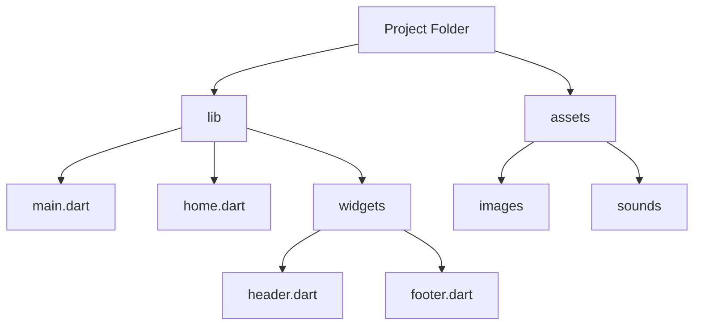

## 4.3.3 File Structure in Flutter

Welcome to the exciting world of organizing your Flutter projects! Just like how you might keep your room tidy by putting toys in one box and books in another, organizing your Flutter project files helps keep everything neat and easy to find. Let's dive into how you can structure your Flutter files for a smoother coding experience.

### Why Organize Your Files?

Imagine trying to find your favorite toy in a messy room. It would take forever, right? The same goes for coding. When your files are organized, you can quickly find what you need, making it easier to work on your project. A well-organized project is like a well-organized desk, where everything has its place.

### Key Concepts of Flutter File Structure

In Flutter, organizing your files is crucial for managing your app efficiently. Here are some key concepts to understand:

#### 1. Main File (`main.dart`)

The `main.dart` file is the heart of your Flutter app. It's the entry point where your app starts running. Think of it as the front door to your house. When you open the app, this is the first file that gets executed.

#### 2. Separate Files for Widgets

Just like you might have different drawers for socks and shirts, you can create separate Dart files for different parts of your app. For example, you might have a `home.dart` file for your home screen and a `header.dart` file for the top part of your app. This separation makes your code easier to read and manage.

#### 3. Assets Folder

The `assets` folder is where you store images, sounds, and other media files. It's like a special drawer for all your art supplies. By keeping these files in one place, you can easily access them whenever you need to add a picture or sound to your app.

### Example of a Flutter Project Structure

Here's an example of how you might organize your Flutter project:

```plaintext
my_flutter_app/
├── lib/
│   ├── main.dart
│   ├── home.dart
│   └── widgets/
│       ├── header.dart
│       └── footer.dart
├── assets/
│   ├── images/
│   │   └── logo.png
│   └── sounds/
│       └── beep.mp3
└── pubspec.yaml
```

### Visualizing the File Structure

To help you visualize this structure, here's a diagram using Mermaid.js:



### Activity: Organize Your Own Flutter Project

Now it's your turn! Create a simple Flutter project and try organizing your code into separate files for different widgets. Here's a step-by-step guide to help you:

1. **Create a New Flutter Project:** Open your code editor and create a new Flutter project.
2. **Add a New Dart File:** In the `lib` folder, add a new Dart file called `home.dart`.
3. **Create a Widgets Folder:** Inside the `lib` folder, create a new folder called `widgets`.
4. **Add Widget Files:** Inside the `widgets` folder, add two Dart files: `header.dart` and `footer.dart`.
5. **Organize Your Assets:** Create an `assets` folder in the root of your project, and add `images` and `sounds` subfolders.

### Best Practices for File Organization

- **Keep It Simple:** Don't overcomplicate your structure. Keep it simple and logical.
- **Use Descriptive Names:** Name your files and folders clearly so you know what's inside.
- **Group Related Files:** Keep related files together, like all widget files in one folder.

### Common Pitfalls and How to Avoid Them

- **Avoid Clutter:** Don't put too many files in one folder. It can get messy!
- **Don't Forget the `pubspec.yaml`:** Make sure to update your `pubspec.yaml` file to include any assets you add.

### Conclusion

Organizing your Flutter project files is like arranging a puzzle. Each piece has its place, and when everything is in order, it creates a beautiful picture. By keeping your files organized, you'll find it easier to manage your code and build amazing apps.

## Quiz Time!



### What is the main purpose of the `main.dart` file in a Flutter project?

- [x] It is the entry point of the Flutter app.
- [ ] It stores all the images for the app.
- [ ] It contains the app's sound files.
- [ ] It is used for styling the app.

> **Explanation:** The `main.dart` file is the entry point of the Flutter app, where the app starts running.

### Why should you create separate files for different widgets in Flutter?

- [x] To make the code easier to read and manage.
- [ ] To make the app run faster.
- [ ] To reduce the size of the app.
- [ ] To store images and sounds.

> **Explanation:** Creating separate files for different widgets helps in organizing the code, making it easier to read and manage.

### What is stored in the `assets` folder of a Flutter project?

- [x] Images and sounds.
- [ ] Dart files.
- [ ] Configuration files.
- [ ] Code libraries.

> **Explanation:** The `assets` folder is used to store images, sounds, and other media files.

### Which file should you update when adding new assets to your Flutter project?

- [x] pubspec.yaml
- [ ] main.dart
- [ ] home.dart
- [ ] header.dart

> **Explanation:** You should update the `pubspec.yaml` file to include any new assets you add to your project.

### What is the benefit of using descriptive names for files and folders?

- [x] It helps in understanding what each file contains.
- [ ] It makes the app run faster.
- [x] It makes the project easier to navigate.
- [ ] It reduces the app's size.

> **Explanation:** Descriptive names help in understanding the contents of each file and make the project easier to navigate.

### What is a common pitfall when organizing files in a Flutter project?

- [x] Putting too many files in one folder.
- [ ] Using too many images.
- [ ] Not writing enough code.
- [ ] Using too many widgets.

> **Explanation:** Putting too many files in one folder can make it cluttered and hard to manage.

### How can organizing your files help in coding?

- [x] It makes finding and managing code easier.
- [ ] It increases the app's download speed.
- [x] It helps in understanding the project structure.
- [ ] It reduces the need for comments.

> **Explanation:** Organizing files makes it easier to find and manage code, and helps in understanding the project structure.

### What should you do if your project files become cluttered?

- [x] Organize them into separate folders.
- [ ] Delete some files.
- [ ] Add more code.
- [ ] Ignore the clutter.

> **Explanation:** Organizing files into separate folders can help reduce clutter and improve manageability.

### What analogy is used to describe organizing files in this section?

- [x] Keeping different parts of a project in separate folders is like keeping different drawers in a desk.
- [ ] Organizing files is like cooking a meal.
- [ ] It's like painting a picture.
- [ ] It's like building a house.

> **Explanation:** The analogy used is that organizing files is like keeping different parts of a project in separate folders, similar to keeping different drawers in a desk.

### True or False: The `assets` folder is used to store Dart files.

- [ ] True
- [x] False

> **Explanation:** The `assets` folder is used to store images, sounds, and other media files, not Dart files.


