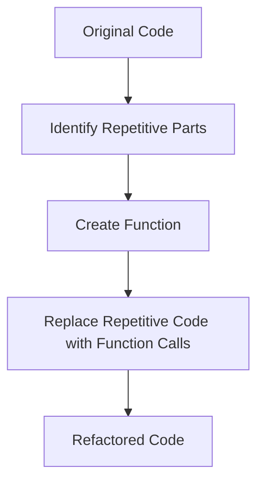

## 4.3.4 Refactoring Code

Welcome to the exciting world of refactoring! In this section, we'll explore how to make your code cleaner, more efficient, and easier to understand. Think of refactoring as tidying up your room—you're organizing and improving without changing the room's purpose. Let's dive into the magic of refactoring!

### What is Refactoring?

Refactoring is the process of improving your code without changing its functionality. It's like cleaning up a messy room: you rearrange things, throw out unnecessary items, and make everything look neat and tidy. The goal is to make your code easier to read, understand, and maintain.

### Key Concepts of Refactoring

#### Simplifying Code

Simplifying code means making it shorter and easier to understand. When you simplify your code, you reduce complexity and make it more approachable for others (and your future self) to read.

#### Removing Redundancies

Redundancies occur when you have repeated code that can be consolidated. By identifying these repetitions, you can create functions to handle them, making your code more efficient and less prone to errors.

#### Improving Readability

Readability is crucial for maintaining code. By using meaningful names for variables and functions, and organizing your code logically, you make it easier for others to understand what your code does.

### Code Example: Before and After Refactoring

Let's look at a simple example to illustrate the power of refactoring.

#### Before Refactoring

```dart
void greetAlice() {
  print('Hello, Alice!');
}

void greetBob() {
  print('Hello, Bob!');
}
```

In this code, we have two functions that do almost the same thing: greet Alice and Bob. This repetition can be improved.

#### After Refactoring

```dart
void greet(String name) {
  print('Hello, $name!');
}

void main() {
  greet('Alice');
  greet('Bob');
}
```

By refactoring, we've created a single function `greet` that takes a `name` as a parameter. This makes the code shorter, more flexible, and easier to maintain.

### Activity: Refactor the Code

Now it's your turn! Here's a piece of repetitive code. Try refactoring it to reduce redundancy.

#### Original Code

```dart
void sayHiToAlex() {
  print('Hi, Alex!');
}

void sayHiToJamie() {
  print('Hi, Jamie!');
}
```

#### Refactored Code

```dart
void sayHi(String name) {
  print('Hi, $name!');
}

void main() {
  sayHi('Alex');
  sayHi('Jamie');
}
```

By creating a function `sayHi`, you eliminate repetition and make the code cleaner.

### Visualizing the Refactoring Process

Let's use a flowchart to visualize the refactoring process:



This flowchart shows the steps involved in refactoring: identifying repetitive parts, creating a function, and replacing the repetitive code with function calls.

### Benefits of Refactoring

- **Easier to Read:** Clean code is easier to read and understand.
- **Less Error-Prone:** By reducing repetition, you minimize the chances of errors.
- **More Efficient:** Refactored code often runs faster and uses fewer resources.
- **Easier to Maintain:** Clean code is easier to update and modify in the future.

### Encouragement to Refactor Regularly

Refactoring is an essential part of coding. By regularly reviewing and refactoring your code, you develop good coding habits that will serve you well in your programming journey. Remember, clean code is happy code!

## Quiz Time!



### What is the main goal of refactoring code?

- [x] To improve code without changing its functionality
- [ ] To add new features to the code
- [ ] To make the code run slower
- [ ] To delete all comments in the code

> **Explanation:** Refactoring aims to improve the structure and readability of code without altering its functionality.

### Which of the following is a benefit of refactoring?

- [x] Improved readability
- [ ] Increased code complexity
- [ ] More bugs
- [ ] Slower performance

> **Explanation:** Refactoring improves readability, making the code easier to understand and maintain.

### What does it mean to remove redundancies in code?

- [x] Eliminating repeated code by using functions
- [ ] Adding more comments to the code
- [ ] Making the code longer
- [ ] Ignoring errors in the code

> **Explanation:** Removing redundancies involves using functions to eliminate repeated code, making it more efficient.

### In the refactored code example, what does the `greet` function do?

- [x] Prints a greeting message with a given name
- [ ] Adds two numbers
- [ ] Deletes a file
- [ ] Changes the background color

> **Explanation:** The `greet` function prints a greeting message using the name provided as a parameter.

### Why is improving readability important in coding?

- [x] It makes the code easier to understand and maintain
- [ ] It makes the code run faster
- [ ] It adds more features to the code
- [ ] It increases the file size

> **Explanation:** Improving readability helps others (and yourself) understand and maintain the code more easily.

### What is the first step in the refactoring process according to the flowchart?

- [x] Identify Repetitive Parts
- [ ] Create Function
- [ ] Replace Repetitive Code with Function Calls
- [ ] Refactored Code

> **Explanation:** The first step is to identify parts of the code that are repetitive and can be improved.

### How does refactoring help with maintaining code?

- [x] It makes the code easier to update and modify
- [ ] It makes the code harder to read
- [ ] It adds more bugs to the code
- [ ] It deletes important functions

> **Explanation:** Refactoring makes the code cleaner and more organized, which simplifies future updates and modifications.

### What should you do after creating a function during refactoring?

- [x] Replace repetitive code with function calls
- [ ] Delete the original code
- [ ] Add more comments
- [ ] Ignore the function

> **Explanation:** After creating a function, you should replace the repetitive code with calls to this new function.

### What analogy is used to describe refactoring in this section?

- [x] Tidying up a messy room
- [ ] Building a new house
- [ ] Cooking a meal
- [ ] Painting a picture

> **Explanation:** Refactoring is compared to tidying up a messy room, where you organize and improve without changing the room's purpose.

### True or False: Refactoring changes the functionality of the code.

- [ ] True
- [x] False

> **Explanation:** Refactoring improves the code's structure and readability without changing its functionality.



By understanding and practicing refactoring, you're taking a big step towards becoming a skilled and thoughtful coder. Keep up the great work, and remember to keep your code clean and efficient!
