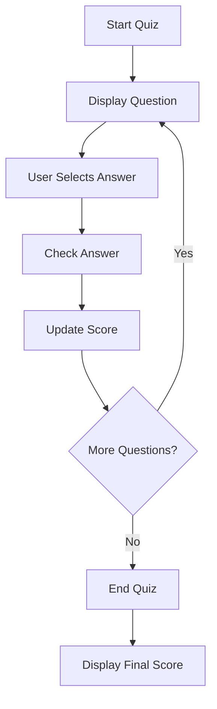

## 4.4.1 Designing the Quiz

Welcome to the exciting world of app design! In this section, we'll embark on a creative journey to design a simple quiz app. Designing a quiz app is not just about coding; it's about planning, creativity, and making decisions that will shape how your app looks and feels. Let's dive in!

### Objective

Our goal is to guide you through the process of planning and designing a quiz app. This involves deciding what questions to ask, how to present them, and how to handle answers. By the end of this section, you'll have a solid plan for your quiz app, ready to be brought to life with code.

### Explanation

Designing a quiz app involves several key steps. First, you'll need to choose a topic that interests you. This could be anything from animals and sports to fairy tales and science. Next, you'll decide on the structure of your questions. Will they be multiple-choice, true/false, or open-ended? Finally, you'll create a scoring system to track and display scores based on correct answers.

### Key Concepts

#### Choosing Topics

The first step in designing your quiz app is selecting a topic. Think about subjects that excite you or that you know a lot about. Here are some ideas to get you started:

- **Animals:** Test your friends' knowledge about different species, habitats, and behaviors.
- **Sports:** Challenge others with questions about famous athletes, sports rules, and historical events.
- **Fairy Tales:** Dive into the world of magic and fantasy with questions about classic stories and characters.

Choosing a topic you love will make the design process more enjoyable and your quiz more engaging.

#### Question Structure

Once you've chosen a topic, it's time to think about the types of questions you'll ask. Here are some common structures:

- **Multiple-Choice:** Provide several answer options, with only one correct choice.
- **True/False:** Present a statement and ask if it's true or false.
- **Open-Ended:** Allow users to type their answers, which can be more challenging to implement but offers flexibility.

Decide on the structure that best fits your topic and the experience you want to create for your users.

#### Scoring System

A scoring system is essential for any quiz app. It keeps track of correct answers and provides feedback to the user. Here are some elements to consider:

- **Points per Question:** Decide how many points each correct answer is worth.
- **Feedback:** Display messages like "Correct!" or "Try Again!" to guide users.
- **Final Score:** Show the total score at the end of the quiz, possibly with a fun message or encouragement.

### Activity: Brainstorm Your Quiz

Now it's your turn to get creative! Take a moment to brainstorm and write down 5-10 questions for your quiz app. Include possible answers, and remember to have fun with it. Here's an example to inspire you:

```plaintext
Q1: What is the capital of France?
A) Berlin
B) London
C) Paris
D) Rome
```

Feel free to use this format for your questions. Once you have your list, think about how you'll present them in your app.

### Visuals: Flowchart of the Quiz App Design

To help you visualize the flow of your quiz app, let's create a simple flowchart using Mermaid.js. This will show the steps from starting the quiz to displaying the final score.



This flowchart outlines the basic structure of your quiz app. It starts with the quiz, displays questions, checks answers, updates the score, and finally ends with a summary of the user's performance.

### Language and Engagement

As you design your quiz, use clear and encouraging language. Remember, the goal is to make the quiz fun and engaging. Think about how you can surprise and delight your users with interesting and varied questions.

### Encouragement

Designing a quiz app is a fantastic way to express your creativity and share your knowledge with others. As you work through this process, remember to have fun and let your imagination run wild. Your quiz app is a reflection of your interests and creativity, so make it uniquely yours!

## Quiz Time!



### What is the first step in designing a quiz app?

- [x] Choosing a topic
- [ ] Writing code
- [ ] Creating a scoring system
- [ ] Designing the user interface

> **Explanation:** The first step in designing a quiz app is choosing a topic that interests you, as it sets the foundation for the rest of the design process.

### Which question structure allows users to type their answers?

- [ ] Multiple-choice
- [ ] True/False
- [x] Open-ended
- [ ] Fill-in-the-blank

> **Explanation:** Open-ended questions allow users to type their answers, offering more flexibility but also requiring more complex implementation.

### What is a key element of a scoring system in a quiz app?

- [ ] Background music
- [x] Points per question
- [ ] Color scheme
- [ ] Animation effects

> **Explanation:** A key element of a scoring system is deciding how many points each correct answer is worth, which helps track the user's performance.

### What should you consider when choosing a topic for your quiz app?

- [x] Your interests and knowledge
- [ ] The latest fashion trends
- [ ] The most popular movies
- [ ] The weather forecast

> **Explanation:** Choosing a topic that aligns with your interests and knowledge makes the design process more enjoyable and the quiz more engaging.

### What does the flowchart in the quiz app design represent?

- [ ] The color scheme of the app
- [ ] The types of questions to ask
- [x] The flow of the quiz from start to finish
- [ ] The scoring system

> **Explanation:** The flowchart represents the flow of the quiz from start to finish, outlining the steps involved in the quiz process.

### How can you make your quiz app engaging?

- [x] By including interesting and varied questions
- [ ] By using only true/false questions
- [ ] By making it very difficult
- [ ] By limiting the number of questions

> **Explanation:** Including interesting and varied questions can make your quiz app engaging and fun for users.

### What is an example of a multiple-choice question?

- [x] What is the capital of France? A) Berlin B) London C) Paris D) Rome
- [ ] Is the sky blue? True/False
- [ ] Describe your favorite animal.
- [ ] What is 2 + 2?

> **Explanation:** A multiple-choice question provides several answer options, with only one correct choice, like the example given.

### What feedback might you provide for a correct answer?

- [x] "Correct!"
- [ ] "Try Again!"
- [ ] "Incorrect!"
- [ ] "Maybe!"

> **Explanation:** Providing feedback like "Correct!" helps guide users and reinforce their correct answers.

### Why is it important to have a scoring system in a quiz app?

- [x] To track and display scores based on correct answers
- [ ] To make the app look more colorful
- [ ] To confuse the users
- [ ] To slow down the app

> **Explanation:** A scoring system is important to track and display scores based on correct answers, providing feedback and motivation to users.

### True or False: Designing a quiz app is only about writing code.

- [ ] True
- [x] False

> **Explanation:** False. Designing a quiz app involves planning, creativity, and decision-making, not just writing code.



By following these steps and engaging in the activities, you're well on your way to designing a fantastic quiz app. Remember, the key is to have fun and let your creativity shine!
