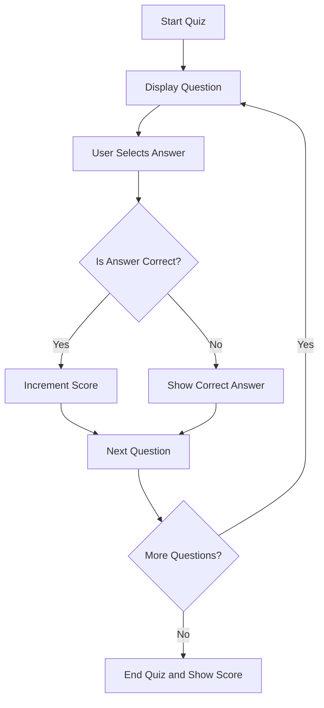

## 4.4.2 Coding the Quiz Logic

Welcome to the exciting world of coding your very own quiz app! In this section, we'll dive into the logic that powers a quiz, teaching you how to display questions, capture user answers, check for correctness, and update scores. By the end of this lesson, you'll have a working quiz app that you can customize and share with friends and family.

### Understanding Quiz Logic

Before we jump into coding, let's break down what quiz logic involves:

1. **Displaying Questions:** We need a way to show each question and its possible answers to the user.
2. **Capturing Answers:** When a user selects an answer, we need to capture that choice.
3. **Checking Correctness:** We must verify if the selected answer is correct.
4. **Updating Scores:** If the answer is correct, we increment the user's score.
5. **Providing Feedback:** Let the user know if they were right or wrong and show the correct answer if needed.

### Key Concepts

To implement this logic, we'll use functions and conditions. Functions will help us organize our code into reusable blocks, while conditions will allow us to make decisions based on user input.

#### Function for Displaying Questions

We'll create a function that displays each question along with its possible answers. This function will be called every time we need to show a new question.

#### Function for Checking Answers

Another function will handle the logic of checking if the user's selected answer is correct. This function will also update the score and provide feedback.

#### Updating Scores

We'll keep track of the user's score and update it whenever they answer a question correctly.

### Coding the Quiz Logic

Let's look at the code that brings all these concepts together:

```dart
import 'package:flutter/material.dart';

void main() {
  runApp(QuizApp());
}

class QuizApp extends StatefulWidget {
  @override
  _QuizAppState createState() => _QuizAppState();
}

class _QuizAppState extends State<QuizApp> {
  final List<Map<String, dynamic>> questions = [
    {
      'question': 'What is the capital of France?',
      'answers': ['Berlin', 'London', 'Paris', 'Rome'],
      'correct': 'Paris',
    },
    {
      'question': 'Which planet is known as the Red Planet?',
      'answers': ['Earth', 'Mars', 'Jupiter', 'Saturn'],
      'correct': 'Mars',
    },
  ];

  int currentQuestion = 0;
  int score = 0;
  String feedback = '';

  void answerQuestion(String selected) {
    if (selected == questions[currentQuestion]['correct']) {
      score++;
      feedback = 'Correct!';
    } else {
      feedback = 'Wrong! The correct answer was ${questions[currentQuestion]['correct']}.';
    }
    setState(() {
      if (currentQuestion < questions.length - 1) {
        currentQuestion++;
      } else {
        feedback += ' Your final score is $score out of ${questions.length}.';
      }
    });
  }

  @override
  Widget build(BuildContext context) {
    return MaterialApp(
      home: Scaffold(
        appBar: AppBar(
          title: Text('Simple Quiz App'),
        ),
        body: Padding(
          padding: EdgeInsets.all(16.0),
          child: Column(
            children: [
              Text(
                questions[currentQuestion]['question'],
                style: TextStyle(fontSize: 20),
              ),
              SizedBox(height: 20),
              ...questions[currentQuestion]['answers'].map<Widget>((answer) {
                return ElevatedButton(
                  onPressed: () => answerQuestion(answer),
                  child: Text(answer),
                );
              }).toList(),
              SizedBox(height: 20),
              Text(
                feedback,
                style: TextStyle(fontSize: 18, color: Colors.blue),
              ),
            ],
          ),
        ),
      ),
    );
  }
}
```

### Code Breakdown

- **State Management:** We use a `StatefulWidget` to manage the state of our quiz app, allowing us to update the UI when the user answers a question.
- **Question List:** We store our questions and answers in a list of maps, where each map contains a question, possible answers, and the correct answer.
- **Answer Function:** The `answerQuestion` function checks if the selected answer is correct, updates the score, and provides feedback.
- **UI Update:** We use `setState` to update the UI with the next question or final score.

### Activity: Customize Your Quiz

Now it's your turn! Add more questions to the quiz or modify existing ones to better suit your interests. You can change the questions, answers, or even the feedback messages.

### Visualizing Quiz Logic

To help you understand the flow of the quiz logic, here's a diagram:



### Encouragement and Engagement

Coding a quiz app is a fantastic way to practice problem-solving and creativity. Test your quiz with friends or family and gather feedback to improve it. Remember, coding is all about learning and having fun!

## Quiz Time!



### What is the main purpose of the `answerQuestion` function in our quiz app?

- [x] To check if the selected answer is correct and update the score
- [ ] To display the next question
- [ ] To initialize the quiz
- [ ] To reset the quiz

> **Explanation:** The `answerQuestion` function checks if the selected answer is correct and updates the score accordingly.

### How do we update the UI in a `StatefulWidget`?

- [x] By using the `setState` method
- [ ] By calling the `build` method directly
- [ ] By using a `StatelessWidget`
- [ ] By restarting the app

> **Explanation:** The `setState` method is used to update the UI in a `StatefulWidget`.

### What data structure is used to store questions and answers in the quiz app?

- [x] A list of maps
- [ ] A single map
- [ ] A list of strings
- [ ] A list of integers

> **Explanation:** We use a list of maps to store each question, its possible answers, and the correct answer.

### What happens when the user selects the correct answer?

- [x] The score is incremented
- [ ] The app closes
- [ ] The question is removed
- [ ] The app restarts

> **Explanation:** When the user selects the correct answer, the score is incremented.

### What is displayed when the quiz ends?

- [x] The final score
- [ ] The first question
- [ ] A restart button
- [ ] A congratulatory message

> **Explanation:** When the quiz ends, the final score is displayed.

### Which widget is used to display the questions and answers?

- [x] `Text` and `ElevatedButton`
- [ ] `ListView`
- [ ] `Container`
- [ ] `Column`

> **Explanation:** We use `Text` to display questions and `ElevatedButton` for answers.

### How can you add more questions to the quiz?

- [x] By adding more maps to the `questions` list
- [ ] By creating a new widget
- [ ] By modifying the `main` function
- [ ] By changing the `build` method

> **Explanation:** You can add more questions by adding more maps to the `questions` list.

### What is the role of the `feedback` variable?

- [x] To provide feedback on whether the answer was correct or wrong
- [ ] To store the user's name
- [ ] To keep track of time
- [ ] To reset the quiz

> **Explanation:** The `feedback` variable provides feedback on whether the answer was correct or wrong.

### What is the purpose of the `currentQuestion` variable?

- [x] To keep track of which question is currently being displayed
- [ ] To store the user's score
- [ ] To reset the quiz
- [ ] To display the final score

> **Explanation:** The `currentQuestion` variable keeps track of which question is currently being displayed.

### True or False: The quiz app uses a `StatelessWidget`.

- [ ] True
- [x] False

> **Explanation:** The quiz app uses a `StatefulWidget` to manage state changes when the user answers questions.


