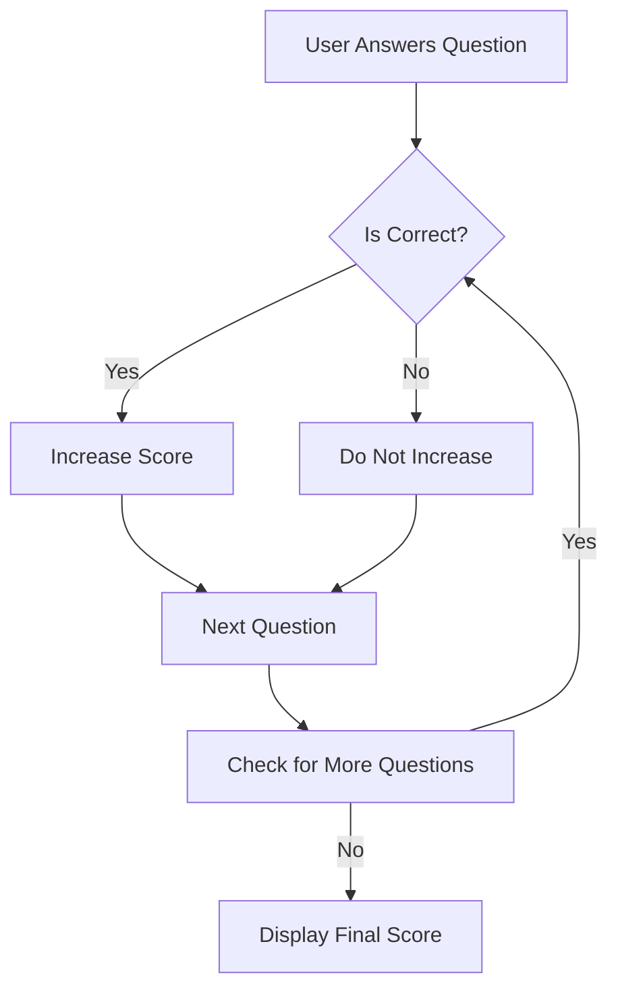

## 4.4.3 Tracking Scores

In this section, we're going to learn how to track scores in your Flutter quiz app. Keeping track of scores is an essential part of any quiz game, as it allows users to see how well they are doing and encourages them to improve. Let's dive into how we can implement score tracking in our app!

### Objective

Our goal is to teach you how to keep track of and display scores based on quiz performance. By the end of this section, you'll be able to update a score variable each time a user answers correctly and display it at the end of the quiz.

### Explanation

Tracking scores involves a few key steps:

1. **Score Variable:** We use a variable to store the user's score. This variable will start at zero and increase as the user answers questions correctly.

2. **Incrementing Scores:** Each time the user answers a question correctly, we increase the score by one.

3. **Displaying Scores:** At the end of the quiz, we show the user their final score, giving them feedback on their performance.

### Key Concepts

#### Score Variable

A score variable is a simple integer that starts at zero. As the user answers questions correctly, this variable is incremented. Here's how you can declare a score variable in Dart:

```dart
int score = 0;
```

#### Incrementing Scores

Whenever a user selects the correct answer, we increase the score. This is done inside a function that checks if the user's answer is correct:

```dart
void answerQuestion(String selected) {
  if (selected == questions[currentQuestion]['correct']) {
    score++;
    feedback = 'Correct!';
  } else {
    feedback = 'Wrong! The correct answer was ${questions[currentQuestion]['correct']}.';
  }
  // Update currentQuestion and feedback as shown in previous sections
}
```

#### Displaying Scores

After the quiz ends, we display the final score to the user. This can be done by checking if the current question index is greater than or equal to the total number of questions:

```dart
if (currentQuestion >= questions.length) {
  feedback += ' Your final score is $score out of ${questions.length}.';
}
```

### Code Example

Here's a complete example of how you might implement score tracking in your quiz app:

```dart
int score = 0;
int currentQuestion = 0;
List<Map<String, String>> questions = [
  {'question': 'What is the capital of France?', 'correct': 'Paris'},
  {'question': 'What is 2 + 2?', 'correct': '4'},
  // Add more questions as needed
];
String feedback = '';

void answerQuestion(String selected) {
  if (selected == questions[currentQuestion]['correct']) {
    score++;
    feedback = 'Correct!';
  } else {
    feedback = 'Wrong! The correct answer was ${questions[currentQuestion]['correct']}.';
  }
  currentQuestion++;
  
  if (currentQuestion >= questions.length) {
    feedback += ' Your final score is $score out of ${questions.length}.';
  }
}
```

### Activity

Try modifying your quiz app to show the score after each question or only at the end, depending on your preference. This will help you understand how score tracking can be customized to fit different types of quizzes.

### Visuals

To better understand how score tracking works, let's look at a flowchart that illustrates the process:



### Language

Remember to keep your code and explanations clear and simple. Reinforce the importance of tracking progress by explaining how it helps users see their improvement over time.

### Engagement

Encourage kids to set personal goals for their quiz scores and strive to improve them with each attempt. This not only makes the quiz more fun but also motivates them to learn and do better.

## Quiz Time!



### What is the purpose of a score variable in a quiz app?

- [x] To keep track of the user's correct answers
- [ ] To store the user's name
- [ ] To display the questions
- [ ] To end the quiz

> **Explanation:** The score variable is used to keep track of the number of correct answers a user has given during the quiz.

### How do you increase the score when a user answers correctly?

- [x] By incrementing the score variable
- [ ] By decrementing the score variable
- [ ] By resetting the score variable
- [ ] By multiplying the score variable

> **Explanation:** When a user answers correctly, you increase the score by incrementing the score variable.

### When should the final score be displayed to the user?

- [x] After all questions have been answered
- [ ] After each question
- [ ] Before the quiz starts
- [ ] During the quiz

> **Explanation:** The final score should be displayed after all questions have been answered to give the user feedback on their overall performance.

### What happens if the user answers a question incorrectly?

- [x] The score remains the same
- [ ] The score decreases
- [ ] The score doubles
- [ ] The quiz restarts

> **Explanation:** If the user answers incorrectly, the score remains the same because we only increase the score for correct answers.

### What is the initial value of the score variable?

- [x] 0
- [ ] 1
- [ ] 10
- [ ] 100

> **Explanation:** The score variable is initialized to 0 because the user hasn't answered any questions correctly at the start.

### Can the score be displayed after each question?

- [x] Yes
- [ ] No

> **Explanation:** The score can be displayed after each question if you choose to implement it that way, providing immediate feedback to the user.

### What is the role of the feedback variable in the code example?

- [x] To provide feedback on the user's answer
- [ ] To store the user's score
- [ ] To display the next question
- [ ] To end the quiz

> **Explanation:** The feedback variable is used to provide feedback to the user on whether their answer was correct or incorrect.

### How can you customize the quiz app to show the score only at the end?

- [x] By checking if the current question index is greater than or equal to the total number of questions
- [ ] By displaying the score after each question
- [ ] By resetting the score after each question
- [ ] By not using a score variable

> **Explanation:** You can customize the app to show the score only at the end by checking if the current question index is greater than or equal to the total number of questions.

### What is the purpose of the `currentQuestion` variable?

- [x] To keep track of which question the user is currently answering
- [ ] To store the user's score
- [ ] To display the final score
- [ ] To end the quiz

> **Explanation:** The `currentQuestion` variable keeps track of which question the user is currently answering, allowing the app to progress through the quiz.

### True or False: The score variable should be reset to zero at the start of each new quiz.

- [x] True
- [ ] False

> **Explanation:** The score variable should be reset to zero at the start of each new quiz to ensure that the user's score is accurate for the current session.


