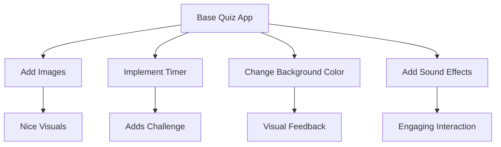

## 4.4.4 Enhancing the Quiz

Congratulations on building your first quiz app! Now, let's take it to the next level by adding exciting features that will make your app more engaging and fun for everyone who uses it. Enhancing your quiz app involves expanding its content, improving its appearance, and incorporating interactive elements. Let's dive into how you can achieve this!

### Adding More Questions

One of the simplest ways to enhance your quiz app is by adding more questions. This not only makes the quiz more challenging but also allows you to cover a wider range of topics. You can include different types of questions, such as multiple-choice, true/false, or even fill-in-the-blank.

Here's how you can add more questions to your quiz app:

```dart
final List<Map<String, dynamic>> questions = [
  {
    'question': 'What is the capital of France?',
    'image': 'assets/images/france.png',
    'answers': ['Berlin', 'London', 'Paris', 'Rome'],
    'correct': 'Paris',
  },
  {
    'question': 'Which planet is known as the Red Planet?',
    'image': 'assets/images/mars.png',
    'answers': ['Earth', 'Mars', 'Jupiter', 'Venus'],
    'correct': 'Mars',
  },
  // Add more questions here
];
```

### User Interface Improvements

A visually appealing app can greatly enhance the user experience. Consider adding colors, images, or animations to make your quiz app more attractive. You can also improve the layout to make it easier for users to navigate through the quiz.

**Example: Displaying an Image with Each Question**

```dart
Image.asset(questions[currentQuestion]['image']),
```

This line of code will display an image related to the current question, making the quiz more visually engaging.

### Additional Features

To make your quiz app even more interactive, consider adding features like timers, hints, or different levels of difficulty. These elements can add a layer of excitement and challenge to your quiz.

**Implementing a Timer**

A timer can create a sense of urgency and make the quiz more challenging. Here's a simple way to add a timer to your quiz app:

```dart
Timer(Duration(seconds: 10), () {
  // Code to execute when the timer ends
  // For example, move to the next question or end the quiz
});
```

**Changing Background Color Based on Answers**

You can provide immediate feedback to users by changing the background color based on whether their answer is correct or incorrect. This visual feedback can enhance the learning experience.

**Adding Sound Effects**

Sound effects can make your quiz app more lively. You can play a sound when a user selects an answer, providing auditory feedback.

### Activity: Brainstorm and Implement Enhancements

Now it's your turn! Think about what features you would like to add to your quiz app. Here are some ideas to get you started:

- Add images related to each question.
- Implement a timer for each question.
- Change the background color based on correct or incorrect answers.
- Add sound effects for correct or wrong answers.

### Visualizing Enhancements

Let's use a Mermaid.js diagram to visualize the enhancements you can make to your quiz app:



### Encouragement and Engagement

Enhancing your quiz app is a fantastic way to express your creativity and improve your coding skills. Don't be afraid to experiment with new features and share your app with friends and family. Gather feedback and continue to refine your project. Remember, the possibilities are endless, and each enhancement you make is a step towards becoming a more skilled coder.

## Quiz Time!



### What is one way to enhance your quiz app?

- [x] Add more questions
- [ ] Remove all questions
- [ ] Make the app slower
- [ ] Use fewer colors

> **Explanation:** Adding more questions can make the quiz more challenging and cover a wider range of topics.

### How can you make your quiz app more visually appealing?

- [x] Add images and colors
- [ ] Use only black and white
- [ ] Remove all images
- [ ] Make the text smaller

> **Explanation:** Adding images and colors can make the app more attractive and engaging for users.

### What feature can add a sense of urgency to your quiz app?

- [x] Timer
- [ ] Longer questions
- [ ] Fewer questions
- [ ] Removing the timer

> **Explanation:** A timer can create a sense of urgency and make the quiz more challenging.

### How can you provide immediate feedback to users?

- [x] Change the background color based on answers
- [ ] Use the same background color for all answers
- [ ] Remove all feedback
- [ ] Make the app silent

> **Explanation:** Changing the background color based on answers provides immediate visual feedback to users.

### What can make your quiz app more interactive?

- [x] Sound effects
- [ ] Removing all sounds
- [ ] Using only text
- [ ] Making the app silent

> **Explanation:** Sound effects can make the app more lively and provide auditory feedback.

### What is a benefit of adding more questions to your quiz app?

- [x] Covers more topics
- [ ] Makes the app shorter
- [ ] Reduces user engagement
- [ ] Makes the app less interesting

> **Explanation:** Adding more questions allows the quiz to cover more topics and keeps users engaged.

### How can you make your quiz app more challenging?

- [x] Implement a timer
- [ ] Remove all challenges
- [ ] Use only easy questions
- [ ] Make the app slower

> **Explanation:** Implementing a timer can add a layer of challenge to the quiz.

### What is a way to improve the user interface of your quiz app?

- [x] Use animations
- [ ] Remove all animations
- [ ] Use only text
- [ ] Make the app less colorful

> **Explanation:** Using animations can make the app more visually appealing and improve the user experience.

### How can you make your quiz app more engaging?

- [x] Add interactive elements
- [ ] Remove all interactions
- [ ] Use only static content
- [ ] Make the app less responsive

> **Explanation:** Adding interactive elements can make the app more engaging and fun for users.

### True or False: Enhancing your quiz app can involve adding new functionalities.

- [x] True
- [ ] False

> **Explanation:** Enhancing your quiz app can involve adding new functionalities, such as timers, hints, or different levels of difficulty.


