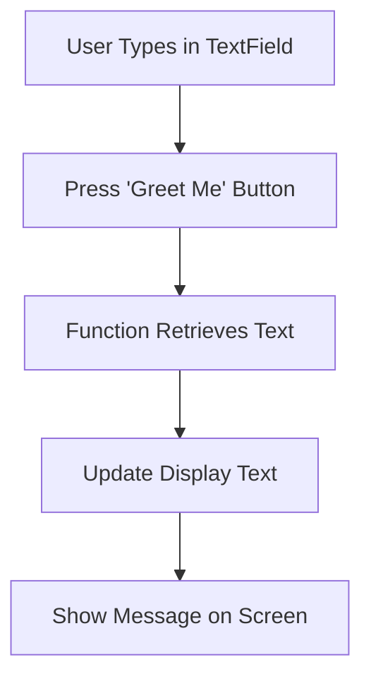

## 5.1.1 Text Input Fields

Welcome to the exciting world of interactive apps! In this section, we'll explore how to capture user input using text input fields in Flutter. Text input fields are essential for creating apps that allow users to enter information, just like filling out a form or writing a message. Let's dive in and learn how to make our apps more interactive!

### Understanding Text Input Fields

Text input fields are like little boxes where users can type their answers or information. Imagine you're filling out a form online or sending a text message to a friend. These fields are crucial for collecting user data, such as names, emails, or any other information you might need in your app.

### Key Concepts

Before we start coding, let's understand some key concepts that will help us create and manage text input fields in Flutter.

#### TextField Widget

The `TextField` widget is the primary tool for creating text input fields in Flutter. It provides a simple way for users to enter text. You can customize it with various properties to make it look and behave just the way you want.

#### Controllers

To manage and retrieve the text entered by the user, we use a `TextEditingController`. This controller keeps track of the text in the field and allows us to access it whenever needed. It's like a helper that remembers what the user typed.

#### Decoration

Decoration is all about enhancing the appearance of your text fields. You can add labels, borders, and hints to make the fields more user-friendly and visually appealing. This makes it easier for users to understand what information they need to enter.

### Code Example

Let's create a simple Flutter app that demonstrates how to use a text input field. In this app, users can enter their name, and when they press a button, the app will greet them with a personalized message.

```dart
import 'package:flutter/material.dart';

void main() {
  runApp(TextInputApp());
}

class TextInputApp extends StatefulWidget {
  @override
  _TextInputAppState createState() => _TextInputAppState();
}

class _TextInputAppState extends State<TextInputApp> {
  final TextEditingController _controller = TextEditingController();
  String displayText = '';

  @override
  Widget build(BuildContext context) {
    return MaterialApp(
      home: Scaffold(
        appBar: AppBar(
          title: Text('Text Input Example'),
        ),
        body: Padding(
          padding: EdgeInsets.all(16.0),
          child: Column(
            children: [
              TextField(
                controller: _controller,
                decoration: InputDecoration(
                  labelText: 'Enter your name',
                  border: OutlineInputBorder(),
                ),
              ),
              SizedBox(height: 20),
              ElevatedButton(
                onPressed: () {
                  setState(() {
                    displayText = 'Hello, ${_controller.text}!';
                  });
                },
                child: Text('Greet Me'),
              ),
              SizedBox(height: 20),
              Text(
                displayText,
                style: TextStyle(fontSize: 24),
              ),
            ],
          ),
        ),
      ),
    );
  }
}
```

### How It Works

1. **TextField Widget:** We use the `TextField` widget to create a text input field. The `controller` property is set to `_controller`, which manages the text input.

2. **TextEditingController:** The `TextEditingController` is used to retrieve the text entered by the user. When the button is pressed, we access the text using `_controller.text`.

3. **Decoration:** The `InputDecoration` property is used to add a label and a border to the text field, making it clear and easy to use.

4. **Button Interaction:** When the "Greet Me" button is pressed, the app updates the `displayText` variable with a personalized greeting using the text from the input field.

5. **Display Text:** The `Text` widget displays the greeting message on the screen.

### Activity: Create Your Own Form

Now it's your turn! Let's create a simple form where users can enter their favorite color. When they press a button, the app will display a message using that color. Here's a challenge for you:

- Use a `TextField` to capture the user's favorite color.
- Add a button that, when pressed, displays a message like "Your favorite color is [color]!".
- Experiment with different decorations to make your text field look great.

### Visualizing the Data Flow

To help you understand how data flows from the text input to the display, here's a visual representation using Mermaid.js:



### Language and Engagement

Remember, a "widget" is just a building block for creating user interfaces in Flutter. A "controller" is like a helper that keeps track of what the user types. Encourage kids to personalize their messages and experiment with different inputs to see how the app responds. It's a fun way to learn and create!

### Conclusion

Text input fields are a powerful tool for making your apps interactive and engaging. By capturing user input, you can create personalized experiences that make your app stand out. Keep experimenting and have fun with your coding journey!

## Quiz Time!



### What is the primary widget used for creating text input fields in Flutter?

- [x] TextField
- [ ] TextInput
- [ ] InputField
- [ ] TextBox

> **Explanation:** The `TextField` widget is the primary widget used for creating text input fields in Flutter.

### What is the purpose of a TextEditingController in Flutter?

- [x] To manage and retrieve the text entered by the user
- [ ] To style the text input field
- [ ] To handle button clicks
- [ ] To manage app navigation

> **Explanation:** A `TextEditingController` is used to manage and retrieve the text entered by the user in a `TextField`.

### How can you enhance the appearance of a TextField in Flutter?

- [x] By using decoration with labels, borders, and hints
- [ ] By changing the font size
- [ ] By adding animations
- [ ] By using a different widget

> **Explanation:** You can enhance the appearance of a `TextField` by using decoration, which includes labels, borders, and hints.

### What happens when the "Greet Me" button is pressed in the example code?

- [x] The app updates the display text with a personalized greeting
- [ ] The app clears the text field
- [ ] The app navigates to a new screen
- [ ] The app closes

> **Explanation:** When the "Greet Me" button is pressed, the app updates the display text with a personalized greeting using the text from the input field.

### What property of the TextField widget is used to set the text controller?

- [x] controller
- [ ] textController
- [ ] inputController
- [ ] manager

> **Explanation:** The `controller` property of the `TextField` widget is used to set the text controller.

### What is the role of the InputDecoration property in a TextField?

- [x] To enhance the appearance of the text field with labels and borders
- [ ] To handle user input
- [ ] To manage text alignment
- [ ] To control text size

> **Explanation:** The `InputDecoration` property is used to enhance the appearance of the text field with labels, borders, and hints.

### What does the Text widget do in the example code?

- [x] Displays the greeting message on the screen
- [ ] Captures user input
- [ ] Handles button clicks
- [ ] Manages app navigation

> **Explanation:** The `Text` widget is used to display the greeting message on the screen.

### What is the purpose of the SizedBox widget in the example code?

- [x] To add spacing between widgets
- [ ] To capture user input
- [ ] To handle button clicks
- [ ] To manage text alignment

> **Explanation:** The `SizedBox` widget is used to add spacing between widgets, such as between the text field and the button.

### What should you do to retrieve the text entered by the user in a TextField?

- [x] Use the text property of the TextEditingController
- [ ] Use the value property of the TextField
- [ ] Use the getText method of the TextField
- [ ] Use the retrieveText function

> **Explanation:** To retrieve the text entered by the user in a `TextField`, you use the `text` property of the `TextEditingController`.

### True or False: The TextField widget can be used without a TextEditingController.

- [x] True
- [ ] False

> **Explanation:** True. The `TextField` widget can be used without a `TextEditingController`, but using a controller is helpful for managing and retrieving the text entered by the user.


