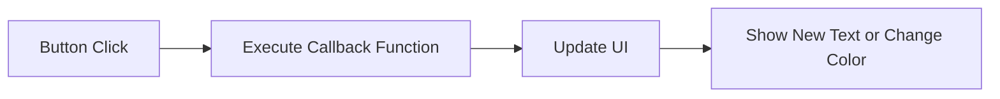

## 5.1.2 Buttons and Clicks

Welcome to the exciting world of interactive apps! In this section, we'll explore how to use buttons in Flutter to make your apps come alive. Buttons are like the switches and levers in a game—they let users interact with your app and make things happen. Let's dive in and learn how to create buttons, handle clicks, and customize their appearance!

### Understanding Buttons in Flutter

Buttons in Flutter are widgets that users can tap to perform actions. Think of them like the buttons on a video game controller or the keys on a piano. When you press a button, something happens—maybe a character jumps, or a note plays. In Flutter, buttons are just as powerful, allowing you to trigger functions and update your app's interface.

#### Key Concepts

1. **ElevatedButton Widget:** This is one of the most commonly used button widgets in Flutter. It provides a raised appearance, making it stand out on the screen.

2. **onPressed Callback:** This is a function that gets executed when the button is clicked. It's where you define what happens when the user interacts with the button.

3. **Styling Buttons:** You can customize buttons with different colors, sizes, and text to match the theme of your app.

### Creating a Simple Button

Let's start by creating a simple app with a button that changes text when clicked. Here's a step-by-step guide:

#### Step 1: Set Up Your Flutter Project

First, ensure you have Flutter installed and set up on your computer. Open your code editor and create a new Flutter project.

#### Step 2: Write the Code

Here's a simple example of a Flutter app with a button:

```dart
import 'package:flutter/material.dart';

void main() {
  runApp(ButtonApp());
}

class ButtonApp extends StatefulWidget {
  @override
  _ButtonAppState createState() => _ButtonAppState();
}

class _ButtonAppState extends State<ButtonApp> {
  String buttonText = 'Press the button!';

  void handleButtonPress() {
    setState(() {
      buttonText = 'Button Pressed!';
    });
  }

  @override
  Widget build(BuildContext context) {
    return MaterialApp(
      home: Scaffold(
        appBar: AppBar(
          title: Text('Button Example'),
        ),
        body: Center(
          child: Column(
            mainAxisAlignment: MainAxisAlignment.center,
            children: [
              ElevatedButton(
                onPressed: handleButtonPress,
                child: Text('Press Me'),
              ),
              SizedBox(height: 20),
              Text(
                buttonText,
                style: TextStyle(fontSize: 24),
              ),
            ],
          ),
        ),
      ),
    );
  }
}
```

#### Step 3: Run the App

Run your app using `flutter run` in your terminal or by pressing the play button in your IDE. You'll see a button labeled "Press Me." When you click it, the text changes to "Button Pressed!"

### How It Works

- **ElevatedButton:** This widget creates a button with a raised appearance. It's perfect for drawing attention to important actions.
  
- **onPressed:** The `handleButtonPress` function is called when the button is clicked. It uses `setState` to update the `buttonText` variable, which changes the displayed text.

- **setState:** This function tells Flutter to rebuild the UI with the updated state, ensuring the new text is displayed.

### Styling Your Button

You can customize your button to make it more visually appealing. Here's how you can change its color and size:

```dart
ElevatedButton(
  onPressed: handleButtonPress,
  style: ElevatedButton.styleFrom(
    primary: Colors.blue, // Background color
    padding: EdgeInsets.symmetric(horizontal: 30, vertical: 15),
    textStyle: TextStyle(fontSize: 20),
  ),
  child: Text('Press Me'),
)
```

### Activity: Create Multiple Buttons

Now it's your turn! Try creating multiple buttons that perform different actions. For example, you could have one button change the text, another change the background color, and a third navigate to a new screen.

### Visualizing Button Interactions

Let's visualize how button interactions work using a flowchart:



This flowchart shows the process from clicking a button to updating the UI and displaying new content.

### Engagement: Get Creative!

Encourage your creativity by thinking of unique actions your buttons can perform. Maybe a button could play a sound, display an animation, or even start a mini-game. The possibilities are endless!

### Conclusion

Buttons are a fundamental part of interactive apps, allowing users to engage with your creations. By mastering buttons and clicks, you're well on your way to building dynamic and engaging Flutter apps. Keep experimenting and have fun!

## Quiz Time!



### What is the primary purpose of a button in a Flutter app?

- [x] To allow user interaction and trigger actions
- [ ] To display static text
- [ ] To store data
- [ ] To navigate between screens

> **Explanation:** Buttons are used to allow user interaction and trigger specific actions in an app.

### Which widget is commonly used for creating buttons in Flutter?

- [x] ElevatedButton
- [ ] TextButton
- [ ] IconButton
- [ ] FlatButton

> **Explanation:** The ElevatedButton widget is commonly used for creating buttons with a raised appearance in Flutter.

### What does the onPressed callback do?

- [x] Executes a function when the button is clicked
- [ ] Changes the button's color
- [ ] Displays a message
- [ ] Navigates to a new screen

> **Explanation:** The onPressed callback is a function that gets executed when the button is clicked.

### How can you change the appearance of a button in Flutter?

- [x] By using the style property
- [ ] By changing the button's text
- [ ] By adding an image
- [ ] By resizing the app window

> **Explanation:** You can change the appearance of a button in Flutter by using the style property to customize colors, padding, and text style.

### What function is used to update the UI in a StatefulWidget?

- [x] setState
- [ ] build
- [ ] initState
- [ ] dispose

> **Explanation:** The setState function is used to update the UI in a StatefulWidget by rebuilding the widget with new data.

### What happens when you call setState in a Flutter app?

- [x] The UI is rebuilt with updated data
- [ ] The app crashes
- [ ] The app closes
- [ ] The button disappears

> **Explanation:** When you call setState, the UI is rebuilt with updated data, reflecting any changes made.

### Which property of ElevatedButton allows you to define the button's action?

- [x] onPressed
- [ ] child
- [ ] style
- [ ] color

> **Explanation:** The onPressed property allows you to define the action that occurs when the button is clicked.

### What is the purpose of the child property in an ElevatedButton?

- [x] To define the content inside the button
- [ ] To set the button's color
- [ ] To handle button clicks
- [ ] To change the button's size

> **Explanation:** The child property is used to define the content inside the button, such as text or an icon.

### Can you use multiple ElevatedButtons in a single Flutter app?

- [x] True
- [ ] False

> **Explanation:** True. You can use multiple ElevatedButtons in a single Flutter app to perform different actions.

### What is a creative action you could assign to a button in your app?

- [x] Play a sound
- [ ] Do nothing
- [ ] Close the app
- [ ] Hide the button

> **Explanation:** A creative action you could assign to a button is to play a sound, making the app more interactive and fun.


