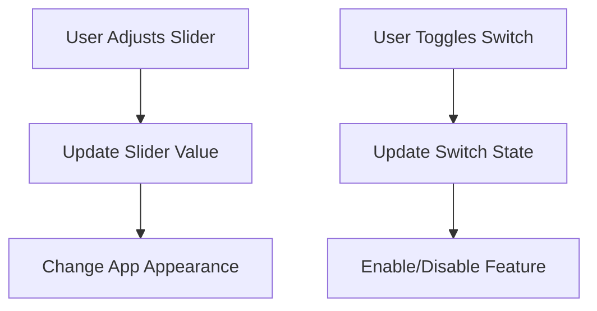

## 5.1.3 Sliders and Switches

In this section, we'll explore two powerful interactive widgets in Flutter: sliders and switches. These widgets allow users to interact with your app by selecting values or toggling settings, making your app more dynamic and engaging.

### Understanding Sliders and Switches

**Sliders** are widgets that let users choose a value from a continuous range by sliding a knob along a track. They are perfect for settings like volume control, brightness adjustment, or any scenario where a range of values is needed.

**Switches**, on the other hand, are used for binary choices, such as turning a feature on or off. They are similar to physical light switches and are great for settings like enabling or disabling notifications.

### Key Concepts

#### Slider Widget

The **Slider** widget in Flutter is used to select a continuous value within a specified range. You can customize the minimum and maximum values, as well as the divisions for discrete steps.

#### Switch Widget

The **Switch** widget provides a simple way to toggle between two states: on and off. It's commonly used for settings that can be enabled or disabled.

#### Handling State

Both sliders and switches require handling state changes to update the app's appearance or behavior based on user interaction. This involves using Flutter's `StatefulWidget` to manage and respond to changes.

### Code Example

Let's dive into a practical example where we use both a slider and a switch in a Flutter app. This example demonstrates how to update the app's state based on user input.

```dart
import 'package:flutter/material.dart';

void main() {
  runApp(SliderSwitchApp());
}

class SliderSwitchApp extends StatefulWidget {
  @override
  _SliderSwitchAppState createState() => _SliderSwitchAppState();
}

class _SliderSwitchAppState extends State<SliderSwitchApp> {
  double sliderValue = 50;
  bool isSwitched = false;

  @override
  Widget build(BuildContext context) {
    return MaterialApp(
      home: Scaffold(
        appBar: AppBar(
          title: Text('Slider and Switch Example'),
        ),
        body: Padding(
          padding: EdgeInsets.all(16.0),
          child: Column(
            children: [
              Text(
                'Slider Value: ${sliderValue.toInt()}',
                style: TextStyle(fontSize: 20),
              ),
              Slider(
                value: sliderValue,
                min: 0,
                max: 100,
                divisions: 100,
                label: sliderValue.round().toString(),
                onChanged: (double value) {
                  setState(() {
                    sliderValue = value;
                  });
                },
              ),
              SizedBox(height: 20),
              Row(
                mainAxisAlignment: MainAxisAlignment.center,
                children: [
                  Text(
                    'Flutter Mode',
                    style: TextStyle(fontSize: 20),
                  ),
                  Switch(
                    value: isSwitched,
                    onChanged: (bool value) {
                      setState(() {
                        isSwitched = value;
                      });
                    },
                  ),
                ],
              ),
              SizedBox(height: 20),
              Text(
                isSwitched ? 'Flutter Mode is ON' : 'Flutter Mode is OFF',
                style: TextStyle(fontSize: 24, color: isSwitched ? Colors.green : Colors.red),
              ),
            ],
          ),
        ),
      ),
    );
  }
}
```

### Activity: Create Your Own App

Now that you've seen how sliders and switches work, try creating a simple app that uses these widgets. Here are a couple of ideas:

- **Brightness Control App:** Use a slider to adjust the brightness of a simulated light bulb in your app.
- **Theme Toggle App:** Use a switch to toggle between light and dark themes in your app.

### Visualizing State Changes

To better understand how sliders and switches affect the app's state and UI, let's use a diagram:



### Relatable Examples

Think about how you adjust the volume on a music player or turn the lights on and off at home. These everyday actions are similar to how sliders and switches work in your app.

### Engagement and Experimentation

Encourage experimentation by adding multiple sliders and switches to your app. See how they can interact with each other and create real-time changes. This hands-on practice will deepen your understanding and spark creativity.

## Quiz Time!



### What is the primary use of a slider widget in Flutter?

- [x] Selecting a continuous value within a range
- [ ] Toggling between two states
- [ ] Displaying static text
- [ ] Navigating between screens

> **Explanation:** A slider is used to select a continuous value within a specified range, such as adjusting volume or brightness.

### What does a switch widget represent in an app?

- [x] A binary choice (on/off)
- [ ] A continuous value selection
- [ ] A list of options
- [ ] A navigation tool

> **Explanation:** A switch represents a binary choice, allowing users to toggle a setting on or off.

### How do you update the app's state when a slider value changes?

- [x] Use `setState()` to update the value
- [ ] Use `print()` to display the value
- [ ] Use `Navigator` to change screens
- [ ] Use `Text` to show the value

> **Explanation:** `setState()` is used to update the app's state and reflect changes in the UI when a slider value changes.

### What is the purpose of the `divisions` property in a slider?

- [x] To create discrete steps within the slider's range
- [ ] To change the slider's color
- [ ] To set the slider's orientation
- [ ] To adjust the slider's size

> **Explanation:** The `divisions` property creates discrete steps within the slider's range, allowing for specific increments.

### In the provided code example, what does the `isSwitched` variable represent?

- [x] The current state of the switch (on/off)
- [ ] The current value of the slider
- [ ] The app's title
- [ ] The color of the text

> **Explanation:** The `isSwitched` variable represents the current state of the switch, indicating whether it is on or off.

### What happens when you call `setState()` in a Flutter app?

- [x] The app's UI is rebuilt with the updated state
- [ ] The app closes
- [ ] The app's data is saved to a file
- [ ] The app's theme changes

> **Explanation:** Calling `setState()` triggers a rebuild of the app's UI with the updated state, reflecting any changes made.

### Which widget would you use to allow users to toggle a setting on or off?

- [x] Switch
- [ ] Slider
- [ ] TextField
- [ ] Button

> **Explanation:** A switch is used to toggle a setting on or off, providing a simple binary choice.

### How can you make a slider display discrete values?

- [x] Set the `divisions` property
- [ ] Use a `Text` widget
- [ ] Change the slider's color
- [ ] Adjust the slider's size

> **Explanation:** Setting the `divisions` property on a slider allows it to display discrete values by creating specific steps.

### What is the role of the `label` property in a slider?

- [x] To display the current value of the slider
- [ ] To change the slider's color
- [ ] To set the slider's orientation
- [ ] To adjust the slider's size

> **Explanation:** The `label` property displays the current value of the slider, providing feedback to the user.

### True or False: A switch can have more than two states.

- [ ] True
- [x] False

> **Explanation:** A switch is designed for binary choices, meaning it can only have two states: on or off.


