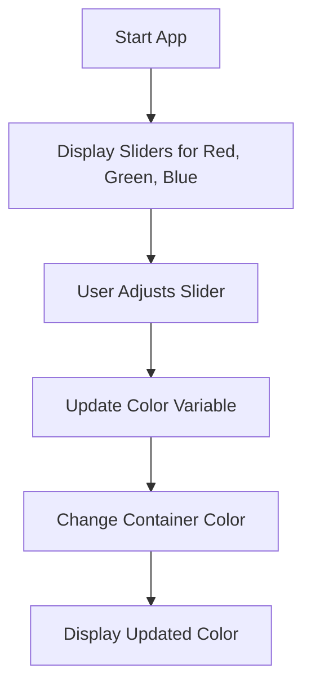

## 5.1.4 Mini Project: Color Mixer

Welcome to the exciting world of interactive app development! In this mini-project, we'll be building a **Color Mixer** app using Flutter. This project will help you understand how to use user input and interactive widgets to create a dynamic and engaging application. Let's dive in!

### Objective

The goal of this project is to create an app where users can adjust sliders to mix custom colors. As users move the sliders for red, green, and blue, the background color of the app will change to reflect the selected color. This hands-on project will teach you how to handle user input and update the UI in real-time.

### Project Overview

Our Color Mixer app will consist of three main components:
1. **Sliders** for adjusting the red, green, and blue color values.
2. A **display area** to show the mixed color based on the slider values.
3. **Real-time updates** to the display area as the sliders are adjusted.

### Step-by-Step Guide

Let's break down the process of building the Color Mixer app into manageable steps:

#### 1. Set Up the UI

First, we'll set up the user interface with three sliders, each representing one of the primary colors: red, green, and blue. We'll also include a display area to show the mixed color.

#### 2. Create Variables

Next, we'll declare variables to store the values of each slider. These variables will be used to calculate the mixed color.

#### 3. Handle Slider Changes

We'll write code to update the color display whenever a slider is adjusted. This involves listening for changes in the slider values and updating the UI accordingly.

#### 4. Display Color

Finally, we'll use a `Container` widget to display the mixed color. The color of the container will change based on the current values of the sliders.

### Code Example

Here's a complete code example for the Color Mixer app:

```dart
import 'package:flutter/material.dart';

void main() {
  runApp(ColorMixerApp());
}

class ColorMixerApp extends StatefulWidget {
  @override
  _ColorMixerAppState createState() => _ColorMixerAppState();
}

class _ColorMixerAppState extends State<ColorMixerApp> {
  double red = 0;
  double green = 0;
  double blue = 0;

  Color get mixedColor => Color.fromRGBO(red.toInt(), green.toInt(), blue.toInt(), 1);

  @override
  Widget build(BuildContext context) {
    return MaterialApp(
      home: Scaffold(
        appBar: AppBar(
          title: Text('Color Mixer'),
        ),
        body: Padding(
          padding: EdgeInsets.all(16.0),
          child: Column(
            children: [
              Text(
                'Red: ${red.toInt()}',
                style: TextStyle(fontSize: 20, color: Colors.red),
              ),
              Slider(
                value: red,
                min: 0,
                max: 255,
                divisions: 255,
                activeColor: Colors.red,
                onChanged: (double value) {
                  setState(() {
                    red = value;
                  });
                },
              ),
              Text(
                'Green: ${green.toInt()}',
                style: TextStyle(fontSize: 20, color: Colors.green),
              ),
              Slider(
                value: green,
                min: 0,
                max: 255,
                divisions: 255,
                activeColor: Colors.green,
                onChanged: (double value) {
                  setState(() {
                    green = value;
                  });
                },
              ),
              Text(
                'Blue: ${blue.toInt()}',
                style: TextStyle(fontSize: 20, color: Colors.blue),
              ),
              Slider(
                value: blue,
                min: 0,
                max: 255,
                divisions: 255,
                activeColor: Colors.blue,
                onChanged: (double value) {
                  setState(() {
                    blue = value;
                  });
                },
              ),
              SizedBox(height: 20),
              Container(
                width: double.infinity,
                height: 150,
                color: mixedColor,
                child: Center(
                  child: Text(
                    'Your Color',
                    style: TextStyle(
                      fontSize: 24,
                      color: mixedColor.computeLuminance() > 0.5 ? Colors.black : Colors.white,
                    ),
                  ),
                ),
              ),
            ],
          ),
        ),
      ),
    );
  }
}
```

### Visuals

To better understand the flow of the Color Mixer app, let's look at a diagram that outlines the process:



### Language and Engagement

As you build your Color Mixer app, remember to have fun and experiment with different color combinations. Celebrate your creativity and enjoy the process of seeing your app come to life!

### Encouragement

Congratulations on creating your very own Color Mixer app! You've learned how to handle user input and update the UI in real-time. Keep experimenting with different colors and see what beautiful combinations you can create. You're doing an amazing job, and this is just the beginning of your coding journey!

## Quiz Time!



### What is the main objective of the Color Mixer app?

- [x] To allow users to mix custom colors using sliders.
- [ ] To create a drawing app.
- [ ] To play music based on color.
- [ ] To display random colors.

> **Explanation:** The main objective is to let users mix custom colors using sliders for red, green, and blue values.

### Which widget is used to display the mixed color in the app?

- [x] Container
- [ ] Text
- [ ] Image
- [ ] Button

> **Explanation:** A `Container` widget is used to display the mixed color based on the slider values.

### How many sliders are used in the Color Mixer app?

- [x] Three
- [ ] One
- [ ] Two
- [ ] Four

> **Explanation:** There are three sliders, one for each primary color: red, green, and blue.

### What function is used to update the UI when a slider value changes?

- [x] setState()
- [ ] initState()
- [ ] build()
- [ ] dispose()

> **Explanation:** The `setState()` function is used to update the UI when a slider value changes.

### What is the range of values for each color slider?

- [x] 0 to 255
- [ ] 0 to 100
- [ ] 0 to 50
- [ ] 0 to 500

> **Explanation:** Each color slider ranges from 0 to 255, representing the intensity of the color.

### What does the `mixedColor` variable represent?

- [x] The combined color from the red, green, and blue sliders.
- [ ] The background color of the app.
- [ ] The text color of the app.
- [ ] The border color of the sliders.

> **Explanation:** The `mixedColor` variable represents the combined color from the red, green, and blue sliders.

### Which method is used to convert slider values to integers?

- [x] toInt()
- [ ] toDouble()
- [ ] toString()
- [ ] toHex()

> **Explanation:** The `toInt()` method is used to convert slider values to integers.

### What happens when a slider is adjusted?

- [x] The color display updates in real-time.
- [ ] The app restarts.
- [ ] The app closes.
- [ ] The sliders reset to zero.

> **Explanation:** When a slider is adjusted, the color display updates in real-time to reflect the new color.

### What is the purpose of the `computeLuminance()` method?

- [x] To determine the brightness of the color for text visibility.
- [ ] To calculate the average color.
- [ ] To reset the color.
- [ ] To change the slider color.

> **Explanation:** The `computeLuminance()` method determines the brightness of the color to ensure text visibility against the background.

### True or False: The Color Mixer app uses Flutter's `MaterialApp` widget.

- [x] True
- [ ] False

> **Explanation:** True. The app uses Flutter's `MaterialApp` widget to provide a material design structure.


