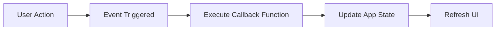

## 5.2.1 Event Handling

In this section, we'll dive into the exciting world of event handling in Flutter. Event handling is a crucial concept that allows your app to respond to user interactions, making it dynamic and engaging. Imagine your app as a friendly robot that listens and reacts when you tap, swipe, or click. Let's explore how this works!

### Understanding Event Handling

**Objective:** Introduce the concept of event handling, allowing the app to respond to user interactions like taps, swipes, and clicks.

Event handling is how your app knows when a user does something, like pressing a button or moving a slider, and responds accordingly. It's like when someone calls your name, and you turn around to see who it is. In the world of apps, these actions are called **events**, and the responses are managed through **callbacks**.

#### Key Concepts

1. **Events:** These are actions performed by the user, such as tapping, dragging, or typing. Each event is like a signal that something has happened.

2. **Callbacks:** These are functions that are triggered in response to events. When an event occurs, the app "calls back" a specific function to handle it.

3. **GestureDetector Widget:** This powerful widget captures complex gestures beyond simple taps, such as swipes and long presses.

### Code Example: Handling a Tap Event

Let's look at a simple example of how to handle a tap event in Flutter. We'll create an app that changes a message on the screen when you tap anywhere.

```dart
import 'package:flutter/material.dart';

void main() {
  runApp(EventHandlingApp());
}

class EventHandlingApp extends StatefulWidget {
  @override
  _EventHandlingAppState createState() => _EventHandlingAppState();
}

class _EventHandlingAppState extends State<EventHandlingApp> {
  String message = 'Tap anywhere!';

  void handleTap() {
    setState(() {
      message = 'You tapped the screen!';
    });
  }

  @override
  Widget build(BuildContext context) {
    return MaterialApp(
      home: Scaffold(
        appBar: AppBar(
          title: Text('Event Handling Example'),
        ),
        body: GestureDetector(
          onTap: handleTap,
          child: Center(
            child: Text(
              message,
              style: TextStyle(fontSize: 24),
            ),
          ),
        ),
      ),
    );
  }
}
```

**Explanation:**

- We use a `GestureDetector` widget to listen for tap events.
- The `onTap` property is set to a callback function `handleTap`.
- When the screen is tapped, `handleTap` changes the `message` state, and the UI updates to reflect the new message.

### Activity: Create Your Own Event Handlers

Now it's your turn! Try creating different event handlers for various widgets. For example:

- Change the text when an image is tapped.
- Update a counter when a button is pressed.
- Change the background color when a long press is detected.

### Visualizing Event Handling

Let's visualize how event handling works using a flowchart. This diagram shows the process from a user action to updating the UI.



**Explanation:**

- **User Action:** The user performs an action, like tapping the screen.
- **Event Triggered:** The app detects the event.
- **Execute Callback Function:** The app calls the function associated with the event.
- **Update App State:** The function updates the app's state.
- **Refresh UI:** The UI refreshes to reflect the new state.

### Relatable Analogy

Think of event handling like responding when someone calls your name. When you hear your name (the event), you turn around or say "hello" (the callback). Similarly, when a user interacts with your app, it responds with a specific action.

### Engagement: Make It Fun!

Encourage kids to think of various user actions and decide how their app should respond. This makes the interactions meaningful and fun. For instance, they could create a game where tapping a character makes it jump, or swiping changes the scene.

### Best Practices and Tips

- **Keep It Simple:** Start with simple events like taps and clicks before moving on to more complex gestures.
- **Test Your App:** Make sure your event handlers work as expected by testing them thoroughly.
- **Use Clear Callbacks:** Name your callback functions clearly to indicate what they do.

### Common Pitfalls

- **Forgetting to Update State:** Always use `setState` to update the UI when handling events.
- **Overlapping Gestures:** Be careful with overlapping gestures, as they can cause unexpected behavior.

### Conclusion

Event handling is a powerful tool that makes your apps interactive and engaging. By understanding how to respond to user actions, you can create apps that are not only functional but also fun to use. Keep experimenting with different events and callbacks to see what you can create!

## Quiz Time!



### What is an event in the context of app development?

- [x] An action performed by the user, such as tapping or swiping
- [ ] A function that responds to user actions
- [ ] A widget that displays information
- [ ] A type of data storage

> **Explanation:** An event is an action performed by the user, like tapping or swiping, which the app can respond to.

### What is a callback function?

- [x] A function that is triggered in response to an event
- [ ] A function that stores data
- [ ] A function that displays text
- [ ] A function that handles errors

> **Explanation:** A callback function is triggered in response to an event, allowing the app to react to user interactions.

### Which widget is used to detect complex gestures in Flutter?

- [x] GestureDetector
- [ ] Text
- [ ] Container
- [ ] ListView

> **Explanation:** The `GestureDetector` widget is used to detect complex gestures like swipes and long presses.

### In the provided code example, what does the `handleTap` function do?

- [x] It updates the message displayed on the screen
- [ ] It changes the background color
- [ ] It plays a sound
- [ ] It closes the app

> **Explanation:** The `handleTap` function updates the message displayed on the screen when the user taps.

### What is the purpose of the `setState` method in Flutter?

- [x] To update the UI when the app's state changes
- [ ] To store data in the app
- [ ] To initialize variables
- [ ] To handle errors

> **Explanation:** The `setState` method is used to update the UI when the app's state changes, ensuring the display reflects the current state.

### What happens when an event is triggered in an app?

- [x] A callback function is executed
- [ ] The app closes
- [ ] The app restarts
- [ ] The app displays an error

> **Explanation:** When an event is triggered, a callback function is executed to handle the event and update the app accordingly.

### Why is it important to test event handlers in your app?

- [x] To ensure they work as expected and provide a good user experience
- [ ] To make the app run faster
- [ ] To reduce the app's size
- [ ] To increase the app's security

> **Explanation:** Testing event handlers ensures they work as expected and provide a good user experience by responding correctly to user actions.

### What is a common pitfall when handling events in Flutter?

- [x] Forgetting to use `setState` to update the UI
- [ ] Using too many widgets
- [ ] Writing too much code
- [ ] Using too many colors

> **Explanation:** A common pitfall is forgetting to use `setState` to update the UI, which can lead to the app not reflecting changes in state.

### How can you make your app's interactions meaningful and fun?

- [x] By thinking of various user actions and deciding how the app should respond
- [ ] By using only one type of widget
- [ ] By avoiding user interactions
- [ ] By using complex code

> **Explanation:** Making interactions meaningful and fun involves thinking of various user actions and deciding how the app should respond creatively.

### True or False: The `GestureDetector` widget can only detect tap events.

- [ ] True
- [x] False

> **Explanation:** False. The `GestureDetector` widget can detect various gestures, including taps, swipes, and long presses.


